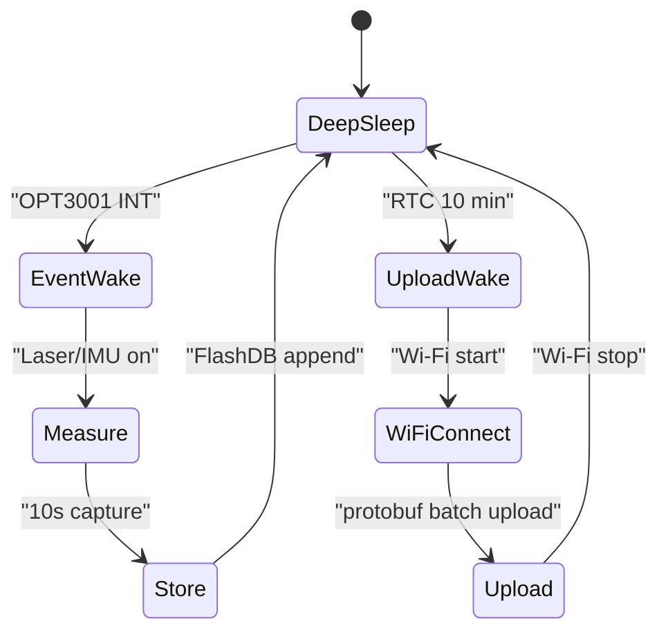

# Event Driven Low Power System Implementation Plan

## 목적

이 문서는 `ESP32-C5` 기반 이벤트 구동 저전력 시스템의 구현 전략을 정리한다.

대상 시나리오는 다음과 같다.

- 이벤트 센서: `OPT3001` 주변광 센서
- 메인 MCU: `ESP32-C5`
- 로컬 저장: `FlashDB`
- 업로드 포맷: `nanopb protobuf`
- 업로드 방식: 10분 주기 `Wi-Fi` 연결 후 누적 데이터 업로드

이 문서의 목표는 두 가지다.

1. `OPT3001` 이벤트를 기준으로 고전력 센서를 필요할 때만 켜는 구조를 정의
2. `30000 mAh` 배터리 기준 예상 동작 시간을 계산

## 입력 조건

운용 규칙:

- 10분에 1번씩 `Wi-Fi` 망 연결 및 누적 측정 건 업로드
- `OPT3001` 주변광 이벤트 발생 시 고성능 센서 on
- 고성능 센서 측정 시간: 10초
- 하루 최대 측정 횟수: 100회
- 비이벤트 시간에는 `Light-sleep` 또는 `Deep-sleep`

고성능 센서 부하:

- 센서 1: `12 V 50 mA` 레이저 센서 3개
- 센서 2: `3.3 V 3 mA` IMU 1개

## 권장 동작 전략

기본 권장안은 `Deep-sleep` 중심 설계다.

이유:

- 업로드 주기가 10분으로 길다
- `OPT3001` 인터럽트와 RTC timer를 wake source로 쓰기 좋다
- 대기 전류에서 `Deep-sleep` 이점이 명확하다

권장 상태 머신:

핵심 원칙:

- 평소에는 `ESP32-C5`와 고성능 센서를 모두 최대한 꺼 둔다
- `OPT3001`는 저전력 감시 센서로 계속 유지한다
- 이벤트 발생 시에만 레이저 센서와 IMU를 켠다
- 측정 결과는 우선 `FlashDB`에 저장한다
- 네트워크 전송은 측정 경로와 분리하고 10분 주기 upload task가 일괄 처리한다

## 하드웨어/펌웨어 역할 분리

### `OPT3001`

- 주변광 임계치 감시
- interrupt pin으로 MCU wakeup 유도
- 이벤트가 사라질 때까지 polling을 계속하지 않도록 threshold/latched interrupt 활용

### `ESP32-C5`

- `Deep-sleep` 기본 상태 유지
- `RTC timer`로 10분 업로드 주기 wake
- `GPIO wakeup`으로 `OPT3001 INT` 처리
- wake 후 `boot_id` 재생성, `sequence`는 `0`부터 시작

### 고성능 센서

- 이벤트 측정 구간 10초 동안만 전원 인가
- 측정 종료 직후 power gate off

## 권장 구현 흐름

### 1. 평상시 대기

- `OPT3001`만 동작
- `ESP32-C5`는 `Deep-sleep`
- wake source:
  - `RTC timer` 10분
  - `OPT3001` interrupt GPIO

### 2. 이벤트 발생 시

- `OPT3001 INT`로 wake
- event cause 확인
- 레이저 센서 3개와 IMU 전원 on
- 10초 동안 샘플링
- 결과를 내부 event 구조에 적재
- `FlashDB`에 저장
- 센서 off
- 다시 sleep 진입

### 3. 업로드 주기 도달 시

- `RTC timer`로 wake
- `Wi-Fi` start
- AP 연결
- `FlashDB`에 쌓인 이벤트를 읽어 protobuf 업로드
- 업로드 성공분 삭제 또는 committed 상태 마킹
- `Wi-Fi` stop
- 다시 sleep 진입

## sleep 모드 선택 가이드

공식 문서 기준 `ESP32-C5` 소비전류:

- `Light-sleep`: typ `0.25 mA` 또는 저전력 설정 typ `0.06 mA`
- `Deep-sleep`: typ `0.012 mA`

출처:

- [ESP32-C5 Series Datasheet](https://www.espressif.com/sites/default/files/documentation/esp32-c5_datasheet_en.pdf)
- [ESP-IDF Sleep Modes](https://docs.espressif.com/projects/esp-idf/en/latest/esp32c5/api-reference/system/sleep_modes.html)

현재 시나리오 권장:

- 기본: `Deep-sleep`
- 예외: 이벤트 직후 짧은 재진입 대기, 연속 측정 가능성이 높은 짧은 윈도우에서는 `Light-sleep` 검토 가능

판단 기준:

- 10분 업로드 주기처럼 긴 공백이 있으면 `Deep-sleep`이 유리
- 수 초 이내로 다시 깰 가능성이 높은 구간만 `Light-sleep` 후보

## 전력 계산 가정

배터리 가정:

- `30000 mAh` 리튬 배터리 팩
- 명목 전압 `3.7 V`
- 총 에너지 약 `111 Wh`

전력 계산 가정:

- `OPT3001` active current: typ `3.7 uA`
- `ESP32-C5 Deep-sleep`: typ `0.012 mA`
- `ESP32-C5 Light-sleep`: typ `0.06 mA`
- `Wi-Fi` 연결/업로드 구간: 평균 `120 mA @ 3.3 V`, 회당 8초
  - 이 값은 공식 고정값이 아니라 계획용 보수 가정
- 이벤트 측정 중 `ESP32-C5` active: 평균 `15 mA @ 3.3 V`
- 레이저 센서 전원 변환 효율: `85%`
- 3.3 V 계통 전원 변환 효율: `90%`

센서 사양 가정:

- 레이저 센서 3개 합계: `12 V * 150 mA = 1.8 W`
- IMU: `3.3 V * 3 mA = 9.9 mW`

## 하루 에너지 예산

### 1. Wi-Fi 업로드

- 10분마다 1회 = 하루 `144회`
- 회당 8초
- 총 동작 시간: `144 * 8s = 1152s = 0.32h`
- 배터리 기준 소모:
  - `120 mA * 0.32h = 38.4 mAh/day`

### 2. 이벤트 측정

- 하루 최대 `100회`
- 회당 `10초`
- 총 측정 시간: `1000s = 0.2778h`

레이저 센서 배터리 환산:

- 부하 전력: `12V * 0.15A = 1.8W`
- 배터리 전류 환산: `1.8W / (3.7V * 0.85) = 0.572A`
- 일일 소모: `0.572A * 0.2778h = 158.9 mAh/day`

IMU 배터리 환산:

- 부하 전력: `3.3V * 0.003A = 0.0099W`
- 배터리 전류 환산: `0.0099W / (3.7V * 0.9) = 0.0030A`
- 일일 소모: `0.0030A * 0.2778h = 0.83 mAh/day`

이벤트 측정 중 MCU active:

- `15 mA * 0.2778h = 4.17 mAh/day`

### 3. 대기 전력

Deep-sleep 기준:

- 하루 sleep 시간:
  - `24h - 0.32h - 0.2778h = 23.4022h`
- `0.012 mA * 23.4022h = 0.28 mAh/day`

Light-sleep 기준:

- `0.06 mA * 23.4022h = 1.40 mAh/day`

### 4. OPT3001 상시 감시

- `0.0037 mA * 24h = 0.089 mAh/day`

## 총 일일 소모량

Deep-sleep 기본안:

- Wi-Fi 업로드: `38.4 mAh/day`
- 레이저 센서: `158.9 mAh/day`
- IMU: `0.83 mAh/day`
- 측정 중 MCU active: `4.17 mAh/day`
- Deep-sleep: `0.28 mAh/day`
- OPT3001: `0.09 mAh/day`

합계:

- 약 `202.7 mAh/day`

Light-sleep 기본안:

- 위 합계에서 sleep만 변경
- 약 `203.8 mAh/day`

## 예상 배터리 수명

`30000 mAh / 202.7 mAh/day = 약 148일`

즉, 최대 이벤트 조건에서는:

- 약 `4.9개월`

Light-sleep 중심으로 가도:

- 약 `147일`

즉 이 시나리오에서는 sleep 모드 차이보다 `12 V 레이저 센서` 소비전력이 훨씬 지배적이다.

## 해석 포인트

가장 큰 전력 지배 항목:

1. 레이저 센서 3개
2. 10분 주기 `Wi-Fi` 연결/업로드
3. 나머지 MCU sleep 전력

의미:

- 배터리 시간을 늘리고 싶다면 먼저 레이저 센서 on 시간을 줄여야 한다
- 그다음은 업로드 주기를 늘리거나 연결 시간을 줄이는 게 효과적이다
- `Light-sleep` vs `Deep-sleep` 차이는 현재 부하 구성에서는 2차적이다

## 이벤트가 적을 때의 수명 참고치

이벤트가 거의 없고 업로드만 유지된다고 보면:

- Wi-Fi 업로드: `38.4 mAh/day`
- Deep-sleep: `0.28 mAh/day`
- OPT3001: `0.09 mAh/day`

합계:

- 약 `38.8 mAh/day`

예상 수명:

- `30000 / 38.8 = 약 773일`
- 약 `2.1년`

즉 배터리 수명은 이벤트 횟수에 매우 민감하다.

## 구현 권장안

1. 기본 sleep은 `Deep-sleep`
2. `OPT3001 INT`와 `RTC timer`를 동시 wake source로 사용
3. 이벤트 발생 시 10초 측정 후 즉시 센서 off
4. 측정 데이터는 먼저 `FlashDB`에 저장
5. 업로드는 10분마다 일괄 처리
6. 실제 1차 시제품에서는 아래 값을 반드시 실측

실측 우선 항목:

- `Wi-Fi` 연결부터 업로드 완료까지 실제 평균 전류와 소요 시간
- 레이저 센서 on 시 실제 전류
- deep-sleep 누설 전류
- event당 평균 측정 횟수

## 후속 세부화 포인트

- `OPT3001` interrupt threshold 설계
- 이벤트 debounce 정책
- `FlashDB` 레코드 포맷
- upload batch 크기와 삭제 정책
- `Deep-sleep` wake 이후 빠른 `Wi-Fi` 재연결 전략
