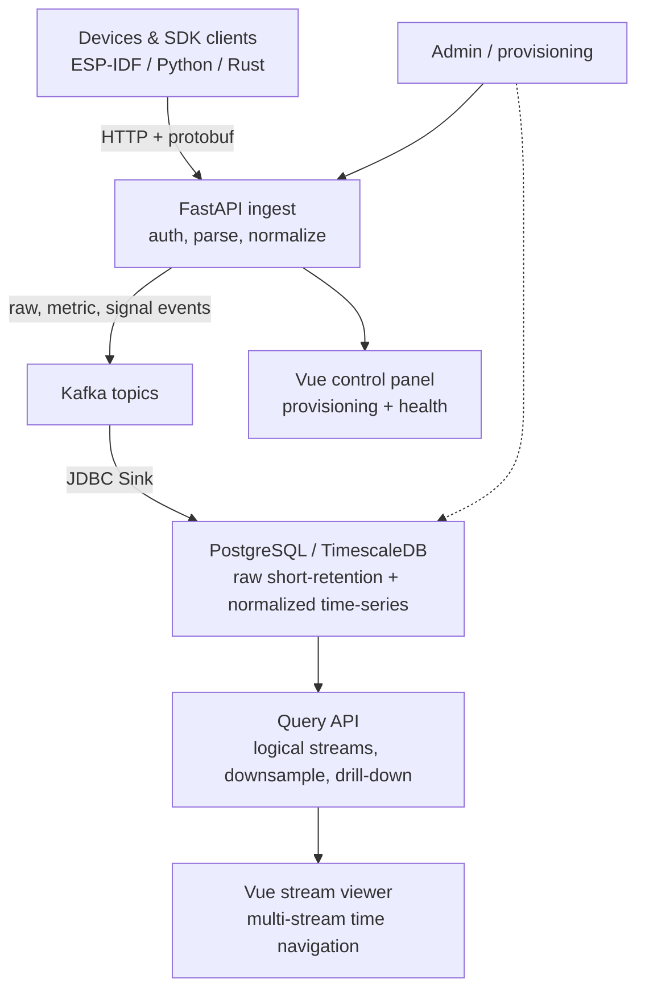
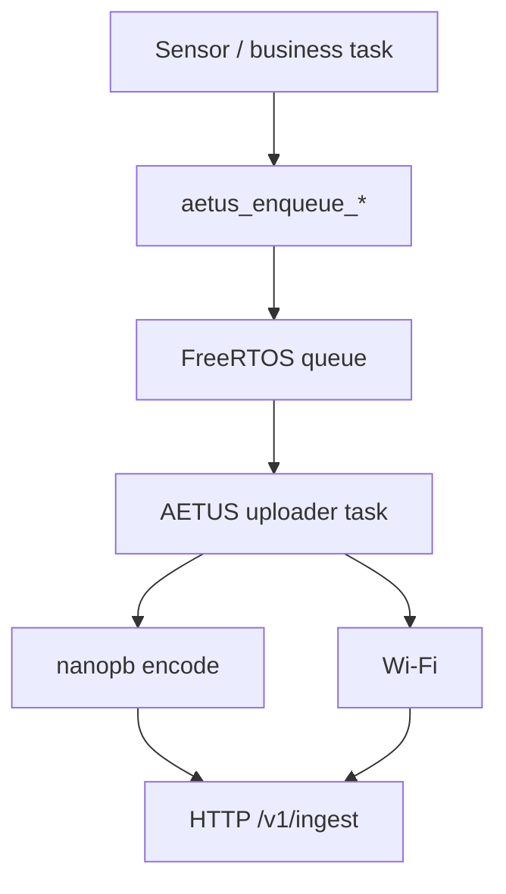

<p align="center">
  
</p>

<h1 align="center">AETUS</h1>

<p align="center">
  <strong>Advanced Edge Telemetry Uplink System</strong>
</p>

<p align="center">
  Protobuf-first edge telemetry ingestion, storage, and visualization for embedded devices and software producers.
</p>

<p align="center">
  <a href="docs/00-index.md">Docs</a>
  ·
  <a href="firmware/esp32-aetus/README.md">Firmware Stack</a>
  ·
  <a href="clients/python-ingest">Python Client</a>
  ·
  <a href="clients/rust-ingest">Rust Client</a>
  ·
  <a href="frontend/ingest-control-panel">Control Panel</a>
  ·
  <a href="frontend/stream-viewer">Stream Viewer</a>
  ·
  <a href="CONTRIBUTING.md">Contributing</a>
  ·
  <a href="SECURITY.md">Security</a>
</p>

<p align="center">
  <a href="https://github.com/donghoonpark/aetus/actions/workflows/ci.yml">
    
  </a>
  <a href="https://github.com/donghoonpark/aetus/actions/workflows/qemu-e2e.yml">
    
  </a>
</p>

---

## What Is AETUS?

AETUS stands for **Advanced Edge Telemetry Uplink System**. It is a protobuf-first stack for moving telemetry from embedded devices, gateways, simulators, and software clients into Kafka, PostgreSQL/TimescaleDB, and stream-oriented visualization tools.

## Why This Exists

Telemetry stacks get messy when device business logic owns HTTP, retries, JSON parsing, and storage-specific details. AETUS keeps that path narrow: producers enqueue telemetry, ingest normalizes it, Kafka decouples writes, and query/viewer layers expose scalar metrics and dense signal frames as logical streams.

Core ideas:

- Keep embedded/client APIs simple and upload work isolated.
- Use protobuf for compact, schema-aware payloads.
- Store short-lived raw events separately from long-lived normalized time-series data.
- Treat metrics and dense signal frames as one stream model for query and visualization.

## Architecture



Detailed Kafka topic, staging table, trigger, and retention design lives in `docs/04-data-pipeline-and-storage.md`.

## Current Features

- `POST /v1/ingest` protobuf telemetry API
- `GET /v1/time` RTC sync endpoint
- `POST /v1/provision` device token issuance
- `GET /v1/metrics` JSON counters and `GET /metrics` Prometheus text counters
- Device bearer token authentication
- Optional HMAC-SHA256 ingest authentication
- In-memory rate limiting for ingest and provisioning
- SQLite-backed control DB for early deployments
- Kafka publisher for raw events and expanded metric records
- SignalFrame ingest path for dense sampled numeric blocks
- Kafka Connect JDBC Sink configs for PostgreSQL
- Plain PostgreSQL base schema plus optional TimescaleDB layer
- Normalized metric storage with dimension tables for devices, boot sessions, and metric definitions
- Normalized signal frame storage with stream definition dimension tables
- Query API for scalar and sampled stream discovery, server-side downsampling, and drill-down
- Vue 3 + Naive UI control panel component
- Vue 3 + Naive UI + ECharts stream viewer component
- ESP-IDF 6.0 portable firmware component for ESP32-class devices
- FreeRTOS queue based uploader task
- nanopb protobuf encoding
- C and C++20 firmware APIs
- NimBLE GATT provisioning path
- WPA2-Enterprise PEAP Wi-Fi path
- ESP32-C5 hardware-in-the-loop upload firmware
- Python ingest client with optional NumPy ndarray signal frame packing and dtype inference
- Rust ingest client with protobuf event builders and signal frame packing

## Current Reference Clients

- ESP-IDF firmware component for ESP32-class devices
- ESP32-C5 hardware-in-the-loop firmware used for real-device validation
- RISC-V ESP32 QEMU firmware stream generator for heavier E2E validation
- nanopb + pybind11 mock device used by Python tests
- Python ingest client SDK for gateways, simulators, notebooks, and non-ESP producers
- Rust ingest client SDK for native gateways and high-throughput edge agents

## Repository Layout

```text
compose/                    # Docker Compose stack for E2E testing
clients/
  python-ingest/            # Python protobuf ingest client SDK
  rust-ingest/              # Rust protobuf ingest client SDK
docs/                       # Architecture, API, protobuf, storage, firmware notes
firmware/
  esp32-aetus/              # Portable ESP-IDF upload component
  examples/                 # Standalone ESP-IDF example apps
  test-apps/                # SIL/QEMU/HIL validation firmware apps
    esp32c5-upload-smoke/   # ESP32-C5 HIL firmware app
    qemu-telemetry/         # QEMU-oriented firmware telemetry generator
frontend/
  ingest-control-panel/     # Portable Vue/Naive UI control panel
  stream-viewer/            # Portable Vue/Naive UI/ECharts stream viewer
services/
  ingest-api/               # FastAPI ingest/provisioning/control service
  query-api/                # FastAPI logical stream query and downsampling service
  kafka/                    # Self-managed Kafka image
  kafka-connect/            # JDBC sink image and connector configs
  postgres/                 # PostgreSQL/TimescaleDB schema
tests/
  mock-device-nanopb/       # nanopb + pybind11 mock device fixture
```

## Quick Start

### 1. Start the backend stack

```bash
docker compose -f compose/e2e-compose.yml up --build
```

Useful local endpoints:

- Ingest API: `http://127.0.0.1:18000`
- Query API: `http://127.0.0.1:18001`
- Kafka Connect: `http://127.0.0.1:18083`
- PostgreSQL: `127.0.0.1:15432`

The compose stack seeds a development device:

- Device ID: `esp32c5-test-001`
- Token: `devtok_test_001`

By default the ingest control plane uses SQLite at `/data/control.db` and writes hourly online backups to `/data/control-backups` in the same compose volume. For multi-pod operation, set `AETUS_CONTROL_DB_BACKEND=postgres` and keep control tables in a separate PostgreSQL schema such as `control`.

### 2. Run backend tests

```bash
cd services/ingest-api
uv run pytest -q
```

The default test suite covers unit tests plus Docker-based E2E pipeline checks. QEMU and real-device HIL paths are intentionally separated because they are heavier and environment-specific.

The compose E2E suite also includes a fault-injection path: Kafka Connect is stopped, ingest still accepts data into Kafka, PostgreSQL writes are observed as delayed, Kafka Connect is restarted, and the Kafka backlog is verified in PostgreSQL.

See [TESTING.md](TESTING.md) for the complete test matrix, including frontend, client SDK, firmware build, QEMU, and HIL paths.

### 3. Run the control panel

```bash
cd frontend/ingest-control-panel
npm install
npm run dev
```

The control panel is a portable Vue component. It can point at an ingest API through its `serverUrl` prop and displays API, Kafka, Kafka Connect, DB, and device provisioning status.

### 4. Run the stream viewer

```bash
cd frontend/stream-viewer
npm install
npm run dev
```

The stream viewer is a portable Vue component. It points at the Query API through `queryServerUrl`, supports remote device search, multi-stream selection, local-time tooltips, wheel zoom, drag panning, zoom-out fetch, and server-side density changes for large ranges.

### 5. Build firmware examples

```bash
source /path/to/esp-idf/export.sh
idf.py -C firmware/examples/basic-telemetry set-target esp32c5 build
idf.py -C firmware/examples/cpp-basic set-target esp32c5 build
idf.py -C firmware/examples/cpp-signal-frame set-target esp32c5 build
```

For local HIL credentials, keep secrets in an untracked `.env.hil` file. Do not commit Wi-Fi credentials or device tokens.

## Firmware Model

The firmware stack is designed so product code does not need to know about HTTP or protobuf details.



Minimal C usage:

```c
aetus_telemetry_t telemetry;
aetus_telemetry_init(&telemetry);
aetus_telemetry_set_timestamp_rtc(&telemetry);
aetus_telemetry_add_double(&telemetry, "temperature", 22.5, "celsius");
aetus_enqueue_telemetry(&telemetry, pdMS_TO_TICKS(1000));
```

Minimal C++20 usage:

```cpp
auto telemetry = aetus::Telemetry()
                     .timestamp_from_rtc()
                     .add_double("temperature", 22.5, "celsius")
                     .add_int64("battery_mv", 4012, "mV");

ESP_ERROR_CHECK(telemetry.enqueue(pdMS_TO_TICKS(1000)));
```

See [firmware/esp32-aetus](firmware/esp32-aetus/README.md) for the full embedded API.

## Client SDKs

Python:

```python
import numpy as np
from aetus_ingest_client import AetusIngestClient, channel

samples = np.array([[120, -12], [121, -10]], dtype=np.int16)

with AetusIngestClient(
    base_url="http://127.0.0.1:18000",
    device_id="python-device-001",
    token="devtok_...",
) as client:
    client.send_signal_frame(
        stream_key="adc.raw",
        sample_interval_ns=1_000_000,
        channels=[channel("adc_a", "count"), channel("adc_b", "count")],
        samples=samples,
    )
```

Python ndarray uploads infer encoding from dtype when `encoding` is omitted. Supported mappings are `float32 -> float32_le`, `int16 -> int16_le`, `uint16 -> uint16_le`, and `int32 -> int32_le`. `float64` arrays are accepted with a warning and downcast to `float32_le` to keep signal frames compact.

Rust provides the same event-building model for metric sets, status/alert events, and dense signal frames. See [clients/rust-ingest](clients/rust-ingest/README.md).

## Data Model

AETUS stores three shapes of data:

- `raw_device_events`: short-retention debugging and replay inspection table
- `device_metric_points`: long-retention normalized time-series metric table
- `device_signal_frames`: long-retention dense sampled signal frame table

Metric points and signal frames use integer surrogate keys for repeated strings such as `device_id`, `boot_id`, metric names, and signal stream definitions:

- `devices`
- `device_boot_sessions`
- `metric_definitions`
- `signal_stream_definitions`
- `device_metric_points`
- `device_signal_frames`

The base schema in `services/postgres/initdb/00-base.sql` runs on plain PostgreSQL. The optional TimescaleDB layer in `services/postgres/initdb/10-timescale.sql` adds hypertable, compression, and retention policies.

Provisioning/control metadata is deliberately separate from telemetry storage. Small deployments can use SQLite with periodic backups; larger deployments can switch the same FastAPI API surface to PostgreSQL by setting `AETUS_CONTROL_DB_BACKEND=postgres`, `AETUS_CONTROL_DATABASE_URL`, and `AETUS_CONTROL_DB_SCHEMA`.

## Query And Visualization

The Query API presents telemetry as streams:

- Scalar streams come from normalized metric points.
- Sampled streams come from dense signal frames.
- String scalar streams are exposed as timestamped state/event markers.
- Numeric sampled streams can be returned as raw samples or min/max envelopes depending on requested range and point budget.

The stream viewer consumes that logical stream contract. Host applications pass a Query API URL and can embed the panel without knowing the underlying PostgreSQL, TimescaleDB, metric, or signal-frame table layout.

## Security Posture

AETUS currently targets restricted device networks, not direct public-internet exposure. The ingest path is designed to be operationally simple for private network deployments while keeping a stronger optional authentication mode available.

- Bearer token mode is the simplest path for isolated deployments.
- HMAC-SHA256 mode is strongly recommended when the device network is shared, less trusted, or routed through more infrastructure.
- HMAC support is enabled by default and can be disabled with `AETUS_HMAC_AUTH_ENABLED=false`.
- Ingest can be made HMAC-only with `AETUS_HMAC_AUTH_REQUIRED=true`.
- `/v1/time` currently uses bearer authentication.
- Source CIDR limits and in-memory rate limits are applied before ingest processing.
- The admin/control surfaces are intended for internal networks unless protected by a reverse proxy or an additional admin auth layer.

## Project Status

AETUS embedded ingest and backend ingest paths are close to product freeze for restricted-network deployments. Query/visualization, public-internet hardening, and long-running fleet operations remain active areas.

0.1 public readiness:

- Embedded ingest, backend ingest, normalized PostgreSQL storage, and Python/Rust clients are suitable for restricted-network evaluation.
- Query API is feature-closed for the current stream-viewer contract, including JWT-based read authorization, but richer dashboard composition remains alpha.
- Public-internet deployment requires additional infrastructure hardening beyond the defaults in this repository.

Known gaps:

- FlashDB durable backlog integration is still pending.
- Large payload pointer/blob queue API is still pending.
- Public-internet security hardening is intentionally out of current scope.
- SQLite control DB is suitable for early deployments, but high-throughput multi-pod deployments should move to a shared DB backend.
- QEMU and HIL tests are intentionally not part of the default quick test loop.
- Query authorization and richer dashboard composition are still evolving.

## Documentation

Start here:

- [Docs index](docs/00-index.md)
- [Overview](docs/01-overview.md)
- [API](docs/02-api.md)
- [Protobuf](docs/03-protobuf.md)
- [Data pipeline and storage](docs/04-data-pipeline-and-storage.md)
- [Embedded architecture](docs/06-embedded-architecture.md)
- [Standard embedded upload stack](docs/06-2-standard-embedded-upload-stack.md)
- [Implementation status](docs/07-implementation-status.md)

## License

AETUS is distributed under the [MIT License](LICENSE).
