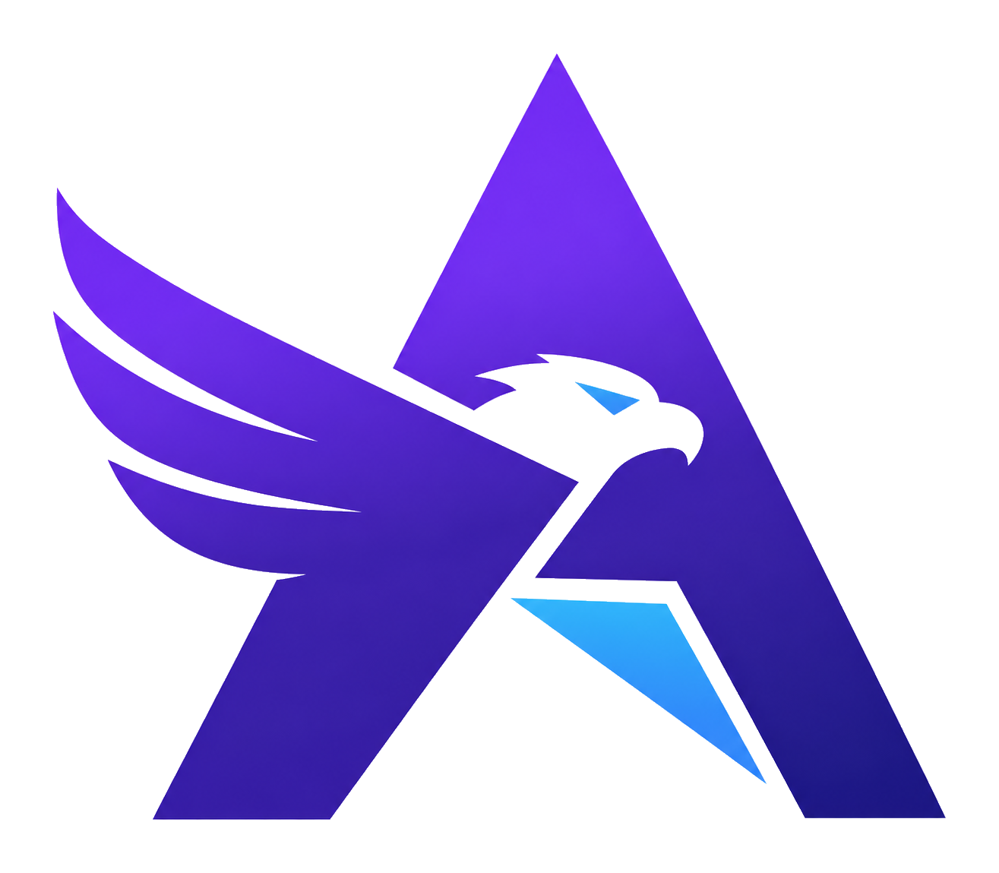
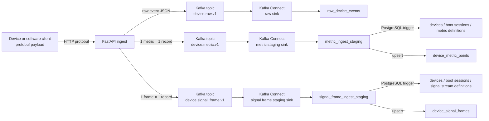
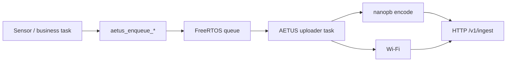

<p align="center">
  
</p>

<h1 align="center">AETUS</h1>

<p align="center">
  Device telemetry ingestion stack with protobuf, FastAPI, Kafka, Kafka Connect, and PostgreSQL/TimescaleDB.
</p>

<p align="center">
  <a href="docs/00-index.md">Docs</a>
  ·
  <a href="firmware/esp32-aetus/README.md">Firmware Stack</a>
  ·
  <a href="frontend/ingest-control-panel">Control Panel</a>
</p>

<p align="center">
  <a href="https://github.com/donghoonpark/aetus/actions/workflows/ci.yml">
    
  </a>
  <a href="https://github.com/donghoonpark/aetus/actions/workflows/qemu-e2e.yml">
    
  </a>
</p>

---

## What Is AETUS?

AETUS is an end-to-end telemetry stack for devices and software clients that need to upload structured sensor data with small client-side overhead.

Clients encode telemetry with protobuf, send it to a FastAPI ingest service, publish normalized records to Kafka, and persist raw events, normalized metric points, and dense signal frames into PostgreSQL. TimescaleDB is supported as an optional layer for hypertables, compression, and retention policies.

This repository is still early, but it already contains a working backend pipeline, ESP-IDF firmware components, hardware-in-the-loop firmware, QEMU-oriented firmware tests, and a portable Vue control panel. `ESP32-C5` is the current reference hardware target, not the intended boundary of the project.

## Why This Exists

Telemetry stacks often start simple and then become tangled: business logic starts doing HTTP, upload retries block sensor work, JSON gets expensive on constrained clients, and backend consumers slowly become bespoke glue code.

AETUS tries to keep those seams clean:

- Device firmware or client SDKs can expose simple enqueue/write APIs and let a dedicated uploader handle transport.
- Protobuf keeps payloads compact and schema-aware without forcing JSON handling onto constrained devices.
- FastAPI only authenticates, parses, normalizes, and publishes.
- Kafka absorbs bursts and decouples ingest from storage.
- Kafka Connect JDBC Sink performs DB writes with minimal custom consumer code.
- PostgreSQL stores short-lived raw events and long-lived normalized metric points / signal frames separately.
- Telemetry payloads stay explicit: one telemetry event is either a scalar `metric_set` or a dense `signal_frame`.

## Architecture



## Current Features

- `POST /v1/ingest` protobuf telemetry API
- `GET /v1/time` RTC sync endpoint
- `POST /v1/provision` device token issuance
- Device bearer token authentication
- Optional HMAC-SHA256 ingest authentication
- In-memory rate limiting for ingest and provisioning
- SQLite-backed control DB for early deployments
- Kafka publisher for raw events and expanded metric records
- SignalFrame ingest path for dense sampled numeric blocks
- Kafka Connect JDBC Sink configs for PostgreSQL
- Plain PostgreSQL base schema plus optional TimescaleDB layer
- Normalized metric storage with dimension tables for devices, boot sessions, and metric definitions
- Normalized signal frame storage with stream definition dimension tables
- Vue 3 + Naive UI control panel component
- ESP-IDF 6.0 portable firmware component for ESP32-class devices
- FreeRTOS queue based uploader task
- nanopb protobuf encoding
- C and C++20 firmware APIs
- NimBLE GATT provisioning path
- WPA2-Enterprise PEAP Wi-Fi path
- ESP32-C5 hardware-in-the-loop upload firmware

## Current Reference Clients

- ESP-IDF firmware component for ESP32-class devices
- ESP32-C5 hardware-in-the-loop firmware used for real-device validation
- RISC-V ESP32 QEMU firmware stream generator for heavier E2E validation
- nanopb + pybind11 mock device used by Python tests
- Python client SDK is planned but not implemented yet

## Repository Layout

```text
compose/                    # Docker Compose stack for E2E testing
docs/                       # Architecture, API, protobuf, storage, firmware notes
firmware/
  esp32-aetus/              # Portable ESP-IDF upload component
  esp32c5-upload-smoke/     # ESP32-C5 HIL firmware app
  esp32-qemu-telemetry/     # QEMU-oriented firmware telemetry generator
  examples/                 # Standalone ESP-IDF example apps
frontend/
  ingest-control-panel/     # Portable Vue/Naive UI control panel
services/
  ingest-api/               # FastAPI ingest/provisioning/control service
  kafka/                    # Self-managed Kafka image
  kafka-connect/            # JDBC sink image and connector configs
  mock-device-nanopb/       # nanopb + pybind11 mock device for tests
  postgres/                 # PostgreSQL/TimescaleDB schema
```

## Quick Start

### 1. Start the backend stack

```bash
docker compose -f compose/e2e-compose.yml up --build
```

Useful local endpoints:

- Ingest API: `http://127.0.0.1:18000`
- Kafka Connect: `http://127.0.0.1:18083`
- PostgreSQL: `127.0.0.1:15432`

The compose stack seeds a development device:

- Device ID: `esp32c5-test-001`
- Token: `devtok_test_001`

### 2. Run backend tests

```bash
cd services/ingest-api
uv run pytest -q
```

The default test suite covers unit tests plus Docker-based E2E pipeline checks. QEMU and real-device HIL paths are intentionally separated because they are heavier and environment-specific.

### 3. Run the control panel

```bash
cd frontend/ingest-control-panel
npm install
npm run dev
```

The control panel is a portable Vue component. It can point at an ingest API through its `serverUrl` prop and displays API, Kafka, Kafka Connect, DB, and device provisioning status.

### 4. Build firmware examples

```bash
source /path/to/esp-idf/export.sh
idf.py -C firmware/examples/basic-telemetry set-target esp32c5 build
idf.py -C firmware/esp32-aetus/examples/cpp-basic set-target esp32c5 build
```

For local HIL credentials, keep secrets in an untracked `.env.hil` file. Do not commit Wi-Fi credentials or device tokens.

## Firmware Model

The firmware stack is designed so product code does not need to know about HTTP or protobuf details.



Minimal C usage:

```c
aetus_telemetry_t telemetry;
aetus_telemetry_init(&telemetry);
aetus_telemetry_set_timestamp_rtc(&telemetry);
aetus_telemetry_add_double(&telemetry, "temperature", 22.5, "celsius");
aetus_enqueue_telemetry(&telemetry, pdMS_TO_TICKS(1000));
```

Minimal C++20 usage:

```cpp
auto telemetry = aetus::Telemetry()
                     .timestamp_from_rtc()
                     .add_double("temperature", 22.5, "celsius")
                     .add_int64("battery_mv", 4012, "mV");

ESP_ERROR_CHECK(telemetry.enqueue(pdMS_TO_TICKS(1000)));
```

See [firmware/esp32-aetus](firmware/esp32-aetus/README.md) for the full embedded API.

## Data Model

AETUS stores three shapes of data:

- `raw_device_events`: short-retention debugging and replay inspection table
- `device_metric_points`: long-retention normalized time-series metric table
- `device_signal_frames`: long-retention dense sampled signal frame table

Metric points and signal frames use integer surrogate keys for repeated strings such as `device_id`, `boot_id`, metric names, and signal stream definitions:

- `devices`
- `device_boot_sessions`
- `metric_definitions`
- `signal_stream_definitions`
- `device_metric_points`
- `device_signal_frames`

The base schema in `services/postgres/initdb/00-base.sql` runs on plain PostgreSQL. The optional TimescaleDB layer in `services/postgres/initdb/10-timescale.sql` adds hypertable, compression, and retention policies.

## Security Posture

The original deployment assumption is a restricted device network, but the stack includes a stronger optional HMAC path.

- Bearer token mode is the simplest path for isolated deployments.
- HMAC-SHA256 mode signs the protobuf body hash and avoids sending the shared secret directly on every ingest request.
- `/v1/time` currently uses bearer authentication.
- Source CIDR limits and in-memory rate limits are applied before ingest processing.
- The admin/control surfaces are intended for internal networks unless protected by a reverse proxy or an additional admin auth layer.

## Project Status

AETUS is not production-ready yet. Treat it as an active reference implementation and lab stack.

Known gaps:

- FlashDB durable backlog integration is still pending.
- Large payload pointer/blob queue API is still pending.
- Admin/control-plane authentication needs a deployment-specific decision.
- SQLite control DB is suitable for early deployments, but high-throughput multi-pod deployments should move to a shared DB backend.
- QEMU and HIL tests are intentionally not part of the default quick test loop.

## Documentation

Start here:

- [Docs index](docs/00-index.md)
- [Overview](docs/01-overview.md)
- [API](docs/02-api.md)
- [Protobuf](docs/03-protobuf.md)
- [Data pipeline and storage](docs/04-data-pipeline-and-storage.md)
- [Embedded architecture](docs/06-embedded-architecture.md)
- [Standard embedded upload stack](docs/06-2-standard-embedded-upload-stack.md)
- [Implementation status](docs/07-implementation-status.md)

## License

No open-source license has been selected yet. Add a license before distributing or accepting external contributions.
