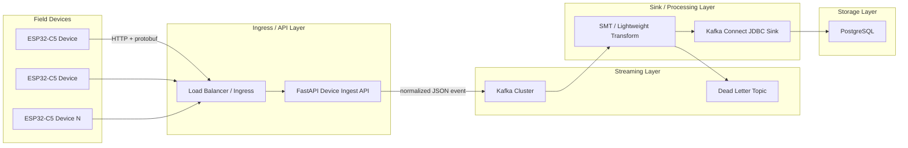
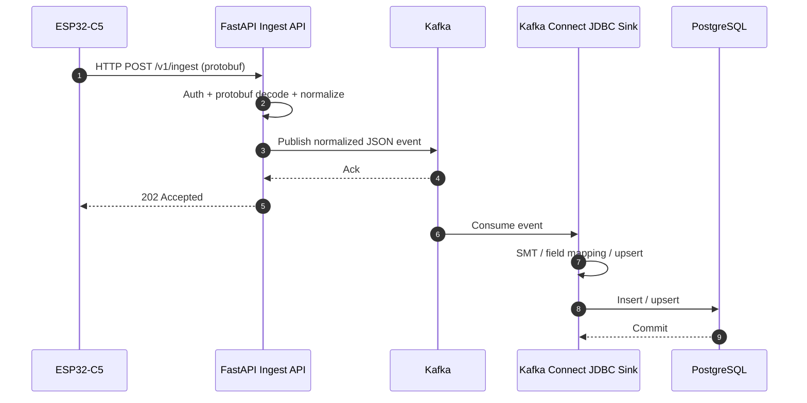
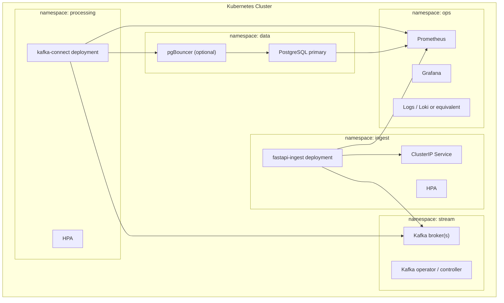
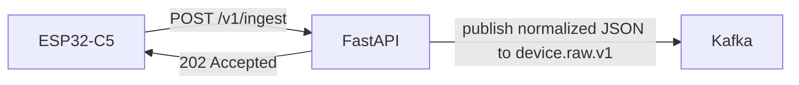
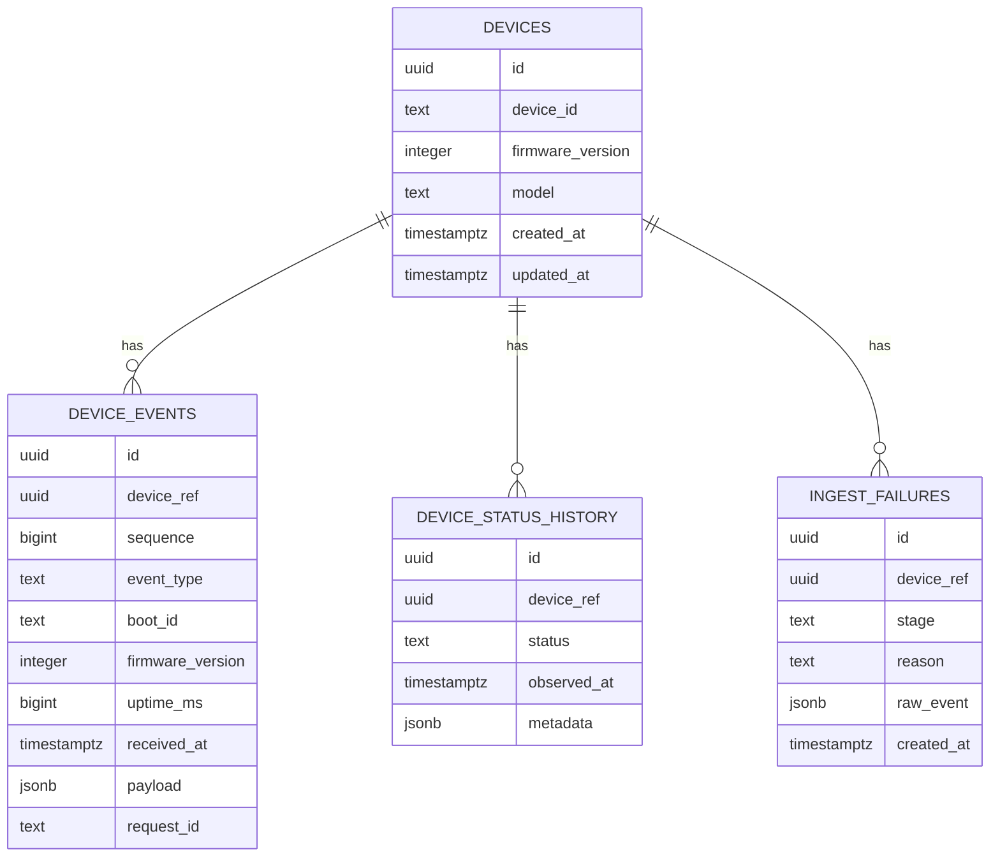
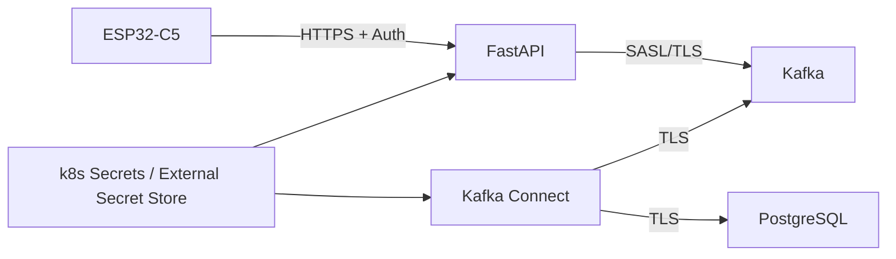
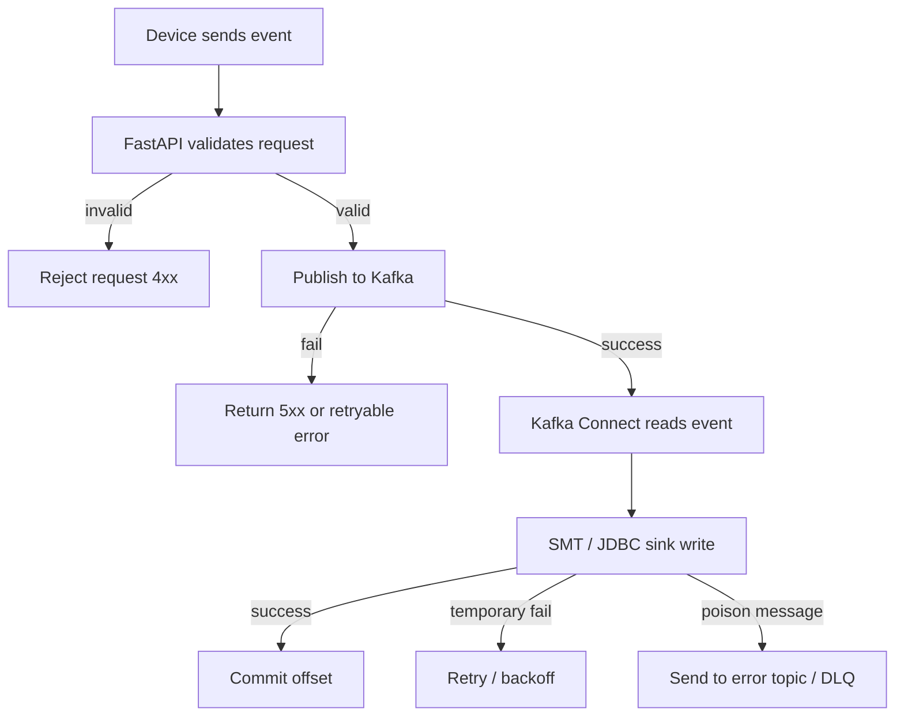
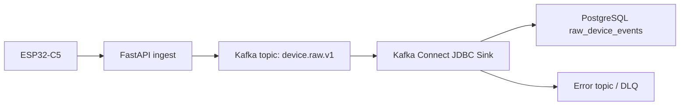

# Embedded Data Collection Stack Draft

> 이 문서는 초기 통합 초안이다.
> 현재 확정 사항은 분할 문서들이 우선이며, 이 파일은 최신 결정과 일부 다를 수 있다.
>
> Obsidian에서 읽기 쉽게 나눈 버전:
> [[00-index]] | [[01-overview]] | [[02-api]] | [[03-protobuf]] | [[04-data-pipeline-and-storage]] | [[05-examples]] | [[06-embedded-architecture]] | [[06-1-event-driven-low-power-system-implementation-plan]] | [[open-decisions]]

## 1. 목적

이 문서는 `ESP32-C5` 계열 임베디드 기기로부터 데이터를 직접 수집하고,
`protobuf -> FastAPI internal object -> Kafka -> PostgreSQL` 파이프라인으로 적재하는 백엔드 스택의 초안 아키텍처를 정의한다.

전제 조건은 다음과 같다.

- 표준 임베디드 모델: `ESP32-C5`
- 서버 진입점: `FastAPI` 기반 HTTP API
- 디바이스 업로드 포맷: `protobuf`
- 비동기 중개: `Kafka`
- 영속 저장: `PostgreSQL`
- 백엔드 배포 환경: `Kubernetes`

이 문서는 구현 명세보다는 구조와 책임 분리, 운영 방식, 그리고 아직 합의되지 않은 기술 의사결정 포인트를 정리하는 데 초점을 둔다.

## 2. 시스템 목표

- 임베디드 기기에서 올라오는 데이터를 안정적으로 수집한다.
- 수집 API와 적재 파이프라인을 분리해 버스트 트래픽을 흡수한다.
- 장애 구간을 명확히 나누고 재처리 가능성을 확보한다.
- 장치 수 증가에 따라 수평 확장이 가능해야 한다.
- `k8s` 상에서 운영 가능한 구조여야 한다.

## 3. 상위 아키텍처



## 4. 권장 책임 분리

### 4.1 Device

`ESP32-C5` 기기는 다음 책임만 갖는 것이 바람직하다.

- 센서/이벤트 데이터 수집
- 최소한의 전처리
- 로컬 버퍼링
- 서버 업로드 재시도
- protobuf 메시지 직렬화

기기 쪽에서 가능한 한 비즈니스 로직을 얇게 유지하면 펌웨어 변경 비용을 줄일 수 있다.

### 4.2 FastAPI Ingest Service

수집 API는 "빠르게 받고, protobuf를 내부 표준 object로 정규화한 뒤 Kafka에 넣는 역할"에 집중한다.

- HTTP 수신
- 인증/인가 검사
- protobuf decode
- 내부 이벤트 object 정규화
- 최소 스키마 검증
- 요청 추적 ID 부여
- Kafka publish
- 즉시 응답 반환

가능하면 이 레이어에서는 DB 직접 적재를 하지 않는다. 그래야 API 응답 지연이 DB 상태에 덜 민감해진다.

### 4.3 Kafka

Kafka는 다음 역할을 담당한다.

- burst traffic 흡수
- API와 적재 로직 분리
- 재처리 가능성 확보
- 소비자 확장 지원

### 4.4 Sink / Low-Code Processing

직접 작성한 Kafka consumer 대신, 가능한 한 `Kafka Connect JDBC Sink` 같은 관리형 또는 설정 기반 컴포넌트로 적재하는 방향을 기본안으로 둔다.

- Kafka 메시지 수신
- 단순 필드 매핑
- PostgreSQL 적재
- 설정 기반 upsert 처리
- 실패 레코드의 에러 토픽 전송

복잡한 비즈니스 로직이 없다면, 이 역할은 애플리케이션 코드보다 커넥터 설정으로 처리하는 편이 운영과 유지보수에 유리하다.

## 5. 데이터 흐름



### 5.1 응답 전략 초안

- API는 Kafka publish 성공 시 `202 Accepted`를 반환
- DB 적재 성공까지 기기가 동기적으로 기다리게 하지 않음
- 적재 실패는 내부 재처리와 운영 알림으로 처리

이 모델은 대량 장치 연결과 불안정 네트워크에 비교적 잘 맞는다.

## 6. 권장 논리 컴포넌트



## 7. API 초안

### 7.1 기본 엔드포인트

- `POST /v1/ingest`
- `GET /v1/healthz`
- `GET /v1/readyz`

별도 status endpoint는 선택 사항이며, 초기 권장안은 `event_type=status`를 `POST /v1/ingest`로 함께 수용하는 방식이다.

### 7.2 ingest API 권장 형태

초기에는 엔드포인트를 많이 나누기보다, 표준 이벤트 수집용 `POST /v1/ingest` 하나를 중심으로 가져가는 것이 좋다.

권장 이유:

- 펌웨어 구현이 단순함
- API 버전 관리가 쉬움
- Kafka 적재 포맷을 일관되게 유지할 수 있음
- 이후 `event_type` 기준으로 서버 측 분기 가능

권장 요청 헤더:

| Header | 필수 여부 | 설명 |
| --- | --- | --- |
| `Content-Type: application/x-protobuf` | 필수 | protobuf 전송 |
| `X-Device-Id` | 필수 | 장치 식별자 |
| `Authorization: Bearer <token>` | 권장 | 장치별 또는 장치군별 토큰 |
| `Idempotency-Key` | 선택 | HTTP 레벨 중복 방지 보조값 |

권장 URI:

- `POST /v1/ingest`

권장 방식:

- 장치 식별자는 path보다 header/body에 둠
- `event_type`과 `schema_version`으로 이벤트 종류와 포맷 버전을 구분
- 서버는 응답을 짧게 유지하고 DB 적재 결과는 동기 반환하지 않음
- 디바이스는 protobuf를 보내고, 서버는 이를 내부 object로 변환해 Kafka에 JSON으로 publish

분리망 환경에서는 인증도 지나치게 무겁게 가져갈 필요가 없다.

현재 권장안:

- `X-Device-Id` + `Authorization: Bearer <device-token>`
- 전송 구간은 가능하면 `HTTPS`
- 네트워크 ACL로 허용된 대역에서만 ingress 접근

이 방식이면 펌웨어 구현이 단순하고, 운영자가 장치 토큰 회전도 비교적 쉽게 관리할 수 있다.

### 7.3 디바이스 protobuf 메시지 권장 구조

필드 설계 원칙:

- upsert/중복 제거에 필요한 값은 공통 헤더에 둠
- 장치 공통 메타데이터는 작게 유지
- 이벤트 종류별 본문은 `oneof`로 분리
- 반드시 `schema_version`을 포함해 계약 변경을 관리함
- 정확하지 않은 RTC에 의존하지 않도록 절대 timestamp는 필수로 두지 않음

권장 필드:

| Field | 타입 | 필수 여부 | 설명 |
| --- | --- | --- | --- |
| `schema_version` | `uint32` | 필수 | 이벤트 계약 버전 |
| `device_id` | `string` | 필수 | 장치 고유 ID |
| `sequence` | `uint64` | 필수 | 장치 내부 단조 증가 번호 |
| `event_type` | `enum` | 필수 | `telemetry`, `status`, `alert` |
| `boot_id` | `string` | 선택 | 재부팅 세션 식별자 |
| `firmware_version` | `uint32` | 선택 | packed integer 버전 |
| `uptime_ms` | `uint64` | 선택 | 장치 부팅 이후 경과 시간 |
| `body` | `oneof` | 필수 | 실제 이벤트 본문 |

기본 멱등 키:

- `device_id + sequence`

확장 멱등 키:

- `device_id + boot_id + sequence`

초기에는 `device_id + sequence`만으로 충분할 가능성이 높다.

`boot_id`는 다음 조건에서만 도입하면 된다.

- 장치가 재부팅 후 `sequence`를 다시 0부터 시작함
- 장치 교체/리셋 후 sequence 충돌 가능성이 큼
- 운영 중 재전송 구간과 재부팅 구간을 명확히 구분하고 싶음

`boot_ts`보다 `boot_id`를 우선 추천하는 이유:

- RTC 정확도에 의존하지 않음
- 세션 식별 목적에 더 직접적임
- 서버 파싱 시 절대시각 해석이 필요 없음

### 7.4 디바이스 protobuf 의미 예시

예를 들어 텔레메트리 이벤트는 개념적으로 아래 정보를 담는다.

- `schema_version = 1`
- `device_id = "esp32c5-001"`
- `sequence = 10452`
- `event_type = EVENT_TYPE_TELEMETRY`
- `telemetry.metrics = [temperature, humidity, battery]`

### 7.5 서버 수신 후 Kafka publish 형태 예시

```json
{
  "request_id": "req-7bdb4f1e",
  "received_at": "2026-04-26T09:00:01Z",
  "source_ip": "masked-or-dropped",
  "tenant_id": "default",
  "schema_version": 1,
  "device_id": "esp32c5-001",
  "sequence": 10452,
  "event_type": "telemetry",
  "firmware_version": 1002003,
  "payload": {
    "metrics": [
      {
        "key": "temperature",
        "type": "double",
        "value": 21.4,
        "unit": "celsius"
      },
      {
        "key": "humidity",
        "type": "double",
        "value": 44.8,
        "unit": "percent"
      },
      {
        "key": "battery",
        "type": "double",
        "value": 3.82,
        "unit": "volt"
      }
    ]
  }
}
```

### 7.6 응답 형태 권장안

성공 응답은 최소한의 ack 정보만 반환하는 것이 좋다.

예시:

```json
{
  "request_id": "req-7bdb4f1e",
  "status": "accepted",
  "accepted_at": "2026-04-26T09:00:01Z"
}
```

권장 상태 코드:

| Status | 의미 | 장치 동작 권장 |
| --- | --- | --- |
| `202 Accepted` | Kafka enqueue 성공 | 성공 처리 |
| `400 Bad Request` | 필수 필드 누락/형식 오류 | 재시도하지 않음 |
| `401 Unauthorized` | 인증 실패 | 설정 점검 후 재시도 |
| `409 Conflict` | `device_id + sequence` 충돌 등 정책 위반 | 장치 상태 점검 |
| `429 Too Many Requests` | rate limit | 지수 백오프 후 재시도 |
| `500/503` | 서버 일시 장애 | 지수 백오프 후 재시도 |

### 7.7 배치 ingest는 2단계로 보는 것이 좋음

처음부터 batch endpoint를 넣을 수도 있지만, 펌웨어/운영 복잡도를 생각하면 순서를 나누는 편이 안전하다.

1단계 권장:

- 단건 이벤트 업로드만 지원
- `POST /v1/ingest`

2단계 확장:

- 오프라인 버퍼 flush를 위한 배치 업로드 추가
- `POST /v1/ingest/batch`

배치 예시:

```json
{
  "schema_version": 1,
  "device_id": "esp32c5-001",
  "events": [
    {
      "sequence": 10452,
      "event_type": "telemetry",
      "payload": {
        "metrics": [
          {
            "key": "temperature",
            "type": "double",
            "value": 21.4
          }
        ]
      }
    },
    {
      "sequence": 10453,
      "event_type": "telemetry",
      "uptime_ms": 5350123,
      "payload": {
        "metrics": [
          {
            "key": "temperature",
            "type": "double",
            "value": 21.6
          }
        ]
      }
    }
  ]
}
```

초기에는 단건 API만 먼저 여는 쪽을 추천한다.

이유:

- 장애 분석이 쉬움
- 멱등성 정책이 단순함
- FastAPI와 Kafka publish 흐름이 단순함

### 7.8 상태 보고 이벤트 제안

상태성 이벤트를 일반 ingest로 같이 받을 수도 있지만, 운영적으로는 별도 endpoint가 유용할 수 있다.

권장 용도:

- heartbeat
- online/offline 추적
- RSSI, free heap, reboot reason 보고

예시:

```json
{
  "schema_version": 1,
  "status": "online",
  "payload": {
    "rssi": -67,
    "free_heap": 183240,
    "uptime_sec": 5320,
    "reboot_reason": "power_on"
  }
}
```

단, 코드와 운영을 더 단순하게 가져가려면 이것도 `POST /v1/ingest`로 통합하고 `event_type=status`로 처리하는 방식이 더 낫다.

현재 요구사항 기준 추천:

- 외부 공개 API는 사실상 `POST /v1/ingest` 하나를 표준으로 삼음
- `status`도 동일 endpoint에 `event_type=status`로 수용
- 별도 status endpoint는 운영 편의가 꼭 필요할 때만 추가

### 7.9 서버 검증 책임 제안

FastAPI에서 해야 할 검증:

- 인증 검증
- protobuf decode 성공 여부
- `sequence` 타입 및 범위 검증
- `oneof body` 존재 여부 검증
- 본문 최대 크기 제한
- `schema_version` 지원 여부 검증

FastAPI에서 하지 않는 것이 좋은 것:

- 복잡한 비즈니스 규칙 해석
- DB 조회 기반 중복 판정
- 다중 테이블 정규화

### 7.10 요청 크기와 재시도 정책 제안

임베디드 장치 특성상 API 계약에 운영 제한을 같이 적어두는 것이 좋다.

권장 시작값:

- 요청 body 최대 크기: `64 KB` 또는 `128 KB`
- 요청 timeout: `3~5초`
- 재시도: `429`, `5xx`, 네트워크 timeout에만 수행
- 백오프: exponential backoff + jitter
- 기기 로컬 버퍼는 최근 N개 이벤트 보관

### 7.11 추천 ingest API 형태 요약

가장 추천하는 초기 형태는 아래와 같다.



추천 계약:

- 단일 endpoint `POST /v1/ingest`
- 요청 본문은 `protobuf`
- `schema_version`, `device_id`, `sequence`, `event_type`, `body` 필수
- `boot_id`, `firmware_version`, `uptime_ms`는 선택
- `received_at`는 서버가 부여
- 인증은 `Bearer token` 또는 `X-Device-Token` 같은 정적 토큰 기반
- 응답은 `202 Accepted`
- FastAPI가 내부 표준 object로 변환한 뒤 적재 친화적 JSON을 Kafka에 publish

### 7.12 FastAPI ingest 예제 코드

아래 예제는 `protobuf` 바디를 받아 내부 표준 object로 정규화하고, Kafka publish payload를 만드는 흐름을 보여준다.

```python
from datetime import datetime, timezone
from typing import Any

from fastapi import FastAPI, Header, HTTPException, Request

from aetus.ingest.v1.ingest_pb2 import (
    EVENT_TYPE_ALERT,
    EVENT_TYPE_STATUS,
    EVENT_TYPE_TELEMETRY,
    IngestEvent,
)

app = FastAPI()


def normalize_payload(event: IngestEvent) -> dict[str, Any]:
    body = event.WhichOneof("body")
    if body == "telemetry":
        metrics = []
        for metric in event.telemetry.metrics:
            value_kind = metric.WhichOneof("value")
            if value_kind == "int_value":
                value = metric.int_value
                value_type = "int"
            elif value_kind == "double_value":
                value = metric.double_value
                value_type = "double"
            elif value_kind == "bool_value":
                value = metric.bool_value
                value_type = "bool"
            elif value_kind == "string_value":
                value = metric.string_value
                value_type = "string"
            elif value_kind == "bytes_value":
                value = metric.bytes_value.hex()
                value_type = "bytes_hex"
            else:
                raise HTTPException(status_code=400, detail="metric value missing")

            metrics.append(
                {
                    "key": metric.key,
                    "type": value_type,
                    "value": value,
                    "unit": metric.unit or None,
                }
            )
        return {"metrics": metrics}

    if body == "status":
        return {
            "status": int(event.status.status),
            "rssi": event.status.rssi,
            "free_heap": event.status.free_heap,
            "reboot_reason": event.status.reboot_reason or None,
        }

    if body == "alert":
        return {
            "code": event.alert.code,
            "severity": int(event.alert.severity),
            "message": event.alert.message,
        }

    raise HTTPException(status_code=400, detail="body missing")


def event_type_name(event_type: int) -> str:
    if event_type == EVENT_TYPE_TELEMETRY:
        return "telemetry"
    if event_type == EVENT_TYPE_STATUS:
        return "status"
    if event_type == EVENT_TYPE_ALERT:
        return "alert"
    return "unknown"


@app.post("/v1/ingest")
async def ingest(
    request: Request,
    x_device_id: str = Header(..., alias="X-Device-Id"),
    authorization: str | None = Header(None, alias="Authorization"),
):
    if not authorization:
        raise HTTPException(status_code=401, detail="missing authorization")

    raw = await request.body()
    event = IngestEvent()

    try:
        event.ParseFromString(raw)
    except Exception as exc:
        raise HTTPException(status_code=400, detail="invalid protobuf") from exc

    if event.device_id != x_device_id:
        raise HTTPException(status_code=400, detail="device id mismatch")

    if not event.sequence:
        raise HTTPException(status_code=400, detail="sequence required")

    normalized = {
        "schema_version": event.schema_version,
        "device_id": event.device_id,
        "sequence": event.sequence,
        "event_type": event_type_name(event.event_type),
        "boot_id": event.boot_id or None,
        "firmware_version": event.firmware_version or None,
        "uptime_ms": event.uptime_ms or None,
        "received_at": datetime.now(timezone.utc).isoformat(),
        "payload": normalize_payload(event),
    }

    # TODO: publish `normalized` to Kafka topic `device.raw.v1`

    return {
        "status": "accepted",
        "device_id": event.device_id,
        "sequence": event.sequence,
    }
```

이 예제의 핵심은 다음과 같다.

- 외부 입력은 `protobuf`
- 내부 처리는 Python object
- Kafka publish 직전엔 운영 친화적인 JSON 이벤트
- 복잡한 적재 로직은 Kafka Connect로 위임

## 8. Kafka 토픽 초안

| Topic | 설명 | 비고 |
| --- | --- | --- |
| `device.raw.v1` | API가 받은 원본 이벤트 | 최초 진입 토픽 |
| `device.validated.v1` | 검증/정규화 완료 이벤트 | 선택 사항 |
| `device.dlq.v1` | 처리 실패 이벤트 | 분석 및 재처리 |
| `device.status.v1` | heartbeat, online/offline 상태 | 운영성 강화 |

### 8.1 메시지 키 초안

기본안은 `device_id`를 메시지 키로 사용한다.

장점:

- 동일 기기 이벤트의 파티션 정렬 보장
- 순서 의존 처리에 유리

주의점:

- 특정 장치에 트래픽이 몰리면 hotspot이 생길 수 있음

### 8.2 Sink 친화적인 이벤트 형태

consumer 코드를 줄이려면 Kafka 토픽에 들어가는 이벤트가 이미 PostgreSQL 적재에 가깝게 정리되어 있어야 한다.

권장 방향:

- 상위 메타데이터는 평평한 필드로 유지
- protobuf `oneof body`는 서버에서 `payload jsonb`로 평탄화
- `payload`는 `jsonb` 컬럼으로 그대로 저장
- upsert key로 쓸 필드(`device_id`, `sequence`)는 최상위에 둠
- 과도한 중첩 JSON은 피함

예시:

```json
{
  "device_id": "esp32c5-001",
  "sequence": 10452,
  "event_type": "telemetry",
  "firmware_version": 1002003,
  "received_at": "2026-04-26T09:00:01Z",
  "request_id": "req-7bdb4f1e",
  "payload": {
    "metrics": [
      {
        "key": "temperature",
        "type": "double",
        "value": 21.4
      }
    ]
  }
}
```

## 9. PostgreSQL 적재 모델 초안

초기에는 단순한 OLTP 구조로 시작하고, 시계열 요구가 강해지면 확장하는 방향을 권장한다.

### 9.1 주요 테이블 후보

- `devices`
- `device_events`
- `device_status_history`
- `ingest_failures`

### 9.2 관계 개요



### 9.3 idempotency 초안

중복 전송을 고려하면 초기에는 `device_id + sequence` 조합이 가장 단순하다.

권장 시작안:

- 기기에서 단조 증가 `sequence` 제공
- DB에 `(device_ref, sequence)` unique index 구성
- 장치가 재부팅 시 sequence를 리셋한다면 그때 `boot_id`를 추가 도입
- sink connector는 `upsert` 모드 사용
- 메시지 key 또는 레코드 필드에서 PK를 추출할 수 있게 설계

### 9.4 Sink 기반 적재 전략

직접 구현 consumer를 피하려면 다음 두 테이블 전략이 현실적이다.

1. `raw_device_events`
2. 필요 시 후속 배치/뷰/SQL로 정규화 테이블 파생

이 방식의 장점:

- Kafka Connect JDBC Sink로 바로 적재 가능
- 적재 경로에 커스텀 코드가 거의 없음
- 스키마 변경 충격을 줄이기 쉬움

예시 적재 테이블:

| Column | Type | 설명 |
| --- | --- | --- |
| `device_id` | `text` | 장치 식별자 |
| `sequence` | `bigint` | 장치 내 단조 증가 번호 |
| `event_type` | `text` | 이벤트 타입 |
| `boot_id` | `text` | 부팅 세션 식별자, 선택 저장 |
| `firmware_version` | `integer` | packed integer 펌웨어 버전, 선택 저장 |
| `uptime_ms` | `bigint` | 부팅 이후 경과 시간, 선택 저장 |
| `received_at` | `timestamptz` | API 수신 시각 |
| `request_id` | `text` | 추적 ID |
| `payload` | `jsonb` | 센서/이벤트 데이터 |

## 10. Kubernetes 배포 관점

### 10.1 FastAPI

- `Deployment`
- `Service`
- `Ingress`
- `HPA`
- readiness/liveness probe

### 10.2 Kafka Connect

- `Deployment` 또는 managed Kafka Connect
- JDBC Sink connector 설정으로 PostgreSQL 적재
- connector task 수를 topic partition 수와 연동
- 에러 토픽 및 retry 정책을 설정으로 관리

### 10.3 Kafka

선택지는 크게 두 가지다.

1. 클러스터 내부 운영
2. managed Kafka 사용

초기 운영 복잡도를 낮추려면 managed 서비스를 선호할 수 있다. 다만 네트워크, 비용, 데이터 주권 요구사항에 따라 달라진다.

### 10.4 PostgreSQL

PostgreSQL은 가능한 한 운영형 서비스 또는 검증된 HA 구성을 권장한다.

- managed PostgreSQL 우선 검토
- self-managed 시 backup, failover, vacuum, connection pool 운영 부담 증가

## 11. 관측성 초안

### 11.1 메트릭

- API request count / latency / error rate
- Kafka publish latency
- topic lag
- sink throughput
- DB insert latency
- dead letter rate
- device online count

### 11.2 로그

- request_id 기반 추적
- device_id 기반 검색 가능성 확보
- payload 전체 로그는 개인정보/비용 관점에서 제한

### 11.3 알림

- sink task failure 또는 consumer lag 임계치 초과
- DLQ 증가율 급증
- DB connection saturation
- ingest API 5xx 증가

## 12. 보안 초안



권장 고려 사항:

- device 인증: 정적 bearer token, device token header, 또는 필요 시 HMAC/mTLS
- 서버 간 통신 암호화
- secret rotation 방식 정의
- tenant 분리가 필요하면 인증 토큰 구조에 반영

## 13. 실패 처리 초안



핵심은 다음이다.

- API 레이어 실패와 DB 적재 실패를 분리한다.
- 재시도 가능한 실패와 폐기해야 할 메시지를 구분한다.
- DLQ는 "버리는 곳"이 아니라 운영 분석 대상이어야 한다.

## 14. 현재 시점 권장 시작안

복잡도를 과도하게 올리지 않는 초기안은 아래와 같다.

1. 기기는 `HTTPS`로 FastAPI에 `protobuf` 업로드
2. FastAPI는 protobuf decode와 최소 검증 후 내부 표준 object로 정규화해 `device.raw.v1`에 publish
3. `Kafka Connect JDBC Sink`가 PostgreSQL에 upsert
4. 실패 메시지는 `device.dlq.v1`로 이동
5. `device_id + sequence`로 멱등성 보장
6. PostgreSQL은 일반 테이블 + `jsonb payload`로 시작
7. `k8s`에는 API와 Kafka Connect만 우선 올리고, Kafka/PG는 managed 여부를 별도 결정

## 15. 같이 결정해야 할 기술 의사결정

아래 항목들은 지금 바로 방향을 잡으면 이후 상세 설계가 훨씬 빨라진다.

### A. Device to Server 프로토콜

현재 초안은 `HTTP/HTTPS` 기반이다.

비교 포인트:

- HTTP: 구현 단순, 디버깅 쉬움, FastAPI와 잘 맞음
- MQTT: 저전력/불안정 네트워크에 유리, 하지만 현재 구상한 API 구조와는 별도 브로커 고려 필요

현재 아이디어와 가장 자연스럽게 맞는 쪽은 `HTTP/HTTPS`다.

### B. Device 인증 방식

후보:

- 장치별 정적 bearer token
- 장치군 공통 token + 네트워크 ACL
- 장치별 shared secret 기반 HMAC 서명
- mTLS

분리망 환경의 초기 권장안은 장치별 정적 bearer token이다.

이유:

- 펌웨어 구현이 가장 단순함
- RTC나 nonce 관리가 없어도 됨
- HMAC/mTLS보다 초기 운영 복잡도가 낮음

보완책:

- ingress 레벨 IP allowlist
- 장치군 또는 장치별 토큰 발급
- 토큰 주기적 교체 정책

### C. Kafka 배치 방식

후보:

- k8s 내부 self-managed Kafka
- managed Kafka

초기 권장안:

- 가능하면 managed Kafka

이유:

- 운영 복잡도 절감
- 브로커/디스크/업그레이드 부담 감소

### D. PostgreSQL 적재 모델

후보:

- 순수 PostgreSQL
- PostgreSQL + TimescaleDB 확장

초기 권장안:

- 순수 PostgreSQL로 시작

조건:

- 이벤트 양이 매우 크거나 시계열 집계가 핵심이면 TimescaleDB를 조기 검토

### E. 스키마 관리 방식

후보:

- 디바이스는 protobuf, Kafka는 정규화 JSON
- Kafka까지 protobuf 유지

초기 권장안:

- 디바이스 업로드는 `protobuf`
- FastAPI 내부에서 표준 object로 정규화
- Kafka에는 운영 친화적인 JSON 이벤트를 publish

이유:

- 디바이스 효율성과 서버 운영 편의의 균형이 좋음
- Kafka Connect 같은 저코드 sink와 잘 맞음

### F. Kafka 이후 처리 방식

후보:

- 커스텀 consumer 서비스 작성
- `Kafka Connect JDBC Sink` 사용
- `Redpanda Connect` 또는 `Benthos` 같은 저코드 파이프라인 사용

현재 요구사항 기준 권장안:

- 1차 적재는 `Kafka Connect JDBC Sink`
- 복잡한 변환이 생기면 그때만 저코드 파이프라인을 추가

이유:

- 가장 코드가 적음
- PostgreSQL sink가 표준 패턴에 가까움
- 운영 시 task/connector 설정으로 조정 가능

## 16. 다음 논의 제안

다음 순서로 합의하면 좋다.

1. 장치 인증 방식을 무엇으로 할지
2. Kafka와 PostgreSQL을 managed로 둘지 self-managed로 둘지
3. 이벤트 payload를 어느 정도까지 정규화할지
4. 장치가 offline일 때 로컬 버퍼와 재전송 정책을 어떻게 둘지

---

초안 기준으로 보면, 지금 가장 먼저 결정할 만한 것은 아래 두 가지다.

- 장치 인증을 `정적 bearer token`으로 갈지, 아니면 장치군 공통 토큰으로 단순화할지
- Kafka/PostgreSQL을 `managed` 전제로 볼지

## 17. 코드 없는 consumer 방향 정리

현재 요구사항을 반영한 추천안은 아래와 같다.



핵심 원칙:

- Kafka 이후 적재는 애플리케이션 코드 대신 connector 설정으로 처리
- FastAPI에서 적재 친화적인 이벤트 포맷으로 정리
- PostgreSQL에는 우선 raw 테이블 중심으로 쌓고, 복잡한 정규화는 뒤로 미룸

이 구성이 특히 잘 맞는 조건:

- 이벤트 변환 로직이 단순함
- `payload`를 `jsonb`로 저장해도 됨
- 실시간 복잡 계산보다 안정적 적재가 우선임

이 구성이 불리해지는 조건:

- 메시지마다 복잡한 비즈니스 룰이 필요함
- 여러 테이블로 분기 적재해야 함
- 적재 전에 외부 시스템 조회가 필요함

그 경우에도 바로 custom consumer를 쓰기보다, 먼저 `Redpanda Connect/Benthos` 같은 저코드 레이어를 검토하는 것이 좋다.

## 18. Protobuf 권장 스키마 초안

현재까지 논의를 반영하면, 디바이스 업로드 포맷은 `protobuf`로 두고 `FastAPI`부터 내부 표준 object로 변환하는 구성이 가장 균형이 좋다.


### 18.1 설계 원칙

- 공통 메타데이터는 작게 유지
- `sequence`는 필수
- `boot_id`는 선택
- `firmware_version`은 `uint32` packed integer를 권장
- `timestamp`는 필수로 두지 않음
- 이벤트 종류별 payload는 `oneof`로 분리
- 미래 확장은 optional 필드 추가로 해결
- 미리 optional 필드를 과하게 넣지 않음

### 18.2 추천 `.proto` 초안

```proto
syntax = "proto3";

package aetus.ingest.v1;

option java_multiple_files = true;
option java_package = "io.aetus.ingest.v1";
option go_package = "aetus/ingest/v1;ingestv1";

enum EventType {
  EVENT_TYPE_UNSPECIFIED = 0;
  EVENT_TYPE_TELEMETRY = 1;
  EVENT_TYPE_STATUS = 2;
  EVENT_TYPE_ALERT = 3;
}

message IngestEvent {
  uint32 schema_version = 1;
  string device_id = 2;
  uint64 sequence = 3;
  EventType event_type = 4;

  string boot_id = 5;
  uint32 firmware_version = 6;
  uint64 uptime_ms = 7;

  oneof body {
    TelemetryPayload telemetry = 10;
    StatusPayload status = 11;
    AlertPayload alert = 12;
  }
}

message TelemetryPayload {
  repeated Metric metrics = 1;
}

message Metric {
  string key = 1;

  oneof value {
    sint64 int_value = 2;
    double double_value = 3;
    bool bool_value = 4;
    string string_value = 5;
    bytes bytes_value = 6;
  }

  string unit = 7;
}

message StatusPayload {
  DeviceStatus status = 1;
  sint32 rssi = 2;
  uint32 free_heap = 3;
  string reboot_reason = 4;
}

enum DeviceStatus {
  DEVICE_STATUS_UNSPECIFIED = 0;
  DEVICE_STATUS_ONLINE = 1;
  DEVICE_STATUS_DEGRADED = 2;
  DEVICE_STATUS_OFFLINE = 3;
}

message AlertPayload {
  string code = 1;
  Severity severity = 2;
  string message = 3;
}

enum Severity {
  SEVERITY_UNSPECIFIED = 0;
  SEVERITY_INFO = 1;
  SEVERITY_WARN = 2;
  SEVERITY_ERROR = 3;
  SEVERITY_CRITICAL = 4;
}
```

### 18.3 이 스키마를 추천하는 이유

- `ESP32`에서 JSON 조립 부담을 줄일 수 있음
- 공통 헤더가 작아서 펌웨어 코드가 단순함
- `telemetry`, `status`, `alert`를 명확히 분리할 수 있음
- `Metric`의 `oneof value`로 숫자/문자열/바이너리를 모두 담을 수 있음
- 서버에서는 이를 Python object로 변환해 통일된 내부 모델로 처리 가능함

### 18.4 서버 내부 object 예시

`FastAPI`는 protobuf를 받은 뒤, 아래 같은 내부 표준 object로 변환하면 된다.

```json
{
  "schema_version": 1,
  "device_id": "esp32c5-001",
  "sequence": 10452,
  "event_type": "telemetry",
  "boot_id": "boot-20260426-01",
  "firmware_version": 1002003,
  "uptime_ms": 5320123,
  "payload": {
    "metrics": [
      {
        "key": "temperature",
        "type": "double",
        "value": 21.4,
        "unit": "celsius"
      },
      {
        "key": "battery",
        "type": "double",
        "value": 3.82,
        "unit": "volt"
      }
    ]
  }
}
```

### 18.5 더 단순한 대안

만약 `Metric` 구조도 과하다고 느껴지면, 1차 표준은 더 단순하게 갈 수 있다.

```proto
message TelemetryPayload {
  optional double temperature = 1;
  optional double humidity = 2;
  optional double battery = 3;
}
```

이 방식은 가장 단순하지만, 센서 종류가 자주 바뀌면 스키마 수정 빈도가 늘어난다.

### 18.6 현재 시점 추천

현 시점에서 가장 균형 잡힌 선택은 다음 둘 중 하나다.

1. 센서 종류가 비교적 고정적이면 `명시적 필드형 TelemetryPayload`
2. 센서 종류가 자주 바뀌면 `repeated Metric + oneof value`

지금까지 대화 기준으로는 확장성과 재사용성을 고려해 `repeated Metric + oneof value` 쪽을 조금 더 추천한다.

다만 펌웨어 구현 단순성이 최우선이면 `temperature`, `humidity`, `battery`처럼 명시적 필드형으로 시작하는 편이 더 쉽다.

### 18.7 버전 진화 원칙

- 새 필드는 뒤 번호로만 추가
- 필드 번호는 재사용하지 않음
- 삭제 시 `reserved` 처리
- `schema_version`은 디버깅과 운영 관찰용으로 두되, 파싱 분기의 유일한 수단으로 의존하지 않음
- 서버 내부 object 모델은 가능한 한 안정적으로 유지

### 18.8 ESP32 nanopb 예제 코드

아래 예제는 `ESP32 + nanopb`에서 텔레메트리 이벤트 하나를 만들어 직렬화하는 최소 흐름을 보여준다.

먼저 `firmware_version` 같은 packed integer 값을 만드는 작은 헬퍼를 둘 수 있다.

```c
#include <stdint.h>

static uint32_t pack_version_u32(uint8_t major, uint8_t minor, uint16_t patch) {
    return ((uint32_t)major << 24) | ((uint32_t)minor << 16) | (uint32_t)patch;
}
```

예:

- `1.2.3` -> `0x01020003`
- `major=1`, `minor=2`, `patch=3`

```c
#include <pb_encode.h>
#include <string.h>
#include "ingest.pb.h"

bool build_telemetry_event(uint8_t *out_buf, size_t out_buf_size, size_t *encoded_size) {
    aetus_ingest_v1_IngestEvent event = aetus_ingest_v1_IngestEvent_init_zero;

    event.schema_version = 1;
    strncpy(event.device_id, "esp32c5-001", sizeof(event.device_id) - 1);
    event.sequence = 10452;
    event.event_type = aetus_ingest_v1_EventType_EVENT_TYPE_TELEMETRY;
    event.firmware_version = pack_version_u32(1, 2, 3);
    event.uptime_ms = 5320123;

    event.which_body = aetus_ingest_v1_IngestEvent_telemetry_tag;
    event.body.telemetry.metrics_count = 3;

    aetus_ingest_v1_Metric *m0 = &event.body.telemetry.metrics[0];
    strncpy(m0->key, "temperature", sizeof(m0->key) - 1);
    m0->which_value = aetus_ingest_v1_Metric_double_value_tag;
    m0->value.double_value = 21.4;
    strncpy(m0->unit, "celsius", sizeof(m0->unit) - 1);

    aetus_ingest_v1_Metric *m1 = &event.body.telemetry.metrics[1];
    strncpy(m1->key, "humidity", sizeof(m1->key) - 1);
    m1->which_value = aetus_ingest_v1_Metric_double_value_tag;
    m1->value.double_value = 44.8;
    strncpy(m1->unit, "percent", sizeof(m1->unit) - 1);

    aetus_ingest_v1_Metric *m2 = &event.body.telemetry.metrics[2];
    strncpy(m2->key, "battery", sizeof(m2->key) - 1);
    m2->which_value = aetus_ingest_v1_Metric_double_value_tag;
    m2->value.double_value = 3.82;
    strncpy(m2->unit, "volt", sizeof(m2->unit) - 1);

    pb_ostream_t stream = pb_ostream_from_buffer(out_buf, out_buf_size);
    if (!pb_encode(&stream, aetus_ingest_v1_IngestEvent_fields, &event)) {
        return false;
    }

    *encoded_size = stream.bytes_written;
    return true;
}
```

메시지에 값을 채우는 흐름을 더 잘게 보면 아래와 같다.

```c
aetus_ingest_v1_IngestEvent event = aetus_ingest_v1_IngestEvent_init_zero;

event.schema_version = 1;
strncpy(event.device_id, "esp32c5-001", sizeof(event.device_id) - 1);
event.sequence = next_sequence();
event.event_type = aetus_ingest_v1_EventType_EVENT_TYPE_TELEMETRY;
event.firmware_version = pack_version_u32(1, 2, 3);
event.uptime_ms = esp_timer_get_time() / 1000ULL;

event.which_body = aetus_ingest_v1_IngestEvent_telemetry_tag;
event.body.telemetry.metrics_count = 1;

aetus_ingest_v1_Metric *metric = &event.body.telemetry.metrics[0];
strncpy(metric->key, "temperature", sizeof(metric->key) - 1);
metric->which_value = aetus_ingest_v1_Metric_double_value_tag;
metric->value.double_value = 21.4;
strncpy(metric->unit, "celsius", sizeof(metric->unit) - 1);
```

직렬화 단계는 보통 아래 순서다.

```c
uint8_t buf[256];
pb_ostream_t stream = pb_ostream_from_buffer(buf, sizeof(buf));

bool ok = pb_encode(&stream, aetus_ingest_v1_IngestEvent_fields, &event);
if (!ok) {
    // stream.errmsg 로 원인 확인 가능
    return false;
}

size_t encoded_size = stream.bytes_written;
```

HTTP 전송은 보통 아래 흐름으로 이어진다.

```c
uint8_t buf[256];
size_t encoded_size = 0;

if (build_telemetry_event(buf, sizeof(buf), &encoded_size)) {
    // POST /v1/ingest
    // Content-Type: application/x-protobuf
    // X-Device-Id: esp32c5-001
    // Authorization: Bearer <device-token>
    // body = buf[0:encoded_size]
}
```

이 예제는 문서 설명용으로 단순화한 것이다.

- 실제 `nanopb` 사용 시에는 문자열 최대 길이와 repeated 배열 최대 개수를 `.options` 파일로 제한하는 편이 좋음
- 메모리를 더 줄이고 싶으면 `repeated Metric` 대신 명시적 필드형 `TelemetryPayload`를 고려할 수 있음
- 큰 바이너리는 `bytes` 필드보다 별도 업로드 경로로 분리하는 편이 안전함

### 18.9 nanopb `.options` 예시

`nanopb`는 생성 코드의 메모리 사용량을 제어하기 위해 `.options` 파일을 함께 두는 편이 좋다.

예시:

```text
IngestEvent.device_id max_size:32
IngestEvent.boot_id max_size:32
Metric.key max_size:24
Metric.unit max_size:16
TelemetryPayload.metrics max_count:8
StatusPayload.reboot_reason max_size:24
AlertPayload.code max_size:24
AlertPayload.message max_size:80
```

이렇게 두면 동적 메모리 사용을 줄이고, `ESP32`에서 버퍼 크기를 예측하기 쉬워진다.

이 두 가지가 정해지면 다음 단계 문서를 훨씬 구체화할 수 있다.
