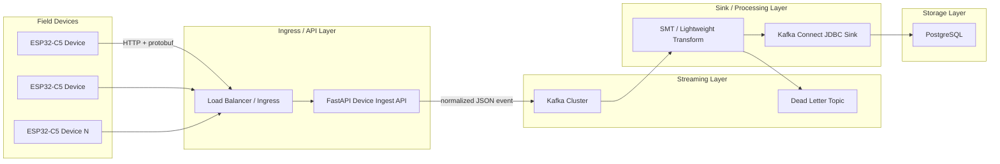
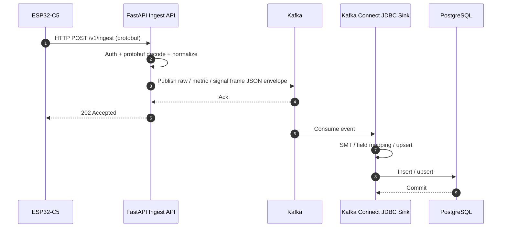
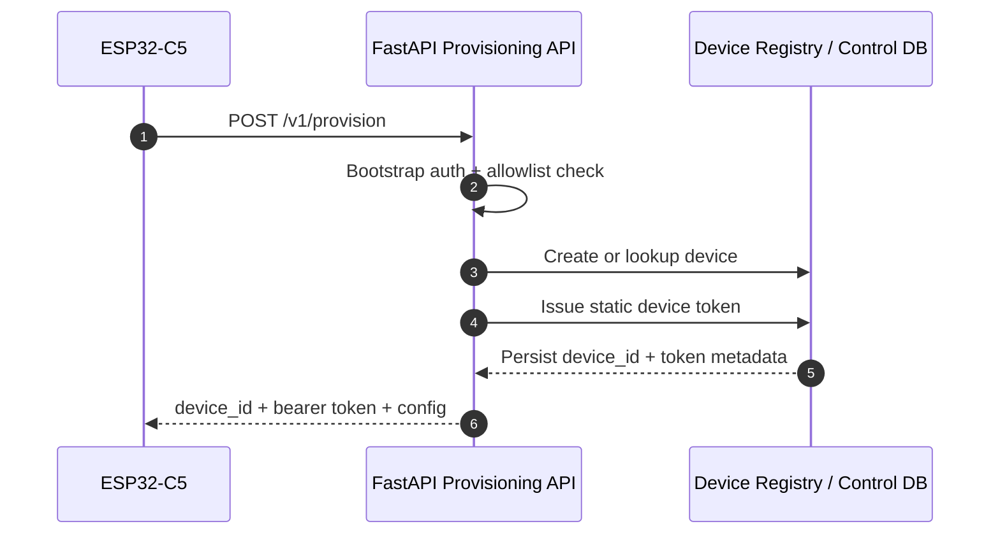
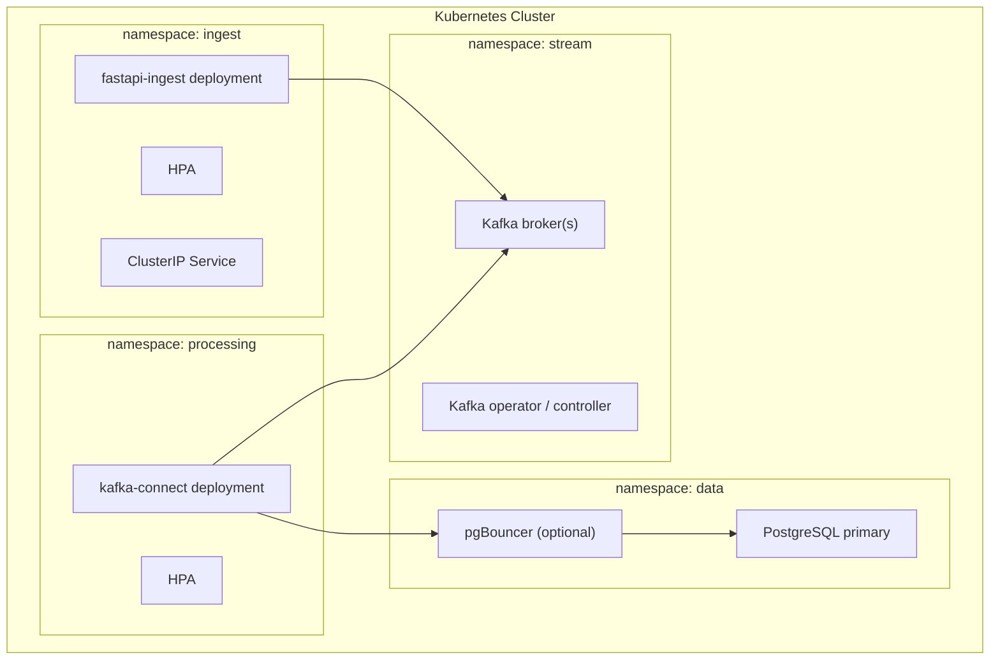

# Overview

## 목적

이 문서는 `ESP32-C5` 계열 임베디드 기기로부터 데이터를 직접 수집하고,
`protobuf -> FastAPI internal object -> Kafka -> PostgreSQL` 파이프라인으로 적재하는 백엔드 스택의 초안 아키텍처를 요약한다.

전제 조건:

- 표준 임베디드 모델: `ESP32-C5`
- 서버 진입점: `FastAPI` 기반 HTTP API
- 디바이스 업로드 포맷: `protobuf`
- 비동기 중개: `Kafka`
- 영속 저장: `PostgreSQL`
- 백엔드 배포 환경: `Kubernetes`
- `Kafka`와 `PostgreSQL`은 분리망 내 self-managed 운영 전제
- `source IP`는 `L4` 직결 환경에서 원본이 보존된다고 가정
- ingest/provisioning API는 기기망 허용 대역에서만 접근 가능

## 시스템 목표

- 임베디드 기기에서 올라오는 데이터를 안정적으로 수집한다.
- 수집 API와 적재 파이프라인을 분리해 버스트 트래픽을 흡수한다.
- 장애 구간을 명확히 나누고 재처리 가능성을 확보한다.
- 장치 수 증가에 따라 수평 확장이 가능해야 한다.
- `k8s` 상에서 운영 가능한 구조여야 한다.

## 상위 아키텍처

## 역할 분리

### Device

- 센서/이벤트 데이터 수집
- 최소한의 전처리
- 로컬 버퍼링
- 서버 업로드 재시도
- 부팅 시 `boot_id` 생성
- 부팅 시 `sequence = 0`으로 초기화
- protobuf 메시지 직렬화
- 재부팅 보고 시 `reboot reason` 포함

관련 상세 문서:

- [[06-embedded-architecture]]

### FastAPI Ingest Service

- HTTP 수신
- 인증/인가 검사
- protobuf decode
- 내부 이벤트 object 정규화
- sparse metric과 dense signal frame을 각 Kafka topic으로 분리 publish
- 최소 스키마 검증
- 요청 추적 ID 부여
- Kafka publish
- 즉시 응답 반환

### Provisioning API

- 장치 등록 요청 수신
- 장치 식별자 발급 또는 확인
- 장치별 정적 토큰 발급
- 초기 설정값 반환
- bootstrap 검증 및 allowlist 확인
- 단일 공용 bootstrap token 검증
- `source IP + hardware_id` 기준 등록 제한

### Kafka

- burst traffic 흡수
- API와 적재 로직 분리
- 재처리 가능성 확보
- 소비자 확장 지원

### Kafka Connect / Low-Code Processing

- Kafka 메시지 수신
- 단순 필드 매핑
- PostgreSQL 적재
- 설정 기반 upsert 처리
- 실패 레코드의 에러 토픽 전송

## 데이터 흐름

## 프로비저닝 흐름

## 응답 전략

- API는 Kafka publish 성공 시 `202 Accepted`를 반환
- DB 적재 성공까지 기기가 동기적으로 기다리게 하지 않음
- 적재 실패는 내부 재처리와 운영 알림으로 처리

## 전송 보안 전제

- 기본 전송 방식은 `HTTP`
- 분리망 환경 특성상 `HTTPS`를 사용하더라도 장치에서는 인증서 검증을 수행하지 않음
- 대신 네트워크 분리, IP 제어, 장치별 정적 토큰, rate limit로 접근을 통제
- bootstrap token은 변경되지 않는 공용 token이며, 유출/공유를 전제로 `POST /v1/provision`에만 매우 낮은 rate limit를 적용

## Kubernetes 논리 컴포넌트

