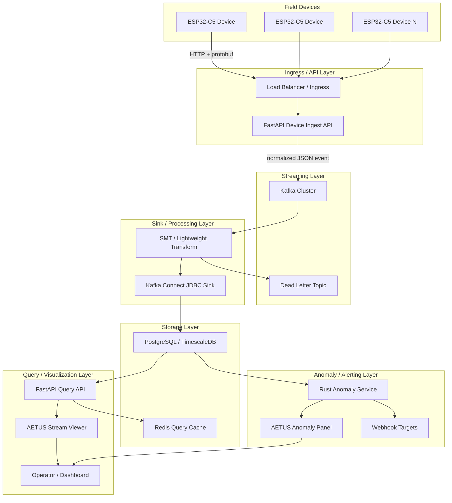
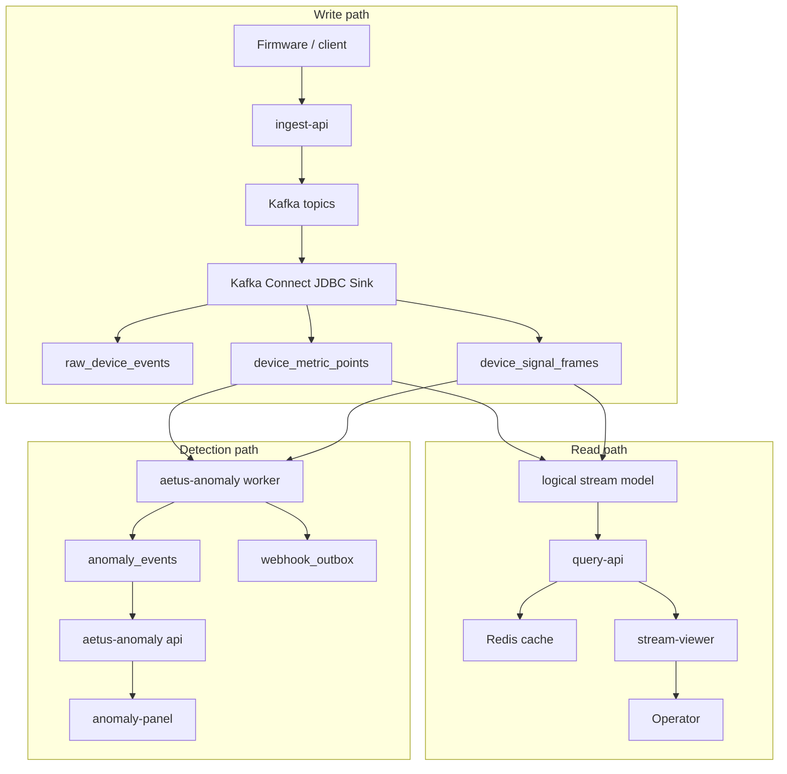
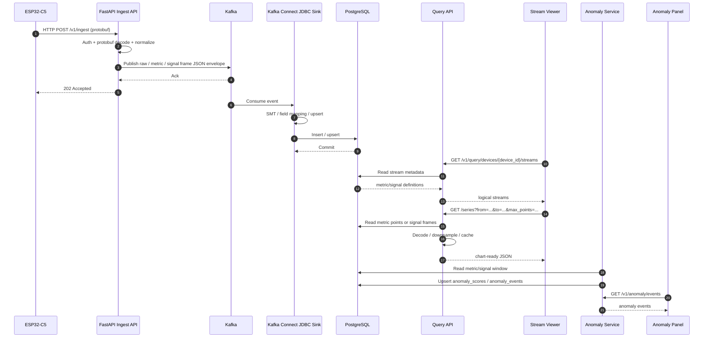
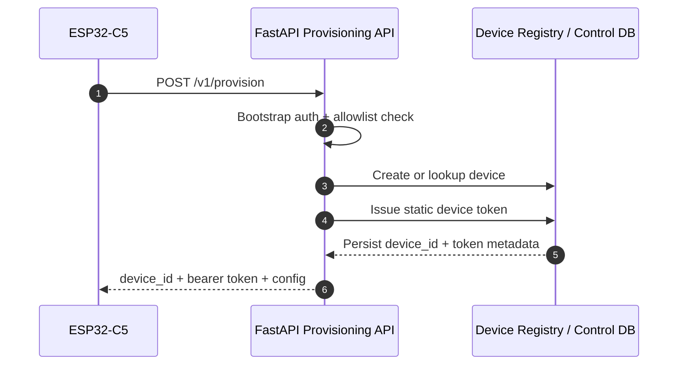
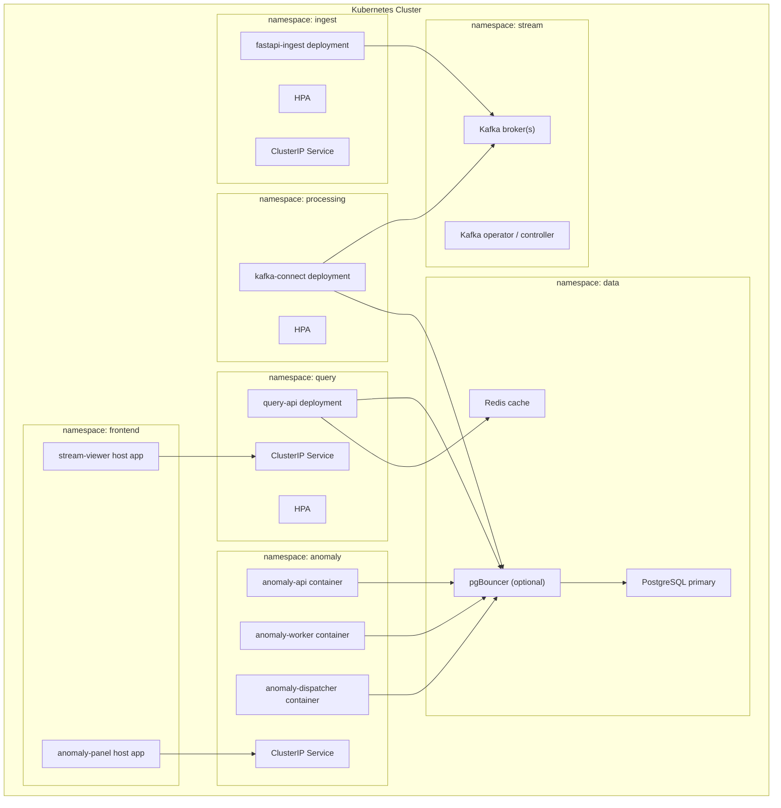

# Overview

## 목적

이 문서는 임베디드 기기로부터 데이터를 직접 수집하고,
`protobuf -> FastAPI internal object -> Kafka -> PostgreSQL/TimescaleDB -> query-api/anomaly-service -> frontend`로 이어지는 전체 데이터 스트림을 요약한다.

초기에는 수집/적재 경로를 중심으로 설계했지만, 현재 구조는 저장된 시계열을 운영자가 조회하고 시각화하는 read path까지 포함한다.

전제 조건:

- 표준 임베디드 모델: `ESP32-C5` 기반 구현을 우선 제공하되, 장기적으로 ESP32 계열 및 범용 client를 고려
- 서버 진입점: `FastAPI` 기반 HTTP API
- 디바이스 업로드 포맷: `protobuf`
- 비동기 중개: `Kafka`
- 영속 저장: `PostgreSQL / TimescaleDB`
- 조회 API: `FastAPI` 기반 `query-api`
- 표준 조회 프론트엔드: `Vue + Naive UI + ECharts` 기반 `stream-viewer`
- 이상감지 서비스: Rust 기반 `services/anomaly`
- 이상감지 운영 프론트엔드: `Vue + Naive UI` 기반 `anomaly-panel`
- 백엔드 배포 환경: `Kubernetes`
- `Kafka`와 `PostgreSQL`은 분리망 내 self-managed 운영 전제
- `source IP`는 `L4` 직결 환경에서 원본이 보존된다고 가정
- ingest/provisioning API는 기기망 허용 대역에서만 접근 가능

## 시스템 목표

- 임베디드 기기에서 올라오는 데이터를 안정적으로 수집한다.
- 수집 API와 적재 파이프라인을 분리해 버스트 트래픽을 흡수한다.
- ingest API와 query API를 분리해 write-heavy 수집 부하와 read-heavy 조회 부하를 독립적으로 확장한다.
- 장애 구간을 명확히 나누고 재처리 가능성을 확보한다.
- 저장 포맷과 공개 조회 모델을 분리해 metric point와 dense signal frame을 모두 logical stream으로 노출한다.
- 고밀도 sampled signal은 query-api에서 server-side downsampling 후 프론트엔드에 전달한다.
- 저장된 metric/signal stream을 기반으로 DB-backed window anomaly detection을 수행할 수 있게 한다.
- 장치 수 증가에 따라 수평 확장이 가능해야 한다.
- `k8s` 상에서 운영 가능한 구조여야 한다.

## 상위 아키텍처

## 전체 데이터 스트림

현재 시스템은 세 개의 주요 경로로 나뉜다.

- write path: 기기 데이터 수집, Kafka 중개, PostgreSQL/TimescaleDB 적재
- read path: 저장된 metric/signal을 query-api가 logical stream으로 변환하고 frontend가 시각화
- detection path: 저장된 metric/signal을 anomaly worker가 window 단위로 평가하고 event/webhook을 생성

write path는 기기가 기다려야 하는 시간을 최소화한다.
read path는 저장된 데이터를 화면 해상도와 요청 범위에 맞춰 줄이는 역할을 한다.
detection path는 ingest API에 부담을 주지 않고 DB 뒷단에서 재처리 가능한 방식으로 이상감지를 수행한다.

## 역할 분리

### Device

- 센서/이벤트 데이터 수집
- 최소한의 전처리
- 로컬 버퍼링
- 서버 업로드 재시도
- 부팅 시 `boot_id` 생성
- 부팅 시 `sequence = 0`으로 초기화
- protobuf 메시지 직렬화
- 재부팅 보고 시 `reboot reason` 포함

관련 상세 문서:

- [[06-embedded-architecture]]

### FastAPI Ingest Service

- HTTP 수신
- 인증/인가 검사
- protobuf decode
- 내부 이벤트 object 정규화
- sparse metric과 dense signal frame을 각 Kafka topic으로 분리 publish
- 최소 스키마 검증
- 요청 추적 ID 부여
- Kafka publish
- 즉시 응답 반환

### Provisioning API

- 장치 등록 요청 수신
- 장치 식별자 발급 또는 확인
- 장치별 정적 토큰 발급
- 초기 설정값 반환
- bootstrap 검증 및 allowlist 확인
- 단일 공용 bootstrap token 검증
- `source IP + hardware_id` 기준 등록 제한

### Kafka

- burst traffic 흡수
- API와 적재 로직 분리
- 재처리 가능성 확보
- 소비자 확장 지원

### Kafka Connect / Low-Code Processing

- Kafka 메시지 수신
- 단순 필드 매핑
- PostgreSQL 적재
- 설정 기반 upsert 처리
- 실패 레코드의 에러 토픽 전송

### PostgreSQL / TimescaleDB

- 디버깅용 raw event 보관
- Kafka Connect staging table 수신
- trigger 기반 normalized metric/signal table 적재
- 장기 metric point 보관
- dense sampled signal frame block 보관
- TimescaleDB hypertable, compression, retention policy 적용
- `devices`, `device_boot_sessions`, `metric_definitions`, `signal_stream_definitions` dimension table로 문자열 반복 저장 최소화

### Query API

- PostgreSQL/TimescaleDB에 저장된 데이터를 read-only로 조회
- metric point와 signal frame을 `stream`이라는 공개 조회 모델로 통합
- scalar stream series 조회
- sampled stream raw sample decode
- sampled stream sample-bucket envelope downsampling
- raw frame drill-down
- summary/feature materialization
- Redis 기반 cache
- ingest 인증과 분리된 query JWT 발급/검증/인가

관련 상세 문서:

- [[08-query-api-and-frontend]]

### Stream Viewer

- `frontend/stream-viewer`의 portable Vue component
- `queryServerUrl`, query JWT, device/stream 파라미터만으로 다른 운영 콘솔에 이식 가능
- ECharts 기반 scalar/sampled chart 렌더링
- 여러 device의 같은 stream key overlay
- zoom/pan 시 query-api에 visible range를 재요청해 high-density 데이터를 fetch
- 세부 설정은 drawer 안에 숨겨 기본 화면은 chart 중심으로 유지
- 브라우저는 chart renderer 역할에 집중하고, downsampling은 query-api가 담당

### Anomaly Service

- `services/anomaly`의 Rust multi-command binary
- `aetus-anomaly api`: detector job, event, webhook endpoint 관리 API
- `aetus-anomaly worker`: PostgreSQL/TimescaleDB window 조회 후 detector 실행
- `aetus-anomaly dispatcher`: webhook outbox 발송, retry, dead-letter 처리
- 현재 PoC는 scalar metric threshold detector를 구현
- 장기적으로 sampled signal feature detector와 ML/rule hybrid detector를 같은 job/event model 위에 추가

관련 상세 문서:

- [[11-anomaly-detection-service]]

### Anomaly Panel

- `frontend/anomaly-panel`의 portable Vue component
- `anomalyServerUrl`, admin token만으로 다른 운영 콘솔에 이식 가능
- detector job, recent event, webhook endpoint 상태를 한 화면에서 조회
- threshold job 생성 UI 제공

## 데이터 흐름

## 저장 모델과 조회 모델의 분리

PostgreSQL에는 운영 효율을 위해 저장 목적별 테이블이 분리되어 있다.

| 저장 테이블 | 목적 | query-api 노출 방식 |
| --- | --- | --- |
| `raw_device_events` | 디버깅용 원본 이벤트 | 기본 query model에는 직접 노출하지 않음 |
| `device_metric_points` | 장기 scalar metric point | `kind=scalar` stream |
| `device_signal_frames` | dense sampled signal frame block | `kind=sampled` stream |
| `signal_frame_features` | query-triggered feature cache | `summary` 응답 |
| `signal_rollup_points` | 시각화용 rollup point | `series` 응답 후보 |

query-api는 저장 테이블명을 사용자에게 직접 노출하지 않고, 모든 조회 가능한 항목을 `stream.key` 기준으로 다룬다.

## 프로비저닝 흐름

## 응답 전략

- API는 Kafka publish 성공 시 `202 Accepted`를 반환
- DB 적재 성공까지 기기가 동기적으로 기다리게 하지 않음
- 적재 실패는 내부 재처리와 운영 알림으로 처리
- query-api는 저장된 데이터만 조회하므로 ingest API 응답 경로에는 관여하지 않음
- frontend 차트 지연은 query-api cache/downsampling/rollup 정책으로 별도 최적화

## 전송 보안 전제

- 기본 전송 방식은 `HTTP`
- 분리망 환경 특성상 `HTTPS`를 사용하더라도 장치에서는 인증서 검증을 수행하지 않음
- 대신 네트워크 분리, IP 제어, 장치별 정적 토큰, rate limit로 접근을 통제
- bootstrap token은 변경되지 않는 공용 token이며, 유출/공유를 전제로 `POST /v1/provision`에만 매우 낮은 rate limit를 적용
- query-api 인증은 ingest 인증과 분리된 JWT 기반 read-only 권한 모델을 기본 방향으로 둔다
- device token, bootstrap token, HMAC upload secret은 브라우저 또는 query frontend에 노출하지 않는다

## Kubernetes 논리 컴포넌트

