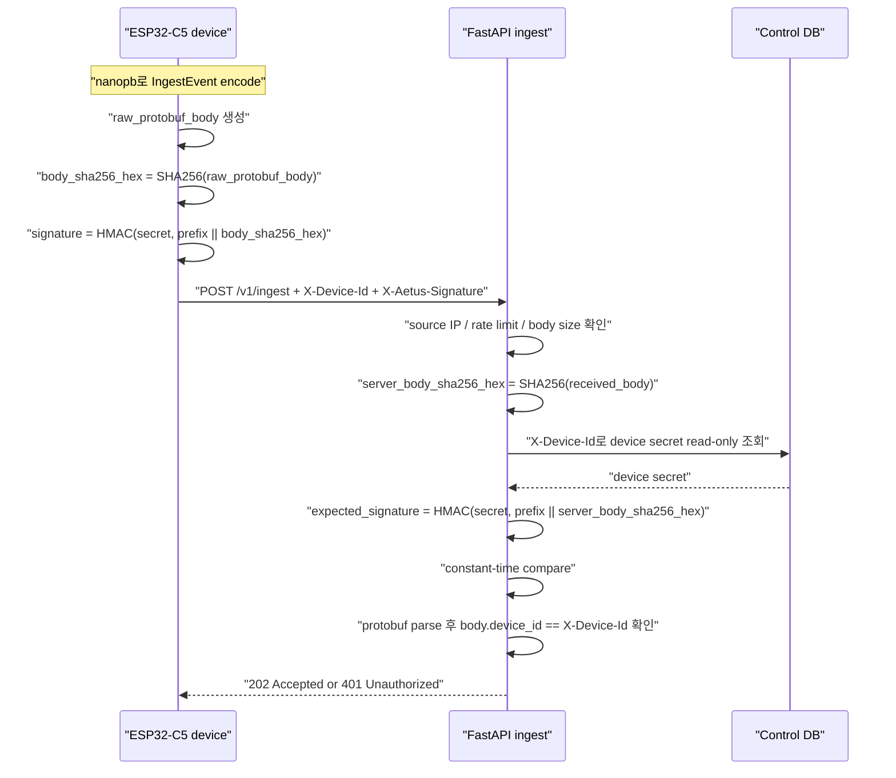
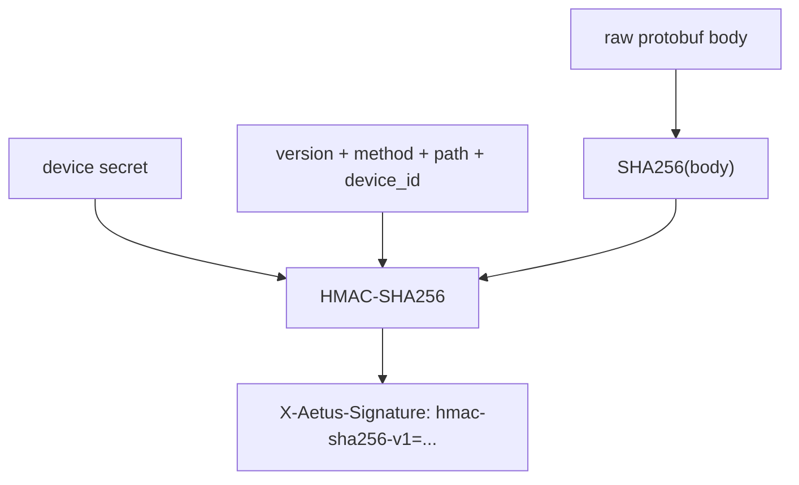

# API

## 기본 엔드포인트

- `POST /v1/provision`
- `POST /v1/ingest`
- `GET /v1/time`
- `GET /v1/healthz`
- `GET /v1/readyz`

별도 status endpoint는 선택 사항이며, 초기 권장안은 `event_type=status`를 `POST /v1/ingest`로 함께 수용하는 방식이다.

## ingest API 형태

표준 이벤트 수집용 `POST /v1/ingest` 하나를 중심으로 가져가는 것이 좋다.

이유:

- 펌웨어 구현이 단순함
- API 버전 관리가 쉬움
- Kafka 적재 포맷을 일관되게 유지할 수 있음
- 이후 `event_type` 기준으로 서버 측 분기 가능

## 요청 헤더

| Header | 필수 여부 | 설명 |
| --- | --- | --- |
| `Content-Type: application/x-protobuf` | 필수 | protobuf 전송 |
| `X-Device-Id` | 필수 | 장치 식별자 |
| `Authorization: Bearer <token>` | 기본 인증 시 필수 | 장치별 정적 토큰 |
| `X-Aetus-Signature: hmac-sha256-v1=<hex>` | HMAC 인증 시 필수 | auth version과 signature를 함께 담는 HMAC-SHA256 서명 |
| `Idempotency-Key` | 선택 | HTTP 레벨 중복 방지 보조값. 현재 구현은 저장/검증하지 않음 |

권장 방식:

- 장치 식별자는 path보다 header/body에 둠
- `event_type`과 `schema_version`으로 이벤트 종류와 포맷 버전을 구분
- 서버는 응답을 짧게 유지하고 DB 적재 결과는 동기 반환하지 않음
- 디바이스는 protobuf를 보내고, 서버는 이를 내부 object로 변환해 Kafka에 JSON으로 publish
- `boot_id`는 항상 포함하고, 서버는 `device_id + boot_id + sequence`를 이벤트 구분 기준으로 사용
- `sequence`는 각 부팅 세션에서 `0`부터 시작하고, 재부팅 시 다시 `0`으로 초기화
- 장치 시각이 필요하면 `timestamp_ns`를 선택 필드로 보낼 수 있지만, 서버는 이를 중복 방지 기준으로 사용하지 않음
- 현재 구현의 실제 중복 방지/적재 기준은 Kafka Connect와 DB의 `(device_id, boot_id, sequence)` upsert 정책이다.

## RTC time sync API

장치 RTC가 부정확할 수 있으므로, 표준 펌웨어는 업로드 전 서버 시간을 받아 RTC를 맞출 수 있다.

권장 엔드포인트:

- `GET /v1/time`

요청 헤더:

| Header | 필수 여부 | 설명 |
| --- | --- | --- |
| `X-Device-Id` | 필수 | 장치 식별자 |
| `Authorization: Bearer <token>` | 필수 | 장치별 정적 토큰 |

응답 예시:

```json
{
  "unix_time_s": 1777443380,
  "unix_time_ms": 1777443380857,
  "unix_time_ns": "1777443380857659666",
  "iso8601": "2026-04-29T06:16:20Z",
  "source": "ingest-api",
  "valid_after_unix_s": 1577836800
}
```

설계 기준:

- `unix_time_ns`는 JSON number 정밀도 문제를 피하기 위해 문자열로 반환한다.
- endpoint는 `Cache-Control: no-store`를 반환한다.
- 인증, source IP CIDR, rate limit 정책은 device token 기반 ingest 계열과 동일하게 적용한다.
- 장치는 RTC sync 성공 후 protobuf `timestamp_ns`를 선택적으로 채운다.
- RTC sync 실패가 데이터 업로드 자체를 반드시 막을 필요는 없으며, 제품 정책에 따라 timestamp 없이 업로드할 수 있다.

## 인증

현재 확정된 기본 인증:

- ingest 기본 인증은 `장치별 정적 bearer token`
- 장치군 공통 토큰은 기본안으로 사용하지 않음
- 토큰 발급은 별도 provisioning API에서 수행
- token은 API 차원 만료를 두지 않음
- token rotate API는 두지 않음
- token 교체는 재프로비저닝 또는 운영자 수동 재발급으로 처리
- ingest API에는 rate limit를 적용

현재 권장안:

- `X-Device-Id` + `Authorization: Bearer <device-token>`
- 기본 전송 방식은 `HTTP`
- `HTTPS`를 사용하는 경우에도 장치에서는 인증서 검증을 수행하지 않음
- 네트워크 ACL로 허용된 대역에서만 ingress 접근
- source IP는 `L4` 직결로 원본 주소가 보존된다고 가정

### 선택 인증 경로: HMAC-SHA256

공개망 또는 보안 요구가 높은 배포를 고려해 `POST /v1/ingest`에 HMAC 인증 경로를 선택 옵션으로 제공한다.

기존 bearer token 경로를 제거하지 않고 병행 지원하는 `dual mode`이며, 장치별로 펌웨어 설정에서 bearer 또는 HMAC mode를 선택한다.

목표:

- HTTP를 유지하더라도 장치 secret이 요청마다 직접 노출되지 않게 함
- ESP32-C5 펌웨어 부담을 크게 늘리지 않음
- protobuf 내부 필드를 HTTP header에 과도하게 반복하지 않음
- 기존 provisioning, rate limit, Kafka/PostgreSQL 파이프라인을 최대한 유지

HMAC 요청 헤더:

| Header | 필수 여부 | 설명 |
| --- | --- | --- |
| `Content-Type: application/x-protobuf` | 필수 | protobuf 전송 |
| `X-Device-Id` | 필수 | secret 조회를 위한 장치 식별자 |
| `X-Aetus-Signature: hmac-sha256-v1=<hex>` | 필수 | auth scheme/version과 HMAC-SHA256 signature |

`boot_id`, `sequence`, `event_type`, `timestamp_ns`는 protobuf body 안의 값을 사용한다. 이 값들을 HMAC 전용 header로 반복하지 않는다.

서명 대상:

```text
body_sha256_hex = SHA256_HEX(raw_protobuf_body)
prefix = "AETUS-HMAC-SHA256-V1\nPOST\n/v1/ingest\n<device_id>\n"
signature = HMAC_SHA256(device_secret, prefix || body_sha256_hex)
```

HTTP header에는 `body_sha256_hex`를 보내지 않는다. 장치와 서버가 같은 raw body에서 각자 SHA256을 계산하고, 그 digest를 HMAC 입력으로 사용한다.





중요한 원칙:

- 서버는 수신한 raw protobuf bytes의 SHA256을 직접 계산한다.
- 서버는 직접 계산한 body hash를 HMAC 입력으로 사용한다.
- `X-Aetus-Signature`의 좌변은 `hmac-sha256-v1`처럼 auth scheme/version을 포함한다.
- 서버는 protobuf를 parse한 뒤 다시 serialize한 bytes로 검증하지 않는다.
- `X-Device-Id`는 secret 조회를 위해 header에 둔다.
- HMAC 검증 후 protobuf를 parse하고, body 내부 `device_id`가 `X-Device-Id`와 일치하는지 다시 확인한다.
- HMAC 검증 실패 시 `401 Unauthorized`를 반환한다.
- HMAC 경로에서도 source IP CIDR 제한과 rate limit는 동일하게 적용한다.

device secret 생성:

- 현재 구현은 provisioning 또는 admin 발급 시 `devtok_` prefix와 `secrets.token_urlsafe(24)` 결과를 합쳐 device token을 만든다.
- `token_urlsafe(24)`는 24-byte cryptographic random 값을 base64url 문자열로 표현한 값이다.
- 초기 HMAC 옵션에서는 이 device token을 그대로 HMAC secret으로 재사용한다.
- 서버는 control DB의 `devices.token` 값을 read-only 조회해 secret으로 사용한다.
- 장치는 provisioning 응답의 `access_token` 값을 저장하고 bearer mode에서는 token으로, HMAC mode에서는 secret으로 사용한다.
- 장기적으로 용어 혼선을 줄이려면 API/DB 필드명을 `device_secret` 또는 `credential_secret`으로 확장할 수 있다.

서버 처리 순서:

1. `Content-Type=application/x-protobuf` 확인
2. source IP CIDR 확인
3. in-memory rate limit 검사
4. request body 읽기 및 크기 제한 확인
5. `Authorization: Bearer` 또는 `X-Aetus-Signature: hmac-sha256-v1=<hex>` 기준으로 인증 방식 선택
6. bearer mode는 기존 device token 비교
7. HMAC mode는 raw body SHA256 계산 후 `X-Device-Id`로 device secret을 read-only 조회하고 body hash 기반 signature 검증
8. protobuf 파싱
9. body 내부 `device_id`, `boot_id`, `body` 기본 검증
10. 내부 event object로 normalize
11. memory publisher 또는 Kafka publisher로 publish

big payload 고려:

- HMAC 입력에 raw body 전체를 직접 넣지 않고 `body_sha256_hex`를 넣는다.
- payload 전체를 새 버퍼로 복사하지 않고 streaming SHA256으로 digest를 계산할 수 있다.
- FlashDB backlog에 이미 저장된 record는 향후 `body_sha256` metadata를 함께 저장해 재전송 시 hash 재계산을 줄일 수 있다.
- HTTP streaming upload로 확장하더라도 `SHA256 update -> HTTP write` 순서로 처리하면 RAM 사용량 증가를 작게 유지할 수 있다.

추가 최적화 여지:

- 현재 고정 버전 `hmac-sha256-v1`에서는 hex signature가 사람이 읽기 쉽지만 32-byte HMAC 결과를 64-byte ASCII로 늘린다.
- 네트워크 바이트를 더 줄이고 싶으면 `X-Aetus-Signature: hmac-sha256-v1-b64=<base64url>` 같은 binary-to-text encoding을 검토할 수 있다.
- 단순성과 디버깅 편의성은 hex가 더 좋으므로 초기 구현은 hex를 권장한다.
- HMAC signature를 32-byte 전체가 아니라 앞 16-byte로 truncate하면 헤더를 줄일 수 있지만, 인증 강도와 표준성 손실이 있으므로 초기 권장안에서는 제외한다.
- `Content-Encoding` 압축은 센서 payload 형태에 따라 효과가 다르며 ESP32 CPU와 RAM 비용이 생기므로 기본 경로에서는 제외한다.
- 대형 payload가 FlashDB에 저장될 때 `body_sha256`을 record metadata로 함께 저장하면 재시도 시 hash 계산을 생략할 수 있다.
- HTTP chunked streaming을 도입하면 encode buffer 전체를 들고 있지 않고 `SHA256 update`와 socket write를 같이 진행할 수 있지만, 서버와 펌웨어 구현 복잡도가 올라가므로 대형 blob API와 함께 검토한다.
- 같은 TCP connection을 유지하는 keep-alive는 HTTPS보다 HMAC과 별개로 네트워크 왕복 비용을 줄이는 최적화이며, Wi-Fi duty cycle 정책과 함께 조정한다.

리플레이 정책:

- HMAC은 secret 미보유 장치를 거르는 인증 수단이다.
- HMAC만으로 캡처된 정상 요청의 재전송을 완전히 막지는 않는다.
- 현재 `device_id + boot_id + sequence`는 downstream 중복 적재 방지 키로 유지한다.
- ingest 서버 단계에서 리플레이를 차단하려면 `(device_id, boot_id, sequence)` 기반 replay cache 또는 persistent sequence guard가 별도로 필요하다.
- 초기 구현은 ingest 경로에서 DB write를 피하는 현재 원칙을 유지하고, replay guard는 별도 확장안으로 둔다.

RTC time sync와 HMAC:

- `GET /v1/time`은 body가 없으므로 ingest와 동일한 raw body HMAC 규칙을 그대로 적용하기 어렵다.
- 초기 HMAC 옵션 범위는 `POST /v1/ingest`로 한정한다.
- `/v1/time`은 기존 bearer token 인증을 유지하거나, 이후 별도 nonce 기반 HMAC 규칙을 추가로 설계한다.

## provisioning API

ingest API와 프로비저닝 API는 역할을 분리하는 것이 좋다.

- `ingest API`: 데이터 업로드 전용
- `provisioning API`: `device_id`, 정적 토큰, 초기 설정 발급 전용

권장 엔드포인트:

- `POST /v1/provision`

### provisioning 요청 헤더

| Header | 필수 여부 | 설명 |
| --- | --- | --- |
| `Content-Type: application/json` | 필수 | bootstrap 요청 |
| `Authorization: Bearer <bootstrap-token>` | 필수 | 초기 등록용 bootstrap 토큰 |

### provisioning 요청 예시

```json
{
  "hardware_id": "esp32c5-a1b2c3d4e5f6",
  "model": "esp32-c5",
  "firmware_version": 1002003,
  "site_code": "factory-a"
}
```

### provisioning 응답 예시

```json
{
  "device_id": "esp32c5-001",
  "token_type": "Bearer",
  "access_token": "devtok_xxxxx",
  "issued_at": "2026-04-27T01:00:00Z",
  "config": {
    "ingest_url": "http://ingest.internal/v1/ingest",
    "max_batch_size": 1,
    "retry_backoff_ms": 3000
  }
}
```

### provisioning 정책

- bootstrap credential + source IP allowlist + hardware_id 검증 기반으로 최초 등록 허용
- 등록 후에는 장치별 정적 토큰으로 ingest 수행
- 토큰 메타데이터는 서버 측에 저장
- 토큰 교체가 필요하면 재프로비저닝 또는 운영자 수동 재발급 수행

권장 운영 정책:

- bootstrap token은 단일 공용 token으로 운영
- bootstrap token은 변경되지 않는 공개 자격증명으로 가정
- bootstrap token 유출/공유는 전제로 두고, 매우 낮은 요청 제한으로만 보호
- device token은 장기 정적 자격증명으로 운영
- 장치 분실, 유출 의심, 현장 교체 시에만 재발급
- 토큰 원문은 장치와 서버 레지스트리 외 구간에 최소 노출
- allowlist와 token 메타데이터는 FastAPI 내부 관리 DB에 저장
- 내부 관리 DB는 `SQLite`로 시작 가능
- 초당 호출량이 `1k req/s` 근방으로 올라가면 내부 관리 DB를 `MySQL`로 전환하고 FastAPI pod를 증설

### hardware_id 규칙

`hardware_id`는 프로비저닝 시 장치를 식별하기 위한 등록용 식별자다.

권장 형식:

- `{device_type}-{mac}`

예:

- `esp32c5-a1b2c3d4e5f6`

권장 원칙:

- `device_type`은 사람이 읽기 쉬운 장치 계열명 사용
- `mac`는 구분자 없이 소문자 hex 사용
- `hardware_id`는 provisioning allowlist 확인용으로 사용
- ingest 인증은 여전히 발급된 `device token`으로 수행

## rate limit 정책

분리망과 정적 토큰 구조를 고려하면, 인증을 과하게 무겁게 가져가기보다 `rate limit`로 보호막을 하나 더 두는 편이 현실적이다.

확정 기준:

- 기본 단위: `device_id`
- 보조 단위: source IP
- 초과 시 응답: `429 Too Many Requests`
- 장치 동작: exponential backoff 후 재시도

기본 정책:

- `bootstrap credential`은 `POST /v1/provision`에만 사용
- `bootstrap credential` 요청 제한: `10초당 1회`
- 기준: source IP + `hardware_id`
- 일반 장치 ingest 제한: `2 req/s`
- 일반 장치 burst: `10`
- allowlist 장치 ingest 제한: `20 req/s`
- allowlist 장치 burst: `20`
- limiter 구현은 FastAPI 기반 in-memory limiter를 기본으로 사용
- Redis 같은 외부 rate limit 저장소는 초기 범위에서 제외

allowlist 정책:

- allowlist 장치는 완전 면제보다 상한 완화를 우선 권장
- allowlist 기준은 `device_id` 우선, 필요 시 source IP 보조 사용
- provisioning allowlist는 FastAPI 내부에서 `source IP + hardware_id` 기준으로 관리
- provisioning allowlist의 source IP는 기기망 허용 대역 목록으로 제한
- 현재는 `L4` 직결로 source IP가 원본 그대로 보존된다고 가정

## 응답 정책

ingest 성공 응답 예시:

```json
{
  "request_id": "req-7bdb4f1e",
  "status": "accepted",
  "accepted_at": "2026-04-26T09:00:01Z"
}
```

권장 상태 코드:

| Status | 의미 | 장치 동작 권장 |
| --- | --- | --- |
| `202 Accepted` | Kafka enqueue 성공 | 성공 처리 |
| `400 Bad Request` | 필수 필드 누락/형식 오류 | 재시도하지 않음 |
| `401 Unauthorized` | 인증 실패 | 설정 점검 후 재시도 |
| `409 Conflict` | `device_id + boot_id + sequence` 충돌 등 정책 위반 | 장치 상태 점검 |
| `429 Too Many Requests` | rate limit | 지수 백오프 후 재시도 |
| `500/503` | 서버 일시 장애 | 지수 백오프 후 재시도 |

provisioning API 권장 상태 코드:

| Status | 의미 | 장치 동작 권장 |
| --- | --- | --- |
| `200 OK` | 기존 장치 재조회 성공 | 발급 토큰 사용 |
| `201 Created` | 신규 장치 등록 성공 | 발급 토큰 사용 |
| `400 Bad Request` | 요청 형식 오류 | 재시도하지 않음 |
| `401 Unauthorized` | bootstrap 인증 실패 | 설정 점검 |
| `403 Forbidden` | allowlist 또는 등록 정책 위반 | 운영자 확인 |
| `409 Conflict` | 중복 하드웨어 ID 또는 정책 충돌 | 운영자 확인 |

## 배치 ingest

1단계 권장:

- 단건 이벤트 업로드만 지원
- `POST /v1/ingest`

2단계 확장:

- 오프라인 버퍼 flush를 위한 배치 업로드 추가
- `POST /v1/ingest/batch`

## 상태 이벤트

권장 용도:

- heartbeat
- online/offline 추적
- RSSI, free heap, reboot reason 보고
- reboot 직후 상태 이벤트 보고

현재 요구사항 기준 추천:

- 외부 공개 API는 사실상 `POST /v1/ingest` 하나를 표준으로 삼음
- `status`도 동일 endpoint에 `event_type=status`로 수용
- 재부팅 보고는 별도 endpoint를 만들지 않고 `event_type=status` 또는 `event_type=alert` 본문에 `reboot_reason`을 포함해 수용
- 별도 status endpoint는 운영 편의가 꼭 필요할 때만 추가

## FastAPI 검증 책임

FastAPI에서 해야 할 검증:

- 인증 검증
- protobuf decode 성공 여부
- `boot_id` 존재 여부 검증
- `sequence` 타입 및 범위 검증
- `sequence=0`을 정상값으로 허용
- `proto3` 기본값 제약상 `sequence` 누락과 `0`은 구분하지 않는다고 가정
- `oneof body` 존재 여부 검증
- 본문 최대 크기 제한
- `schema_version` 지원 여부 검증
- rate limit 적용 및 allowlist 완화 판단

FastAPI에서 하지 않는 것이 좋은 것:

- 복잡한 비즈니스 규칙 해석
- DB 조회 기반 중복 판정
- 다중 테이블 정규화

## transport 정책

확정 사항:

- 기본 transport는 `HTTP`
- `HTTPS`를 쓰더라도 장치에서는 certificate verification을 pass
- transport 보완책은 네트워크 분리, allowlist, 장치별 정적 토큰, rate limit 중심으로 가져감
