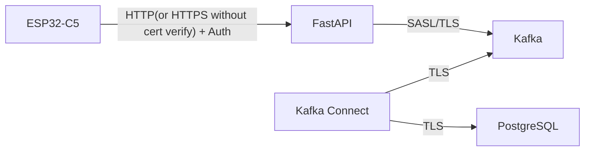
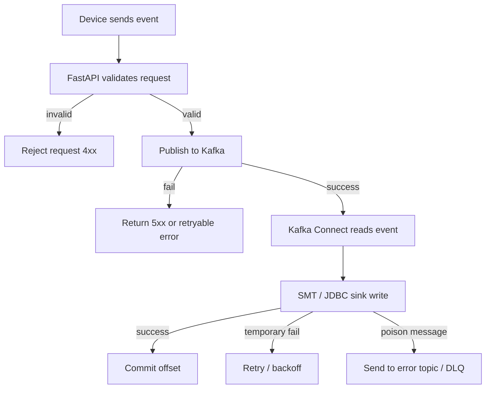

# Data Pipeline And Storage

## Kafka 토픽

| Topic | 설명 | 비고 |
| --- | --- | --- |
| `device.raw.v1` | API가 받은 원본 이벤트 | 최초 진입 토픽 |
| `device.validated.v1` | 검증/정규화 완료 이벤트 | 선택 사항 |
| `device.dlq.v1` | 처리 실패 이벤트 | 분석 및 재처리 |
| `device.status.v1` | heartbeat, online/offline 상태 | 운영성 강화 |

## 메시지 키

기본안은 `device_id`를 메시지 키로 사용한다.

장점:

- 동일 기기 이벤트의 파티션 정렬 보장
- 순서 의존 처리에 유리

주의점:

- 특정 장치에 트래픽이 몰리면 hotspot이 생길 수 있음

## Sink 친화적인 이벤트 형태

권장 방향:

- 상위 메타데이터는 평평한 필드로 유지
- protobuf `oneof body`는 서버에서 `payload jsonb`로 평탄화
- `payload`는 `jsonb` 컬럼으로 그대로 저장
- 중복 방지 키로 쓸 필드(`device_id`, `boot_id`, `sequence`)는 최상위에 둠
- 과도한 중첩 JSON은 피함
- raw 적재는 이벤트 원문 보존에 집중하고, metric 전개는 후속 단계로 분리

예시:

```json
{
  "device_id": "esp32c5-001",
  "boot_id": "boot-20260427-01",
  "sequence": 0,
  "event_type": "telemetry",
  "firmware_version": 1002003,
  "timestamp_ns": 1777242001000000000,
  "received_at": "2026-04-26T09:00:01Z",
  "request_id": "req-7bdb4f1e",
  "payload": {
    "metrics": [
      {
        "key": "temperature",
        "type": "double",
        "value": 21.4
      }
    ]
  }
}
```

## PostgreSQL 적재 모델

주요 테이블 후보:

- `devices`
- `device_events`
- `device_status_history`
- `ingest_failures`

관계 개요:

```mermaid
erDiagram
    DEVICES ||--o{ DEVICE_EVENTS : has
    DEVICES ||--o{ DEVICE_STATUS_HISTORY : has
    DEVICES ||--o{ INGEST_FAILURES : has

    DEVICES {
        uuid id
        text device_id
        integer firmware_version
        text model
        timestamptz created_at
        timestamptz updated_at
    }

    DEVICE_EVENTS {
        uuid id
        uuid device_ref
        bigint sequence
        text event_type
        text boot_id
        integer firmware_version
        bigint uptime_ms
        bigint timestamp_ns
        timestamptz received_at
        jsonb payload
        text request_id
    }
}
```

## 중복 방지 기준

권장 시작안:

- 기기에서 각 부팅 세션마다 `sequence = 0`부터 시작
- 기기에서 부팅마다 새 `boot_id` 생성
- DB에 `(device_ref, boot_id, sequence)` unique index 구성
- sink connector는 `upsert` 모드 사용
- 메시지 key 또는 레코드 필드에서 PK를 추출할 수 있게 설계

## Sink 기반 적재 전략

직접 구현 consumer를 피하려면 다음 두 테이블 전략이 현실적이다.

1. `raw_device_events`
2. 필요 시 후속 배치/뷰/SQL로 정규화 테이블 파생

장점:

- Kafka Connect JDBC Sink로 바로 적재 가능
- 적재 경로에 커스텀 코드가 거의 없음
- 스키마 변경 충격을 줄이기 쉬움

예시 적재 테이블:

| Column | Type | 설명 |
| --- | --- | --- |
| `device_id` | `text` | 장치 식별자 |
| `boot_id` | `text` | 부팅 세션 식별자 |
| `sequence` | `bigint` | 부팅 세션 내부 이벤트 번호 |
| `event_type` | `text` | 이벤트 타입 |
| `firmware_version` | `integer` | packed integer 펌웨어 버전, 선택 저장 |
| `uptime_ms` | `bigint` | 부팅 이후 경과 시간, 선택 저장 |
| `timestamp_ns` | `bigint` | 장치 기준 ns 단위 절대시각, 선택 저장 |
| `received_at` | `timestamptz` | API 수신 시각 |
| `request_id` | `text` | 추적 ID |
| `payload` | `jsonb` | 센서/이벤트 데이터 |

## Kubernetes 배포

### FastAPI

- `Deployment`
- `Service`
- `Ingress`
- `HPA`
- readiness/liveness probe
- 초기에는 단일 pod + `SQLite` 제어 DB로 시작 가능
- 호출량이 초당 `1k` 근방으로 올라가면 제어 DB를 `MySQL`로 전환하고 pod를 추가 할당

### Kafka Connect

- `Deployment`
- JDBC Sink connector 설정으로 PostgreSQL 적재
- connector task 수를 topic partition 수와 연동
- 에러 토픽 및 retry 정책을 설정으로 관리

### Kafka

운영 전제:

- 분리망 내부의 self-managed Kafka
- `k8s` 내부 StatefulSet/Operator 기반 또는 내부 전용 VM/플랫폼 기반 운영

운영 고려 사항:

- broker disk 운영
- 장애 복구 절차
- 업그레이드 및 파티션 운영
- 모니터링과 lag 추적

### PostgreSQL

운영 전제:

- 분리망 내부 VM 기반 self-managed PostgreSQL

운영 고려 사항:

- backup 및 restore 절차
- failover 또는 복구 전략
- vacuum 및 bloat 관리
- connection pool 운영

## 관측성

메트릭:

- API request count / latency / error rate
- Kafka publish latency
- topic lag
- sink throughput
- DB insert latency
- dead letter rate
- device online count

로그:

- request_id 기반 추적
- device_id 기반 검색 가능성 확보
- payload 전체 로그는 개인정보/비용 관점에서 제한

알림:

- sink task failure 또는 consumer lag 임계치 초과
- DLQ 증가율 급증
- DB connection saturation
- ingest API 5xx 증가

## 보안



권장 고려 사항:

- device 인증: 장치별 정적 bearer token
- 공개망 또는 보안 요구가 높은 배포에서는 `POST /v1/ingest`에 HMAC-SHA256 선택 인증 경로를 추가 검토
- device to API 구간은 `HTTP` 기본, 필요 시 `HTTPS` 사용 가능
- `HTTPS`를 쓰더라도 장치에서는 인증서 검증을 수행하지 않음
- API 이후 서버 간 통신은 가능한 한 암호화
- device token은 장기 정적 자격증명으로 운영
- tenant 분리가 필요하면 인증 토큰 구조에 반영
- source IP는 `L4` 직결 환경에서 원본이 보존된다고 가정
- API는 기기망 허용 대역에서만 접근 허용

추가 권장 사항:

- provisioning API는 ingest API와 분리된 권한 정책 적용
- bootstrap token과 device token은 서로 다른 용도로 관리
- bootstrap token은 단일 공용 token으로 운영
- bootstrap token은 공개/공유를 전제로 하며, 매우 낮은 요청 제한으로만 보호
- bootstrap token은 provisioning에만 사용
- hardware allowlist를 함께 적용
- allowlist 및 token 메타데이터는 FastAPI 내부 관리 DB에서 관리
- 내부 관리 DB는 `SQLite`로 시작 가능
- 제어 DB는 초기에는 `SQLite`, 고부하 시 `MySQL`로 전환
- 토큰 원문은 최소 노출 원칙 적용
- token rotate API는 초기 범위에서 제외
- token 교체는 재프로비저닝 또는 운영자 수동 재발급으로 처리

### HMAC 선택 인증 경로 검토안

기존 bearer token 방식은 단순하지만, HTTP 환경에서는 장치 자격증명이 요청마다 그대로 전송된다.

HMAC 선택 경로를 추가하면 장치 secret 자체를 wire에 싣지 않고 `raw protobuf body`의 hash와 그 hash에 대한 서명만 전송할 수 있다.

기본 방향:

- 기존 bearer token 인증은 유지한다.
- HMAC은 `POST /v1/ingest`에 한정된 선택 경로로 추가한다.
- provisioning에서 발급한 device token을 HMAC secret으로 재사용할 수 있다.
- 더 엄격한 명명이 필요하면 향후 `device_secret`으로 용어를 전환한다.
- HMAC 검증은 FastAPI에서 수행하고, Kafka/PostgreSQL 이후 파이프라인은 변경하지 않는다.
- protobuf 내부의 `boot_id`, `sequence`를 HMAC 전용 header에 반복하지 않는다.
- big payload 확장을 고려해 HMAC은 raw body 전체가 아니라 `SHA256(raw body)` 결과를 입력으로 사용한다.

HMAC이 해결하는 것:

- secret 없는 비인가 장치 요청 거부
- bearer token 원문이 매 요청에 노출되는 문제 완화
- HTTP 기반 운영을 유지하면서 인증 강도 향상

HMAC만으로 해결하지 않는 것:

- 캡처된 정상 요청의 재전송 방지
- 서버 DB에 저장된 secret 보호
- TLS가 제공하는 통신 기밀성

리플레이 방지를 ingest 서버에서 직접 수행하려면 `(device_id, boot_id, sequence)` 기반 replay cache 또는 persistent sequence guard가 필요하다. 단, 이 경우 현재 원칙인 "ingest 경로에서 내부 관리 DB write를 하지 않음"과 충돌할 수 있으므로 별도 의사결정 대상으로 둔다.

## FastAPI 내부 관리 DB

`allowlist`, `bootstrap token` 메타데이터, `device token` 메타데이터 같은 운영용 시스템 데이터는 FastAPI 내부 관리 DB로 관리할 수 있다.

현재 권장안:

- `SQLite`
- 약 `1k req/s` 근방부터는 `MySQL` 전환을 준비

이 선택이 적절한 이유:

- 운영 데이터 양이 작음
- 분리망 환경에서 의존성을 줄일 수 있음
- FastAPI와 함께 단순하게 배포 가능

권장 저장 대상:

- bootstrap token 메타데이터
- provisioning allowlist
- device token 메타데이터
- device provisioning registry 최소 정보

주의:

- 이벤트 본문 적재용 DB로는 사용하지 않음
- `SQLite`는 운영 정책/메타데이터 저장 용도로 한정
- 다중 pod 운영 전환 시에는 공유 상태를 위해 `MySQL` 같은 서버형 DB가 더 적절

## rate limit

정적 토큰 구조를 보완하기 위해 ingest API에 rate limit를 적용한다.

권장 방향:

- 기본 제한은 `device_id` 기준
- source IP 기준 제한을 보조로 둠
- allowlist 장치는 완전 면제보다 상한 완화 적용
- provisioning API는 ingest보다 더 엄격한 제한 적용

예시 정책:

- 일반 장치: `2 req/s`
- allowlist 장치: `20 req/s`
- 일반 장치 burst: `10`
- allowlist 장치 burst: `20`
- bootstrap provisioning: `10초당 1회`
- 초과 시: `429 Too Many Requests`
- 구현은 FastAPI in-memory limiter를 기본으로 사용
- 분리망 초기 단계에서는 Redis를 두지 않음
- 다중 pod 시 limiter 상태는 pod별로 분산될 수 있으며, 현재 단계에서는 이를 수용

## InfluxDB 호환 덤프 구조

PostgreSQL 적재는 raw 이벤트 중심으로 가져가되, 이후 Influx 스타일 덤프를 만들기 쉬운 형태를 함께 고려한다.

핵심 대응 관계:

- `measurement` -> `event_type` 또는 별도 논리 measurement
- `tag` -> `device_id`, `boot_id`, `site_code`, `metric key`
- `field` -> 실제 metric 값
- `time` -> `timestamp_ns` 우선, 없으면 `received_at`

권장 전략:

1. 1차 적재는 `raw_device_events`에 그대로 저장
2. 2차 조회/덤프용으로 `device_metric_points` 뷰 또는 파생 테이블 구성
3. Influx line protocol 또는 CSV dump는 이 파생 구조에서 생성

예시 파생 구조:

| Column | Type | 설명 |
| --- | --- | --- |
| `device_id` | `text` | tag |
| `boot_id` | `text` | tag |
| `measurement` | `text` | 예: `telemetry`, `status` |
| `field_key` | `text` | 예: `temperature` |
| `field_type` | `text` | `double`, `int`, `bool`, `string` |
| `value_double` | `double precision` | 숫자 필드 저장 |
| `value_int` | `bigint` | 정수 필드 저장 |
| `value_bool` | `boolean` | 불리언 필드 저장 |
| `value_text` | `text` | 문자열 필드 저장 |
| `unit` | `text` | 단위 |
| `timestamp_ns` | `bigint` | 장치 시각 |
| `received_at` | `timestamptz` | 서버 수신 시각 |

이 구조를 두면 raw 적재 모델을 깨지 않고도 InfluxDB 유사 포맷으로 덤프하거나 외부 시계열 시스템으로 옮기기 쉬워진다.

## 실패 처리



## 현재 시점 권장 시작안

1. 기기는 기본적으로 `HTTP`로 FastAPI에 `protobuf` 업로드
2. FastAPI는 protobuf decode와 최소 검증 후 내부 표준 object로 정규화해 `device.raw.v1`에 publish
3. `Kafka Connect JDBC Sink`가 PostgreSQL에 upsert
4. 실패 메시지는 `device.dlq.v1`로 이동
5. `device_id + boot_id + sequence`로 중복 전송을 구분
6. PostgreSQL은 일반 테이블 + `jsonb payload`로 시작
7. FastAPI control DB는 초기 `SQLite`, 고부하 시 `MySQL`로 전환
8. `k8s`에는 API와 Kafka Connect를 올리고, Kafka와 PostgreSQL은 분리망 내 self-managed로 운영
