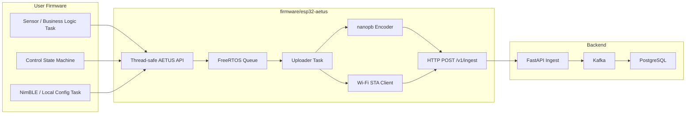
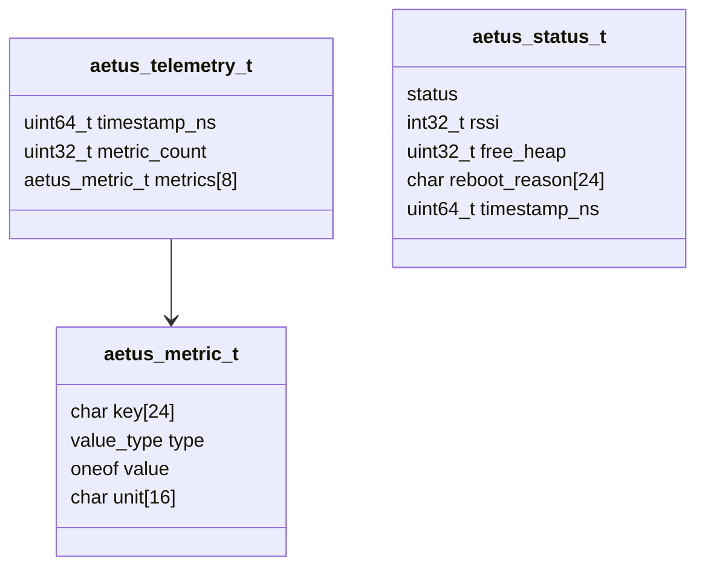
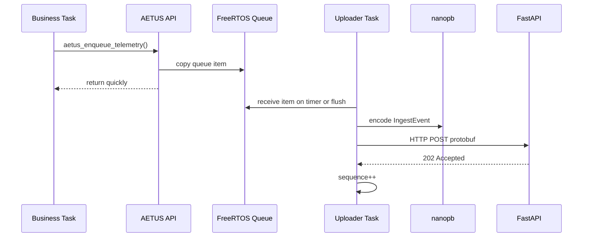
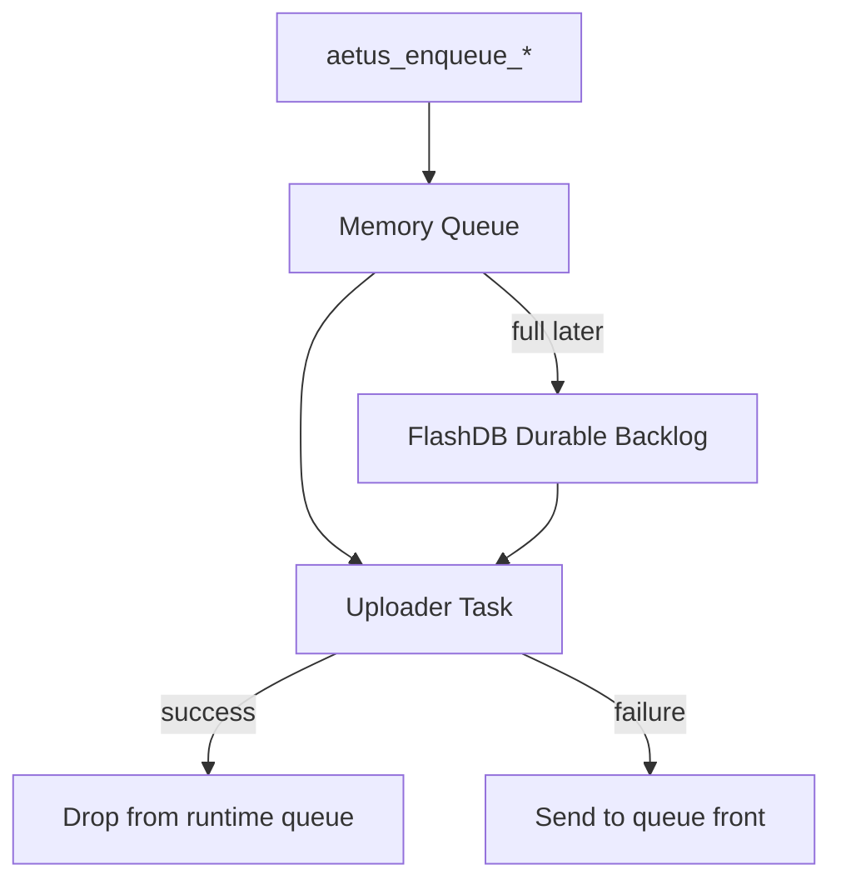

# Standard ESP32 Upload Stack

## 목적

이 문서는 AETUS 표준 임베디드 업로드 스택의 구현 경계를 정의한다.

목표는 유저 펌웨어가 네트워크, protobuf, 재시도, 업로드 주기를 직접 다루지 않게 만드는 것이다. 유저는 비즈니스 로직 task에서 thread-safe API를 호출하고, AETUS 스택은 별도 uploader task에서 메시지를 서버까지 전달한다.

현재 구현 위치:

- [[../firmware/esp32-aetus]]
- [[../firmware/esp32c5-upload-smoke]]
- [[../firmware/examples]]

## 설계 방향



핵심 결정:

- `ESP32-C5`를 표준 target으로 둔다.
- `ESP-IDF 6.0`을 기준으로 빌드한다.
- `FreeRTOS Queue`를 user task와 uploader task 사이의 경계로 둔다.
- `nanopb`로 protobuf payload를 만든다.
- 기본 transport는 분리망 HTTP다.
- `device_id + boot_id + sequence`는 서버 적재 중복 방지 기준으로 유지한다.

## 폴더 구조

```text
firmware/
  esp32-aetus/
    components/
      aetus/
      nanopb/
  examples/
    basic-telemetry/
    multitask-producers/
    metric-types/
  esp32c5-upload-smoke/
    main/
```

역할:

- `esp32-aetus/components/aetus`: 공개 API, 업로드 task, protobuf encode, HTTP client
- `esp32-aetus/components/nanopb`: 최소 nanopb runtime
- `examples`: 표준 컴포넌트를 소비하는 이식 가능한 ESP-IDF 예제 app
- `esp32c5-upload-smoke`: 실제 ESP32-C5 HIL 검증용 app

## Flash/Partition 기준

표준 예제는 최소 외부 SPI flash `4MB`를 가정한다.

- ESP-IDF 기본 single-app 파티션은 app 영역이 작아 Wi-Fi, HTTP client, mbedTLS, nanopb가 들어간 예제에서 쉽게 부족해진다.
- 예제 app은 custom partition table을 사용하고 factory app 영역을 `3MB`로 둔다.
- 예제에서는 OTA slot을 아직 구성하지 않는다.
- 제품 firmware에서 OTA가 필요하면 같은 4MB 기준으로 OTA partition layout을 별도 설계한다.

## 공개 API

헤더:

- [[../firmware/esp32-aetus/components/aetus/include/aetus.h]]

현재 공개 함수:

```c
esp_err_t aetus_start(const aetus_config_t *config);
esp_err_t aetus_update_config(const aetus_config_t *config);
esp_err_t aetus_get_config(aetus_config_t *config);
esp_err_t aetus_start_provisioning(const aetus_provisioning_config_t *config);
esp_err_t aetus_sync_rtc(TickType_t timeout);
esp_err_t aetus_rtc_timestamp_ns(uint64_t *timestamp_ns);
esp_err_t aetus_telemetry_set_timestamp_rtc(aetus_telemetry_t *telemetry);
esp_err_t aetus_status_set_timestamp_rtc(aetus_status_t *status);
esp_err_t aetus_enqueue_telemetry(const aetus_telemetry_t *telemetry, TickType_t timeout);
esp_err_t aetus_enqueue_status(const aetus_status_t *status, TickType_t timeout);
esp_err_t aetus_flush(TickType_t timeout);
```

Thread safety 규칙:

- `aetus_start()`는 부팅 초기에 1회 호출한다.
- `aetus_sync_rtc()`는 시작 후 필요 시 호출하며, `/v1/time`에서 받은 서버 시간으로 RTC를 설정한다.
- `aetus_start_provisioning()`은 NimBLE GATT server를 열어 Wi-Fi/API 설정을 런타임에 갱신한다.
- `aetus_update_config()`는 provisioning apply 또는 앱 정책에 의해 running config를 교체한다.
- `aetus_enqueue_telemetry()`는 여러 FreeRTOS task에서 동시에 호출해도 된다.
- `aetus_enqueue_status()`도 여러 FreeRTOS task에서 동시에 호출해도 된다.
- enqueue API는 메시지를 내부 queue item으로 복사하므로 caller의 stack-local struct를 재사용해도 된다.
- 현재 API는 ISR-safe가 아니다.
- ISR 경로에서 직접 업로드 이벤트를 만들 필요가 생기면 `aetus_enqueue_*_from_isr()`를 별도 추가한다.

## 데이터 모델

Telemetry는 `TelemetryPayload` 내부에서 상호 배타적인 두 경로를 가진다. sparse scalar 값에는 `MetricSet { repeated Metric + oneof value }`를 쓰고, 고주파 numeric sample block은 `SignalFrame`으로 전송한다.

현재 C API에서 지원하는 metric value:

- `AETUS_METRIC_VALUE_INT64`
- `AETUS_METRIC_VALUE_DOUBLE`
- `AETUS_METRIC_VALUE_BOOL`
- `AETUS_METRIC_VALUE_STRING`
- `AETUS_METRIC_VALUE_BYTES`

Status event는 재부팅, online, degraded, offline 같은 장치 상태를 보낼 때 사용한다.

현재 펌웨어 C/C++ 공개 API는 scalar metric 중심이며, `SignalFrame` 전용 편의 API는 후속 구현 대상이다. 서버와 nanopb mock/e2e 경로는 이미 `SignalFrame`을 수신하고 PostgreSQL/TimescaleDB에 적재한다.



## 업로드 흐름



업로드 트리거:

- 기본 주기: 10분
- 테스트 주기: `.env.hil`에서 10초 등으로 조정
- 즉시 업로드: `aetus_flush(timeout)`

RTC 동기화:

- `aetus_config_t.time_url`을 지정하면 해당 endpoint를 사용한다.
- `time_url`을 생략하면 `ingest_url`이 `/v1/ingest`로 끝나는 경우 `/v1/time`으로 자동 치환한다.
- `/v1/time` 응답의 `unix_time_ns` 문자열을 파싱해 `settimeofday()`로 RTC를 설정한다.
- RTC가 `2020-01-01T00:00:00Z` 이전이면 `aetus_rtc_timestamp_ns()`는 미초기화 상태로 보고 실패한다.
- `aetus_telemetry_set_timestamp_rtc()`와 `aetus_status_set_timestamp_rtc()`는 RTC가 유효할 때만 protobuf `timestamp_ns`를 채운다.

실패 처리:

- Wi-Fi 연결 실패 시 해당 drain cycle을 종료한다.
- HTTP 실패 시 실패한 메시지를 queue front에 다시 넣는다.
- queue가 가득 차서 재삽입할 수 없으면 해당 메시지는 drop된다.
- sequence는 서버가 2xx를 반환한 경우에만 증가한다.

## Boot ID와 Sequence

현재 구현:

- `aetus_start()`에서 `boot-xxxxxxxx` 형식의 boot ID를 생성한다.
- boot ID seed는 `esp_random()`이다.
- sequence는 `0`에서 시작한다.
- telemetry와 status 모두 같은 sequence stream을 사용한다.
- 서버 수락 후 sequence를 증가시킨다.

의미:

- 재부팅 후에는 새 boot ID가 생성된다.
- 재부팅 후 sequence는 다시 `0`에서 시작한다.
- 서버는 `device_id + boot_id + sequence`로 같은 이벤트 재전송을 식별할 수 있다.

## 사용자 펌웨어 예시

```c
#include "aetus.h"

static void sensor_task(void *arg)
{
    (void)arg;

    while (true) {
        aetus_telemetry_t telemetry = {0};
        aetus_telemetry_init(&telemetry);
        aetus_telemetry_set_timestamp_rtc(&telemetry);
        aetus_telemetry_add_double(&telemetry, "temperature", 22.5, "celsius");

        esp_err_t err = aetus_enqueue_telemetry(&telemetry, pdMS_TO_TICKS(50));
        if (err != ESP_OK) {
            // Queue is full or uploader is not started. Business logic decides whether to drop or retry.
        }

        vTaskDelay(pdMS_TO_TICKS(1000));
    }
}
```

위 API는 현재 scalar metric 편의 계층이다. uploader task는 이를 protobuf `TelemetryPayload.metric_set`으로 인코딩해 서버로 전송한다. `SignalFrame` 전용 enqueue/helper API는 후속 구현 대상으로 남겨둔다.

## 현재 구현 범위

구현됨:

- portable ESP-IDF component layout
- thread-safe enqueue API
- in-memory FreeRTOS queue
- periodic upload timer
- manual flush
- protobuf encode via nanopb
- HTTP POST with bearer token
- optional HMAC-SHA256 ingest auth
- NimBLE GATT provisioning
- WPA2-Enterprise PEAP Wi-Fi path
- optional Wi-Fi connected LED
- C++20 wrapper API
- telemetry event
- status event
- double, int64, bool, string, bytes metric value
- upload success 후 sequence 증가
- upload 실패 메시지 requeue

아직 구현하지 않음:

- FlashDB durable backlog
- 대형 payload용 pointer/blob queue API
- ISR-safe enqueue API
- Wi-Fi ownership 분리
- HTTPS client/certificate policy
- server-side provisioning API client

대형 payload용 pointer/blob queue API는 1200B급 이상 센서 샘플처럼 고정 배열 복사가 부담스러운 데이터를 위한 향후 기능이다. `SignalFrame`은 이 요구의 서버/스키마 쪽 기반이며, 펌웨어 편의 API에서는 `aetus_enqueue_payload_copy()`와 `aetus_enqueue_payload_owned()` 같은 소유권 기반 enqueue를 검토한다. 성공적으로 enqueue된 owned payload는 AETUS uploader task가 소유권을 가져가 업로드 성공 또는 최종 drop 시 release callback으로 해제한다. 이 기능을 구현할 때는 queue item에는 포인터와 크기만 저장하고, protobuf 인코딩은 가능하면 nanopb callback 또는 HTTP streaming 방식으로 처리해 순간 RAM 사용량이 원본 payload의 2배 이상으로 튀지 않게 한다.

## HMAC 인증 옵션

현재 표준 업로드 컴포넌트는 bearer token과 HMAC-SHA256 ingest 인증을 모두 지원한다.

기본값은 기존 호환성을 위해 bearer token이며, `aetus_config_t.auth_mode` 또는 C++ wrapper의 `.hmac_sha256_auth()`로 HMAC mode를 선택한다.

구현 방식:

- HMAC mode에서는 `device_token` 값을 HMAC secret으로 사용한다.
- nanopb가 생성한 raw protobuf bytes의 SHA256 digest를 계산한다.
- HMAC은 raw protobuf bytes 전체가 아니라 body SHA256 hex digest를 입력으로 계산한다.
- `boot_id`, `sequence`는 protobuf body에 이미 있으므로 별도 HMAC header로 반복하지 않는다.
- HTTP header에는 `X-Device-Id`, `X-Aetus-Signature: hmac-sha256-v1=<hex>`만 추가한다.
- auth scheme/version은 `X-Aetus-Signature` 좌변에 통합한다.

권장 서명 입력:

```text
body_sha256_hex = SHA256_HEX(raw_protobuf_body)
prefix = "AETUS-HMAC-SHA256-V1\nPOST\n/v1/ingest\n<device_id>\n"
signature = HMAC_SHA256(device_secret, prefix || body_sha256_hex)
header = "X-Aetus-Signature: hmac-sha256-v1=<signature_hex>"
```

ESP32-C5 구현 관점:

- ESP-IDF의 mbedTLS SHA256 primitive를 사용한다.
- HMAC은 SHA256 ipad/opad 방식으로 component 내부에서 계산한다.
- SHA256/HMAC 계산은 업로드 직전 `post_payload()` 경로에 넣는 것이 가장 단순하다.
- SHA256/HMAC 버퍼와 hex signature 버퍼만 추가하면 되므로 RAM 부담은 작다.
- 큰 payload에서는 body hash만 HMAC 입력에 넣어 HMAC update 대상 크기를 고정한다.
- 향후 FlashDB backlog에는 payload와 함께 `body_sha256` metadata를 저장해 재전송 시 hash 재계산을 줄일 수 있다.
- retry 시 같은 protobuf body와 같은 sequence를 재전송하므로 signature도 동일하게 유지될 수 있다.
- upload 성공 후에만 sequence를 증가시키는 기존 정책은 유지한다.

최적화 여지:

- 초기 구현은 디버깅이 쉬운 hex digest/header를 사용한다.
- 헤더 바이트를 더 줄여야 하면 base64url encoding을 검토한다.
- HMAC digest truncation은 헤더를 줄일 수 있지만 인증 강도가 낮아지므로 기본안에서 제외한다.
- FlashDB durable backlog 구현 시 payload metadata에 `body_sha256`을 저장하면 재전송 때 SHA256 계산을 생략할 수 있다.
- 대형 blob/pointer payload API를 구현할 때는 protobuf encode buffer, SHA256 update, HTTP write를 streaming pipeline으로 묶는 방안을 같이 검토한다.

주의:

- HMAC은 인증 강화를 위한 옵션이며, 단독으로 replay attack을 완전히 막지는 않는다.
- replay 방지가 필요하면 서버가 `(device_id, boot_id, sequence)`를 별도로 기억해야 한다.
- `/v1/time`은 body가 없는 endpoint이므로 초기 HMAC 적용 범위에서 제외하고 bearer token을 유지한다.

## FlashDB 통합 계획

FlashDB는 표준 스택의 중요한 구성요소지만, 첫 portable extraction에서는 메모리 큐까지만 구현한다.

권장 다음 단계:

1. queue full 또는 upload failure 시 FlashDB에 event envelope 저장
2. uploader task가 upload cycle 시작 시 FlashDB backlog를 먼저 drain
3. 성공한 FlashDB record는 tombstone 또는 delete 처리
4. Flash wear를 고려해 batch delete 또는 compaction 정책 정의
5. low-power mode 진입 전 `aetus_flush()`와 FlashDB sync를 연결



## HIL 검증 위치

현재 실기기 검증 app:

- [[../firmware/esp32c5-upload-smoke]]

검증 내용:

- ESP32-C5 실기기 빌드
- Wi-Fi 접속
- protobuf payload 생성
- `/v1/ingest` HTTP 업로드
- FastAPI, Kafka, Kafka Connect, PostgreSQL 적재 확인
- bearer/HMAC mode 선택 빌드
- random telemetry stream mode로 연속 적재 확인

이 app은 제품 코드가 아니라 표준 스택의 HIL consumer 예제다.
