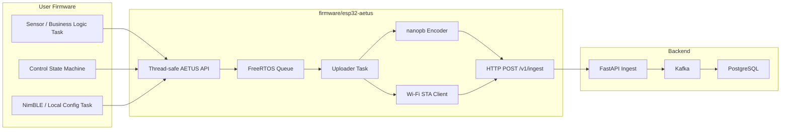
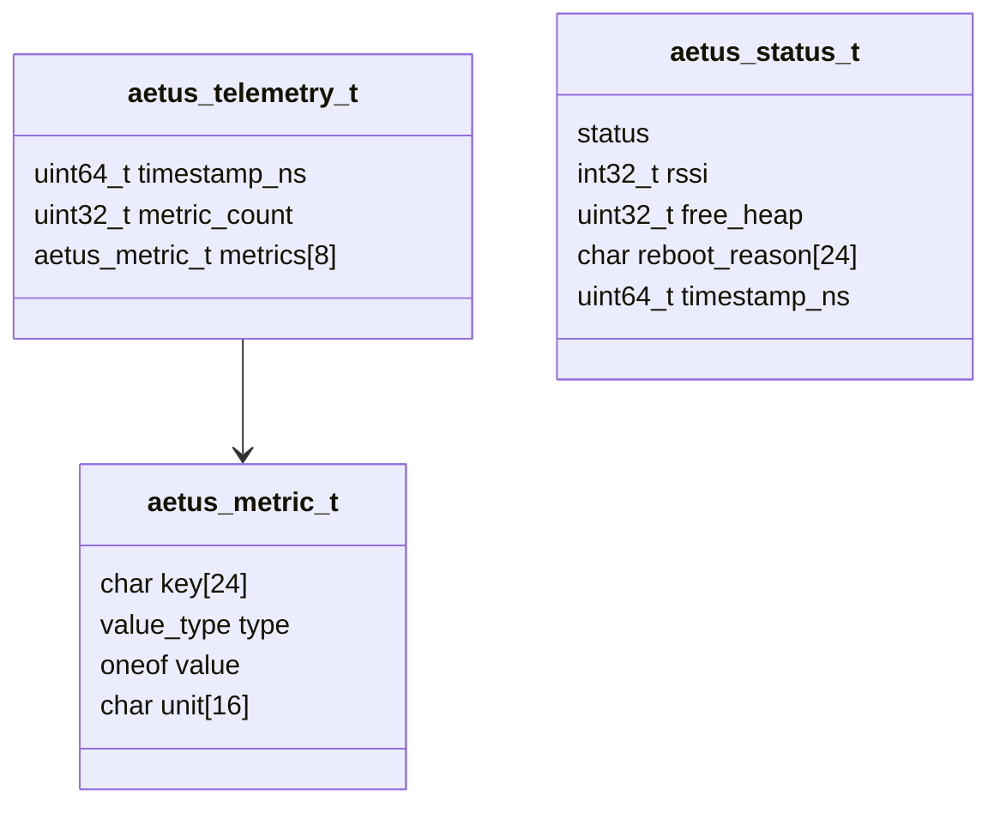
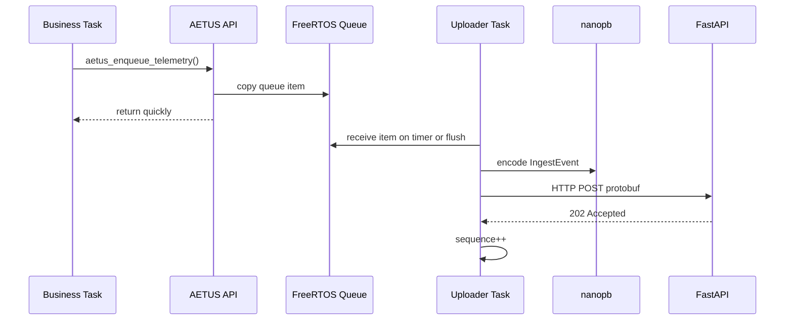
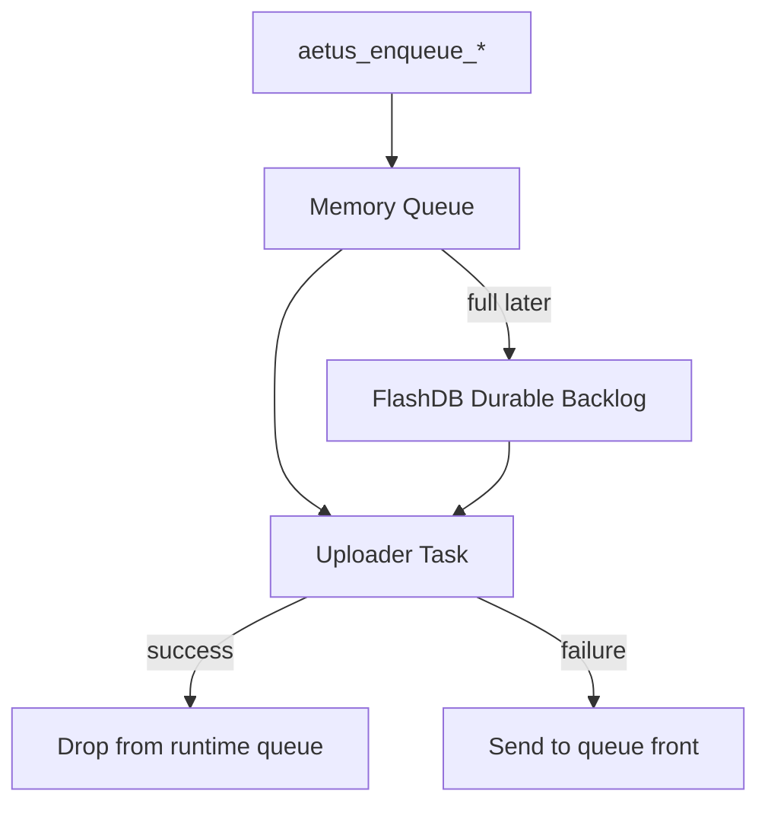

# Standard ESP32 Upload Stack

## 목적

이 문서는 AETUS 표준 임베디드 업로드 스택의 구현 경계를 정의한다.

목표는 유저 펌웨어가 네트워크, protobuf, 재시도, 업로드 주기를 직접 다루지 않게 만드는 것이다. 유저는 비즈니스 로직 task에서 thread-safe API를 호출하고, AETUS 스택은 별도 uploader task에서 메시지를 서버까지 전달한다.

현재 구현 위치:

- [[../firmware/esp32-aetus]]
- [[../firmware/esp32c5-upload-smoke]]

## 설계 방향



핵심 결정:

- `ESP32-C5`를 표준 target으로 둔다.
- `ESP-IDF 6.0`을 기준으로 빌드한다.
- `FreeRTOS Queue`를 user task와 uploader task 사이의 경계로 둔다.
- `nanopb`로 protobuf payload를 만든다.
- 기본 transport는 분리망 HTTP다.
- `device_id + boot_id + sequence`는 서버 적재 중복 방지 기준으로 유지한다.

## 폴더 구조

```text
firmware/
  esp32-aetus/
    components/
      aetus/
      nanopb/
  esp32c5-upload-smoke/
    main/
```

역할:

- `esp32-aetus/components/aetus`: 공개 API, 업로드 task, protobuf encode, HTTP client
- `esp32-aetus/components/nanopb`: 최소 nanopb runtime
- `esp32c5-upload-smoke`: 실제 ESP32-C5 HIL 검증용 app

## 공개 API

헤더:

- [[../firmware/esp32-aetus/components/aetus/include/aetus.h]]

현재 공개 함수:

```c
esp_err_t aetus_start(const aetus_config_t *config);
esp_err_t aetus_enqueue_telemetry(const aetus_telemetry_t *telemetry, TickType_t timeout);
esp_err_t aetus_enqueue_status(const aetus_status_t *status, TickType_t timeout);
esp_err_t aetus_flush(TickType_t timeout);
```

Thread safety 규칙:

- `aetus_start()`는 부팅 초기에 1회 호출한다.
- `aetus_enqueue_telemetry()`는 여러 FreeRTOS task에서 동시에 호출해도 된다.
- `aetus_enqueue_status()`도 여러 FreeRTOS task에서 동시에 호출해도 된다.
- enqueue API는 메시지를 내부 queue item으로 복사하므로 caller의 stack-local struct를 재사용해도 된다.
- 현재 API는 ISR-safe가 아니다.
- ISR 경로에서 직접 업로드 이벤트를 만들 필요가 생기면 `aetus_enqueue_*_from_isr()`를 별도 추가한다.

## 데이터 모델

Telemetry는 `repeated Metric + oneof value` protobuf 모델을 따른다.

현재 C API에서 지원하는 metric value:

- `AETUS_METRIC_VALUE_INT64`
- `AETUS_METRIC_VALUE_DOUBLE`
- `AETUS_METRIC_VALUE_BOOL`
- `AETUS_METRIC_VALUE_STRING`
- `AETUS_METRIC_VALUE_BYTES`

Status event는 재부팅, online, degraded, offline 같은 장치 상태를 보낼 때 사용한다.



## 업로드 흐름



업로드 트리거:

- 기본 주기: 10분
- 테스트 주기: `.env.hil`에서 10초 등으로 조정
- 즉시 업로드: `aetus_flush(timeout)`

실패 처리:

- Wi-Fi 연결 실패 시 해당 drain cycle을 종료한다.
- HTTP 실패 시 실패한 메시지를 queue front에 다시 넣는다.
- queue가 가득 차서 재삽입할 수 없으면 해당 메시지는 drop된다.
- sequence는 서버가 2xx를 반환한 경우에만 증가한다.

## Boot ID와 Sequence

현재 구현:

- `aetus_start()`에서 `boot-xxxxxxxx` 형식의 boot ID를 생성한다.
- boot ID seed는 `esp_random()`이다.
- sequence는 `0`에서 시작한다.
- telemetry와 status 모두 같은 sequence stream을 사용한다.
- 서버 수락 후 sequence를 증가시킨다.

의미:

- 재부팅 후에는 새 boot ID가 생성된다.
- 재부팅 후 sequence는 다시 `0`에서 시작한다.
- 서버는 `device_id + boot_id + sequence`로 같은 이벤트 재전송을 식별할 수 있다.

## 사용자 펌웨어 예시

```c
#include "aetus.h"

static void sensor_task(void *arg)
{
    (void)arg;

    while (true) {
        aetus_telemetry_t telemetry = {0};
        telemetry.metric_count = 1;

        strncpy(telemetry.metrics[0].key, "temperature", sizeof(telemetry.metrics[0].key) - 1);
        telemetry.metrics[0].type = AETUS_METRIC_VALUE_DOUBLE;
        telemetry.metrics[0].value.double_value = 22.5;
        strncpy(telemetry.metrics[0].unit, "celsius", sizeof(telemetry.metrics[0].unit) - 1);

        esp_err_t err = aetus_enqueue_telemetry(&telemetry, pdMS_TO_TICKS(50));
        if (err != ESP_OK) {
            // Queue is full or uploader is not started. Business logic decides whether to drop or retry.
        }

        vTaskDelay(pdMS_TO_TICKS(1000));
    }
}
```

## 현재 구현 범위

구현됨:

- portable ESP-IDF component layout
- thread-safe enqueue API
- in-memory FreeRTOS queue
- periodic upload timer
- manual flush
- protobuf encode via nanopb
- HTTP POST with bearer token
- telemetry event
- status event
- double, int64, bool, string, bytes metric value
- upload success 후 sequence 증가
- upload 실패 메시지 requeue

아직 구현하지 않음:

- FlashDB durable backlog
- NimBLE 기반 현장 설정 또는 진단 API
- ISR-safe enqueue API
- Wi-Fi ownership 분리
- HTTPS certificate verification bypass option
- provisioning client

## FlashDB 통합 계획

FlashDB는 표준 스택의 중요한 구성요소지만, 첫 portable extraction에서는 메모리 큐까지만 구현한다.

권장 다음 단계:

1. queue full 또는 upload failure 시 FlashDB에 event envelope 저장
2. uploader task가 upload cycle 시작 시 FlashDB backlog를 먼저 drain
3. 성공한 FlashDB record는 tombstone 또는 delete 처리
4. Flash wear를 고려해 batch delete 또는 compaction 정책 정의
5. low-power mode 진입 전 `aetus_flush()`와 FlashDB sync를 연결



## HIL 검증 위치

현재 실기기 검증 app:

- [[../firmware/esp32c5-upload-smoke]]

검증 내용:

- ESP32-C5 실기기 빌드
- Wi-Fi 접속
- protobuf payload 생성
- `/v1/ingest` HTTP 업로드
- FastAPI, Kafka, Kafka Connect, PostgreSQL 적재 확인

이 app은 제품 코드가 아니라 표준 스택의 HIL consumer 예제다.
