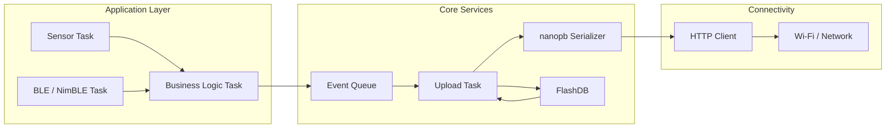

# Embedded Architecture

## 목적

이 문서는 `ESP32-C5` 기반 임베디드 기기의 표준 소프트웨어 구조를 정의한다.

핵심 목표는 다음과 같다.

- 유저는 센서 처리, 상태 판단, 제어 같은 비즈니스 로직에 집중한다.
- 업로드 로직은 별도 task가 담당한다.
- 이벤트 생성과 네트워크 전송을 메시지 큐 기반으로 분리한다.
- 네트워크 불안정이나 서버 장애가 있어도 비즈니스 로직 task가 직접 영향을 덜 받도록 한다.

## 표준 임베디드 스택

표준 목표 스택:

- `ESP32-C5`
- `ESP-IDF`
- `FreeRTOS`
- `NimBLE`
- `FlashDB`
- `nanopb`

역할 요약:

- `ESP-IDF`: 보드 지원, 네트워크, 시스템 프레임워크
- `FreeRTOS`: task, queue, timer, synchronization
- `NimBLE`: BLE 통신이 필요한 경우 표준 BLE 스택
- `FlashDB`: 로컬 이벤트 버퍼링 및 설정 저장
- `nanopb`: protobuf 메시지 직렬화

현재 `firmware/esp32-aetus` portable component는 `ESP-IDF`, `FreeRTOS`, `NimBLE`, `nanopb` 기반으로 구현되어 있다. `FlashDB` durable backlog는 설계상 포함되어 있지만 아직 구현되지 않았고, 현재 재시도 버퍼는 메모리 queue 중심이다.

## 설계 원칙

- 비즈니스 로직 task와 업로드 task를 분리한다.
- 이벤트는 공통 메시지 구조로 큐에 넣는다.
- 네트워크 전송 실패는 업로드 task에서 처리한다.
- 로컬 보관이 필요한 이벤트는 `FlashDB`에 저장한다.
- protobuf 인코딩은 업로드 직전 또는 큐 적재 직전에 수행할 수 있으나, 책임은 공통 메시지 경계에서 명확히 둔다.

## 권장 구조



## Task 분리

권장 task 구성:

- `business_logic_task`
- `upload_task`
- `connectivity_task`
- `ble_task`
- `sensor_task`

핵심 원칙:

- `business_logic_task`는 절대 직접 HTTP 업로드를 하지 않는다.
- `business_logic_task`는 이벤트 객체를 큐에 넣고 바로 복귀한다.
- `upload_task`가 큐를 소비하고, protobuf 인코딩, 재시도, 서버 업로드를 담당한다.

## 메시지 기반 큐잉

이 구조의 핵심은 "비즈니스 로직은 이벤트를 발행만 하고, 전송은 별도 consumer task가 처리한다"는 점이다.

예시 흐름:

1. 센서 값 변화 감지
2. 비즈니스 로직이 이벤트 생성
3. 이벤트를 `FreeRTOS Queue`에 적재
4. `upload_task`가 큐에서 이벤트 수신
5. protobuf 직렬화
6. 서버 업로드
7. 실패 시 재시도 또는 `FlashDB` 저장

장점:

- 비즈니스 로직이 네트워크 지연에 묶이지 않음
- 업로드 정책 변경이 앱 로직에 덜 영향을 줌
- 테스트 경계가 명확해짐

## 권장 이벤트 구조

임베디드 내부에서는 protobuf 원본 메시지와 1:1일 필요는 없다. 다만 업로드 task가 protobuf로 옮기기 쉬운 공통 구조를 가지는 것이 좋다.

예시 개념:

```c
typedef enum {
    APP_EVENT_TELEMETRY = 0,
    APP_EVENT_STATUS = 1,
    APP_EVENT_ALERT = 2,
} app_event_type_t;

typedef struct {
    char device_id[32];
    char boot_id[32];
    uint64_t sequence;
    app_event_type_t type;
    uint32_t firmware_version;
    uint64_t uptime_ms;
    uint64_t timestamp_ns;
    // payload union or metric list reference
} app_event_t;
```

## boot_id 생성 규칙

`boot_id`는 임베디드에서 반드시 생성한다.

규칙:

- 부팅할 때마다 새 `boot_id` 생성
- 같은 부팅 세션 동안에는 동일 값 유지
- 재부팅 후에는 반드시 다른 값 사용
- reset reason이 무엇이든 새 부팅 세션이면 새 `boot_id` 사용

권장 방식:

- 난수 기반 문자열
- 또는 영속 부팅 카운터 기반 문자열

예:

- `boot-a1b2c3d4`
- `boot-0000002f`

핵심은 사람이 읽기 쉬운 형식보다 "부팅 세션마다 달라지는 안정적 값"이다.

## hardware_id 규칙

프로비저닝용 `hardware_id`는 아래 규칙으로 정의한다.

- 형식: `{device_type}-{mac}`
- 예: `esp32c5-a1b2c3d4e5f6`

권장 원칙:

- `device_type`은 제품군 또는 보드 계열을 나타냄
- `mac`는 장치의 MAC 주소를 구분자 없이 소문자 hex로 표현
- 이 값은 provisioning allowlist 확인용으로 사용
- 실제 업로드 인증은 provisioning 이후 발급된 `device token`으로 수행

## sequence 관리

`sequence`는 각 부팅 세션 내부에서 단조 증가하도록 유지한다.

권장 방식:

- 부팅 시 `sequence = 0`부터 시작
- 이벤트 생성 시마다 1 증가
- 재전송 시에는 기존 이벤트의 `sequence`를 그대로 유지
- 재부팅 시 다시 `0`으로 초기화
- 서버는 `device_id + boot_id + sequence`를 중복 방지 기준으로 사용

이 방식이면 재전송 시에도 같은 이벤트를 안정적으로 식별할 수 있다.

## FlashDB 역할

`FlashDB`는 다음 역할로 사용한다.

- 전송 실패 이벤트 임시 저장
- 기기 설정 저장
- 부팅 카운터 또는 장치 메타데이터 저장

권장 사용 패턴:

- 실시간 hot path는 우선 메모리 큐 사용
- 큐 적체 또는 업로드 실패 시 `FlashDB`에 영속화
- 업로드 task가 재시도 시 `FlashDB`에서도 읽어 전송

## 업로드 task 책임

`upload_task`가 담당하는 것:

- 이벤트 큐 수신
- protobuf 메시지 생성
- HTTP 전송
- 응답 코드 처리
- retry / backoff
- `FlashDB` fallback 저장
- 저장된 이벤트 재전송
- 재부팅 보고 시 `reboot_reason` 포함 상태 이벤트 전송

`upload_task`가 담당하지 않는 것:

- 센서 해석
- 비즈니스 의사결정
- 제어 로직

## protobuf 처리 위치

권장 방식:

- 비즈니스 로직은 내부 `app_event_t` 생성
- `upload_task`가 `app_event_t -> nanopb protobuf` 변환 수행

이유:

- protobuf 스키마 변경이 앱 로직에 덜 번짐
- 비즈니스 로직이 serialization 세부사항을 몰라도 됨
- 업로드 경계가 명확함

## 네트워크 정책

현재 시스템 전제:

- 기본 transport는 `HTTP`
- `HTTPS`를 쓰더라도 인증서 검증은 수행하지 않음
- source IP는 `L4` 직결 환경에서 서버에 원본 그대로 전달된다고 가정

임베디드 측 해석:

- transport 보안보다 분리망/토큰/rate limit 전제를 우선
- 네트워크 클라이언트 구현은 단순하게 유지

## BLE / NimBLE 위치

`NimBLE`은 직접 업로드 채널이 아니라, 장치 설정/페어링/현장 진단/초기 프로비저닝 보조 채널로 보는 것이 적절하다.

가능한 용도:

- 장치 상태 확인
- 현장 설정값 변경
- 프로비저닝 보조 입력
- 디버그 정보 조회

권장 원칙:

- BLE 로직도 비즈니스 로직과 업로드 로직을 직접 결합하지 않음
- BLE에서 들어온 설정 변경은 내부 메시지 또는 설정 저장 경로로 전달

## 유저 개발 경험 목표

이 구조에서 유저는 주로 아래에 집중하면 된다.

- 센서 값 읽기
- 특정 조건에서 어떤 이벤트를 만들지
- 상태 머신
- 제어 로직

유저가 최대한 신경 쓰지 않게 할 영역:

- HTTP 전송 세부 구현
- protobuf 인코딩 세부 구현
- retry / backoff
- 로컬 재전송 버퍼 관리

## 권장 개발 규칙

- 비즈니스 로직 코드에서 네트워크 API 직접 호출 금지
- 비즈니스 로직 코드에서 `FlashDB` 직접 접근 최소화
- 모든 외부 업로드는 `upload_task` 단일 진입점 사용
- protobuf 메시지 생성은 가능한 공통 모듈로 캡슐화

## 이후 확장 포인트

- 표준 업로드 컴포넌트 구현 상세는 [[06-2-standard-embedded-upload-stack]]에서 관리한다.
- 임베디드 섹션 하위에 `boot sequence`, `FlashDB schema`, `upload retry policy`, `BLE provisioning flow` 문서를 별도 분리 가능
- [[06-1-event-driven-low-power-system-implementation-plan]]에서 `OPT3001` 기반 이벤트 구동 저전력 동작 계획을 상세화
