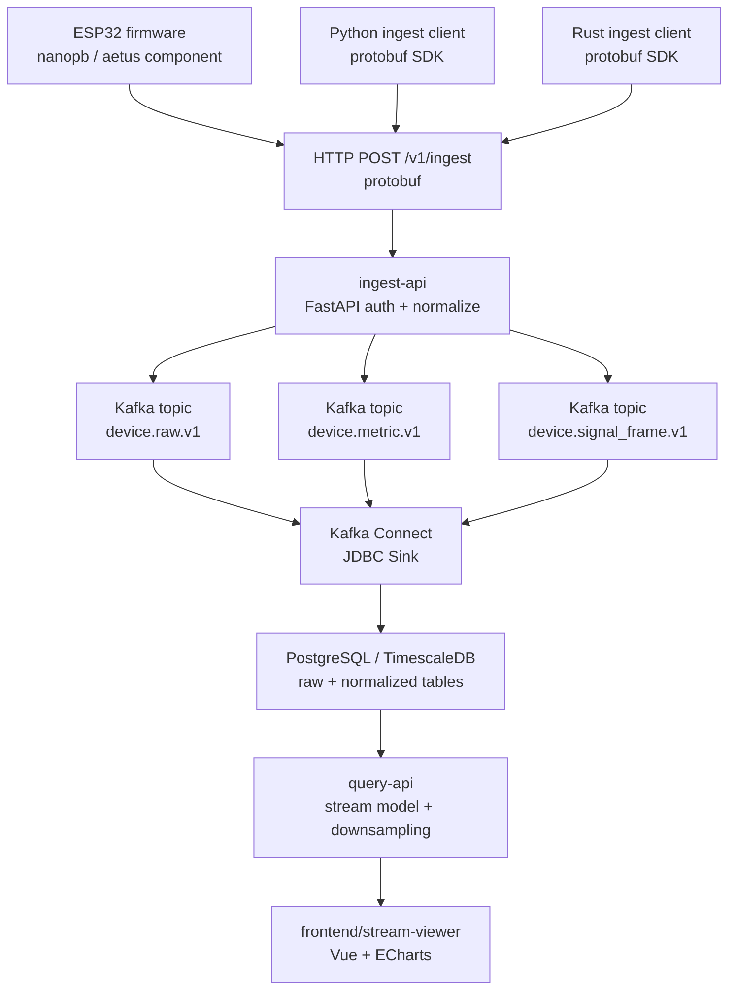
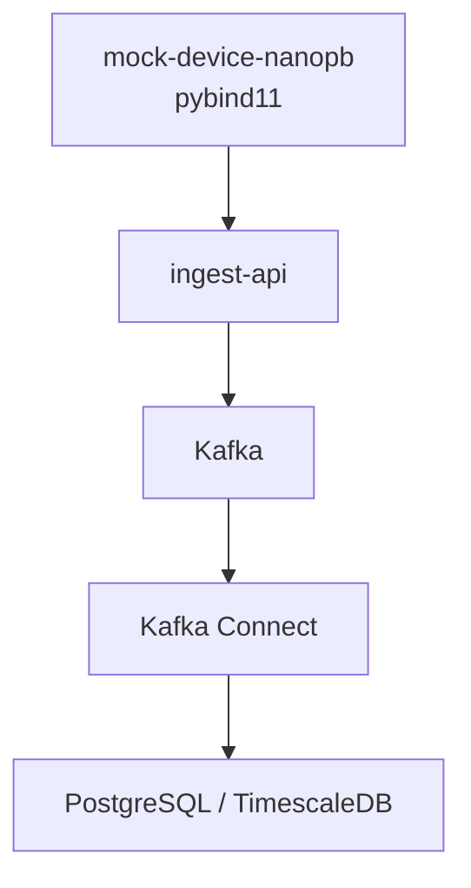
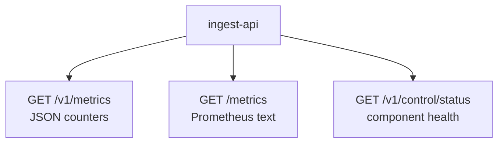
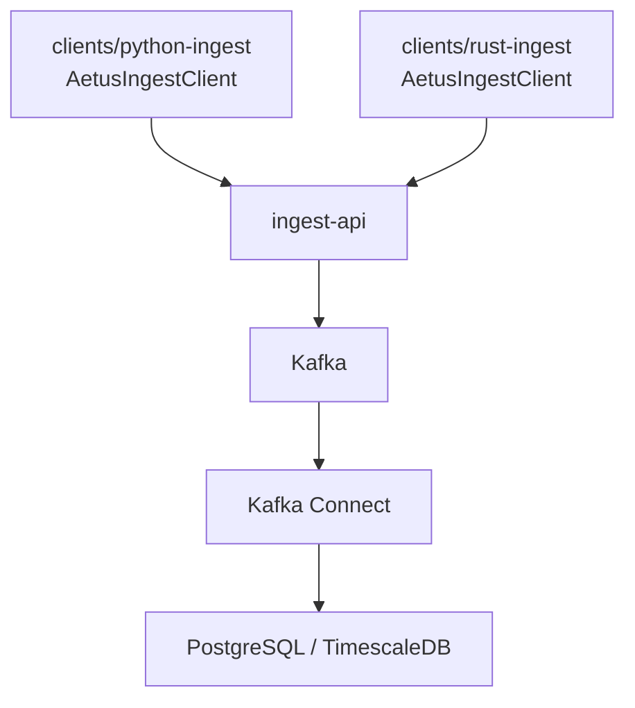
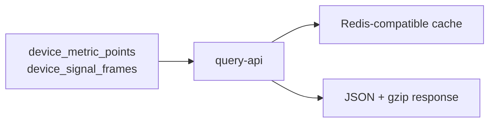
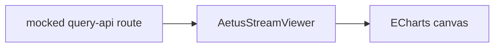
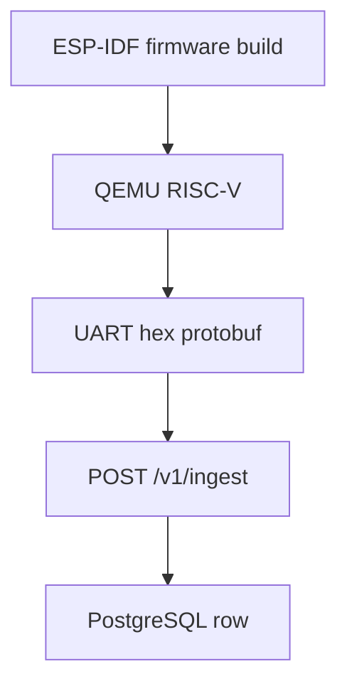
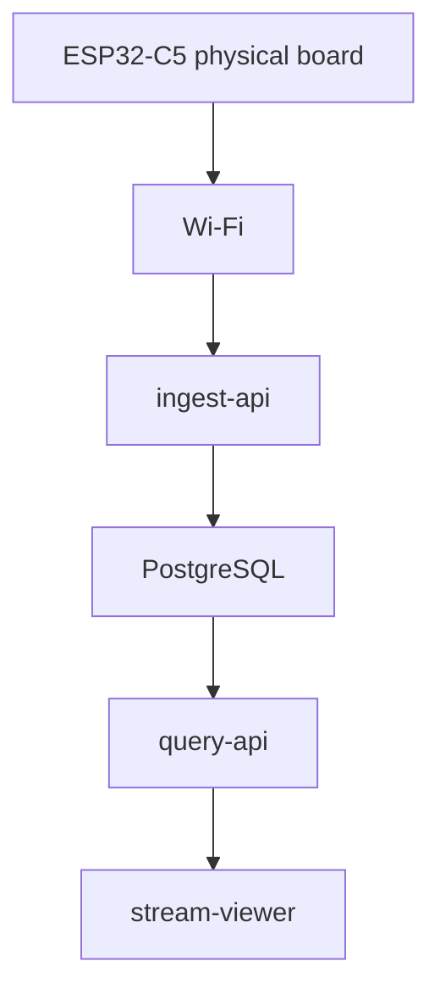

# Testing And E2E Coverage

## 목적

이 문서는 현재 AETUS 프로젝트의 테스트 루프를 “데이터가 실제로 어디까지 흐르는가” 기준으로 정리한다.

목표:

- 펌웨어에서 생성된 protobuf가 ingest, Kafka, PostgreSQL, query-api, frontend까지 이어지는지 한눈에 확인
- GitHub Actions에서 자동으로 막는 영역과 수동/HIL로 남겨둔 영역을 구분
- 현재 기준 테스트 구멍과 다음 보강 우선순위를 명확히 남김

## 전체 데이터 루프

## 테스트 계층

| 계층 | 위치 | 자동 CI | 목적 |
| --- | --- | --- | --- |
| ingest unit | `services/ingest-api/tests/unit` | yes | 인증, rate limit, protobuf normalize, publisher contract |
| ingest compose e2e | `services/ingest-api/tests/e2e` | yes | provisioning, ingest, Kafka, Kafka Connect, PostgreSQL 적재, Kafka Connect 장애/복구 |
| Python ingest client unit/e2e | `clients/python-ingest/tests` | yes | Python SDK event building, protobuf upload, PostgreSQL normalized 적재 |
| Rust ingest client unit/e2e | `clients/rust-ingest/tests` | yes | Rust SDK event building, protobuf upload, PostgreSQL normalized 적재 |
| query-api unit/e2e | `services/query-api/tests` | yes | stream 조회, raw sample decode, downsampling, Redis cache, DB-backed query |
| stream-viewer build/e2e | `frontend/stream-viewer` | yes | portable Vue component build, mocked query-api 기반 chart 렌더 |
| ingest-control-panel build | `frontend/ingest-control-panel` | yes | control panel bundle build |
| firmware examples build | `firmware/examples` | yes | ESP-IDF 6.0, ESP32-C5 target compile coverage for standalone examples |
| firmware test-apps build | `firmware/test-apps` | yes | QEMU fixture, HIL app, signal frame memory contract app의 compile coverage |
| firmware negative compile | `firmware/test-apps/cpp-literal-limit-negative` | yes | C++ wrapper가 overlong metric key literal을 static_assert로 거부하는지 검증 |
| QEMU firmware e2e | `services/ingest-api/tests/qemu_e2e` | manual workflow | ESP-IDF firmware build, QEMU 실행, UART protobuf stream, DB 적재 |
| HIL firmware runtime | `firmware/test-apps/esp32c5-upload-smoke`, `firmware/examples/cpp-basic`, `firmware/examples/cpp-signal-frame` | no | 실제 ESP32-C5 Wi-Fi/HMAC/provisioning/upload 검증 |

## GitHub Actions 기준

기본 `CI` workflow는 다음을 실행한다.

- `ingest-control-panel`: `npm ci`, `npm run build`
- `stream-viewer`: `npm ci`, `npm run build`, `npm run test:e2e`
- `ingest-unit`: `uv run pytest tests/unit -q`
- `query-api`: `uv run pytest -q`
- `python-ingest-client`: `uv run pytest -q`
- `rust-ingest-client`: `cargo test -- --test-threads=1`
- `e2e`: `uv run pytest tests/e2e -q` in `services/ingest-api`
- `Firmware Examples Build`: `idf.py -C firmware/examples/<example> -B build-ci set-target esp32c5 build`
- `Firmware Test Apps Build`: `idf.py -C firmware/test-apps/<app> -B build-ci set-target <target> build`
- `Negative compile checks`: C++ wrapper overlong metric key literal build가 실패하고 `AETUS metric key literal is too long` static_assert 문구를 내는지 확인

`ESP32 QEMU E2E` workflow는 수동 실행이다.

- 이유: ESP-IDF v6.0 설치와 QEMU 준비 시간이 길다.
- 검증 대상: host mock이 아니라 실제 ESP-IDF firmware binary가 만든 protobuf stream.

## 현재 자동으로 검증되는 루프

### 1. Host nanopb mock to PostgreSQL

검증 내용:

- protobuf telemetry/status/signal frame 업로드
- bearer/HMAC 인증
- provisioning 발급 token
- rate limit
- Kafka publish
- Kafka Connect JDBC Sink
- Kafka Connect 중단 중 ingest 수락, DB 적재 지연, Connect 재기동 후 Kafka backlog 적재
- `raw_device_events`
- `device_metric_points`
- `device_signal_frames`
- Timescale hypertable/compression/retention policy 존재

### 1-0. Ingest Observability Contract

검증 내용:

- HTTP method/path/status counter
- accepted ingest event counter by `event_type` and `payload_kind`
- ingest payload byte counter
- publisher failure counter
- Prometheus text exposition format

### 1-1. Client SDKs to PostgreSQL

검증 내용:

- provisioning으로 발급한 device token 사용
- Python/Rust SDK의 metric/status/signal frame protobuf 생성
- HTTP header와 bearer auth contract
- 성공 응답에서만 sequence 증가
- `raw_device_events`
- `device_metric_points`
- `device_signal_frames`

### 2. PostgreSQL to Query API

검증 내용:

- unified stream 목록
- scalar series
- sampled raw sample series
- sampled sample-bucket envelope
- raw frame drill-down
- summary feature materialization
- invalid range/window 거부
- Redis-compatible cache hit

### 3. Query API Contract to Frontend Component

검증 내용:

- `queryServerUrl` prop만으로 API 경로 구성
- sampled stream 렌더링
- scalar stream 전환
- ECharts canvas 생성

## 수동 또는 별도 실행 루프

### QEMU firmware e2e

이 루프는 `workflow_dispatch`로 실행한다.

### HIL firmware

HIL은 실기기, Wi-Fi, BLE provisioning, GPIO LED, HMAC upload, power mode 같은 물리 조건을 보기 위한 영역이다.
`firmware/test-apps/esp32c5-upload-smoke`의 compile coverage는 GitHub Actions에 포함하지만, 실제 flash/monitor/runtime 검증은 로컬 HIL로만 수행한다.
`firmware/test-apps/esp32c5-isr-enqueue`는 runtime에서 ISR 정상 enqueue와 4개 초과 metric overflow 거부를 함께 확인한다.
`firmware/test-apps/qemu-telemetry-heap`은 QEMU runtime에서 5개 이상 metric의 heap storage, string/bytes blob deep-copy, producer deinit 이후 queue item ownership 유지, release counter, 반복 실행 후 heap 회복을 확인한다.

## 현재 남은 테스트 구멍

### P0

현재 문서 작성 시점 기준 P0 구멍은 CI workflow 보강으로 해소했다.

- `query-api` tests가 기본 CI에 포함됨
- `frontend/stream-viewer` build/e2e가 기본 CI에 포함됨

### P1

- `stream-viewer` frontend e2e가 `mode=envelope` sampled 응답을 별도 테스트하지 않는다. 지금은 dense `mode=samples`, multi-device overlay, scalar 전환, zoom refetch 중심이다.
- query-api e2e에 `max_points=10000` dense scenario가 없다. unit으로는 sample-bucket을 검증하지만, DB/API/JSON 전체 경로의 고밀도 응답 검증은 아직 별도다.
- rollup row가 존재할 때 query-api가 raw fallback 대신 rollup을 선택하는 DB-backed e2e가 없다.
- multi-channel sampled stream에서 모든 channel이 동일 timestamp alignment와 point count를 유지하는지 unit/e2e 보강이 필요하다.
- cache key가 `device_id`, `stream_key`, `from`, `to`, `max_points` 변화에 따라 섞이지 않는지 더 직접적인 테스트가 필요하다.
- Kafka broker 자체 중단 시 ingest-api가 `503`으로 빠르게 실패하고 recovery 후 다시 수락하는 장애 주입 E2E가 필요하다. 현재는 Kafka Connect sink 장애/복구를 먼저 커버한다.
- PostgreSQL 중단 시 Kafka Connect task 상태, backlog 유지, DB 복구 후 적재 재개를 확인하는 장애 주입 E2E가 필요하다.

### P2

- `seed_dense_query_data.py`는 CLI help와 수동 실행 위주다. 작은 규모의 deterministic seed unit 또는 integration test가 있으면 좋다.
- `ingest-control-panel`은 build만 있고 브라우저 e2e가 없다.
- firmware portable component는 host-side C/C++ unit test가 거의 없다. ESP-IDF 없이 검증 가능한 string copy, queue policy, HMAC signing input construction 같은 순수 로직은 분리하면 테스트 가능하다.
- signal frame sample memory pool은 static/FreeRTOS heap backend와 기본 release stats를 갖췄다. `signal-frame-contract` compile test는 유지하고, 이후에는 upload success release, retry ownership 유지, final drop release를 ESP-IDF Unity 또는 host-testable module로 더 촘촘히 보강해야 한다.
- HIL 결과를 사람이 읽는 로그에 의존한다. 장기적으로는 HIL pytest marker와 장치 포트/env 기반 수동 test runner가 있으면 좋다.

## 권장 다음 작업

1. `stream-viewer` e2e에 envelope 응답 렌더링 케이스 추가
2. query-api e2e에 작은 dense fixture로 `max_points` 수렴 검증 추가
3. rollup table seed 후 rollup source 선택 검증 추가
4. query-api cache key collision 방지 테스트 추가
5. firmware component 순수 로직을 host-testable module로 분리
