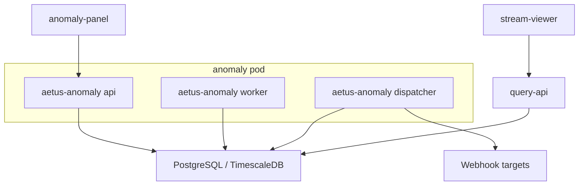
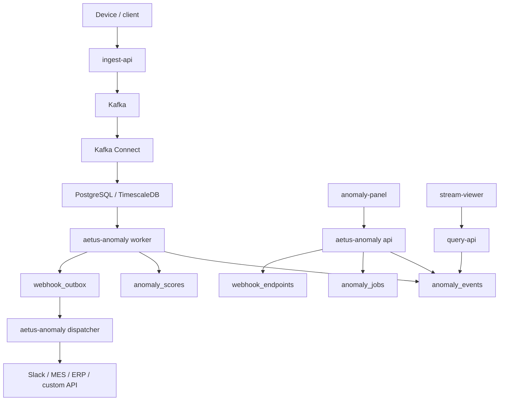
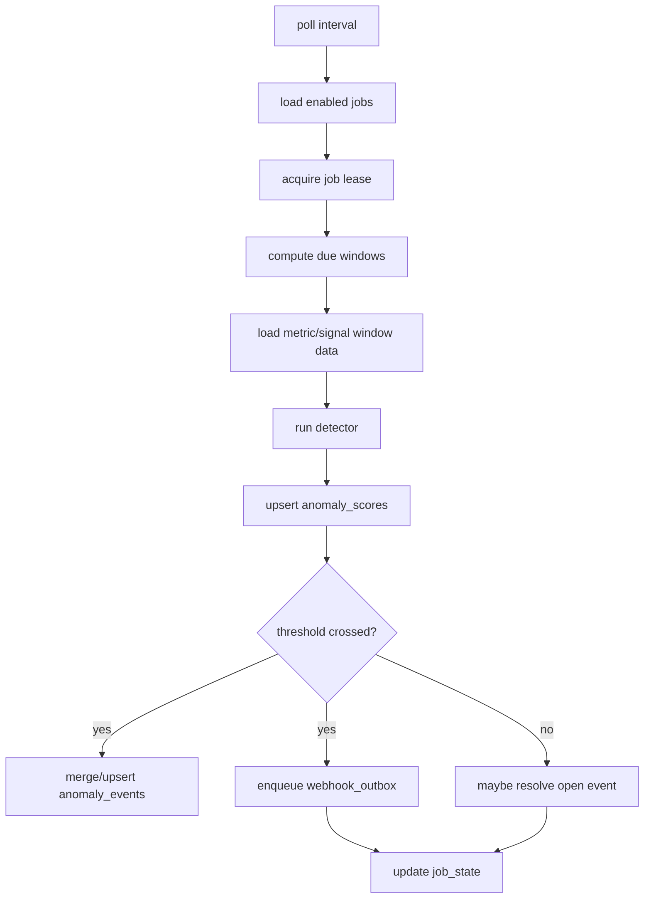
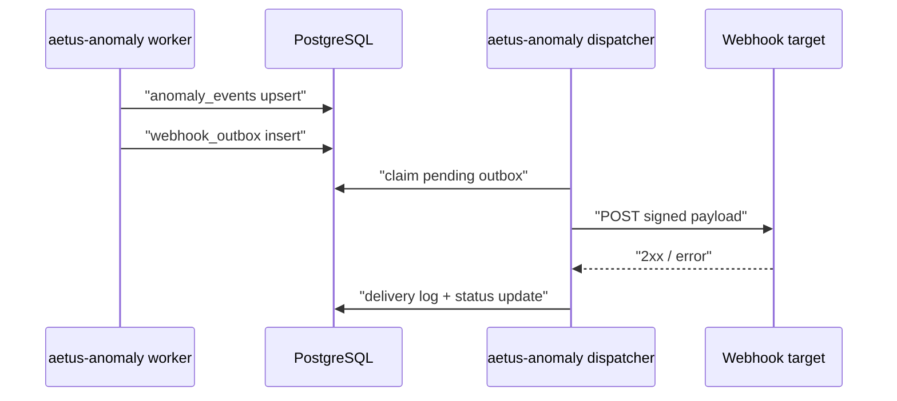

# Anomaly Detection Service Plan

## 목적

이 문서는 AETUS에 window 기반 이상감지와 webhook 알림 기능을 추가하기 위한 구현 계획을 정리한다.

핵심 목표:

- ingest 경로의 안정성을 해치지 않는다
- PostgreSQL/TimescaleDB에 적재된 metric/signal stream을 기준으로 window 감지를 수행한다
- 감지 결과를 DB에 보존하고 query/frontend에서 overlay로 소비할 수 있게 한다
- 외부 시스템 연동은 webhook outbox로 비동기 처리한다
- 초기에는 rule-based detector를 구현하고, 이후 ML detector를 같은 실행 모델에 붙일 수 있게 한다

## 결론

anomaly 기능은 `services/anomaly`라는 하나의 Rust 서비스 코드베이스로 둔다.

단, 런타임 역할은 분리한다.

- `aetus-anomaly api`: panel/API용 설정 및 조회
- `aetus-anomaly worker`: window 기반 detector 실행
- `aetus-anomaly dispatcher`: webhook outbox 발송/retry/dead-letter 처리

초기 운영은 하나의 Kubernetes Pod 안에서 여러 container로 구성한다.
각 container는 같은 Docker image와 같은 Rust binary를 사용하고 command만 다르게 실행한다.



정합성 있는 상태는 DB를 source of truth로 둔다.
Pod 내부 IPC는 필수로 설계하지 않는다.
worker 상태 표시가 필요하면 DB heartbeat row와 Prometheus metrics를 우선 사용하고, local IPC는 편의 기능으로만 둔다.

## 왜 DB 뒷단인가

window 기반 이상감지는 과거 구간 조회, late-arrival 처리, 재처리, detector version 변경, backfill이 중요하다.

따라서 Kafka streaming consumer보다 DB 뒷단 worker가 초기 구현에 더 적합하다.

| 방식 | 장점 | 단점 | 판단 |
| --- | --- | --- | --- |
| ingest inline | 즉시 처리 가능 | 수집 지연/장애 영향 큼 | 사용하지 않음 |
| Kafka streaming detector | 저지연 | late arrival, backfill, 모델 변경 복잡 | 추후 low-latency 옵션 |
| DB-backed worker | window 조회, 재처리, 운영 단순 | 초저지연은 아님 | 기본안 |

## 상위 데이터 흐름



## 서비스 구조

권장 디렉터리:

```text
services/
  anomaly/
    Dockerfile
    Cargo.toml
    migrations/
    src/
      main.rs
      config.rs
      error.rs
      api/
        mod.rs
        routes.rs
        schemas.rs
        auth.rs
        openapi.rs
      repository/
        mod.rs
        jobs.rs
        events.rs
        webhooks.rs
        streams.rs
      detector/
        mod.rs
        threshold.rs
        rms.rs
        peak.rs
        missing_data.rs
      worker/
        mod.rs
        lease.rs
        planner.rs
      webhook/
        mod.rs
        signing.rs
        retry.rs
      metrics.rs
    tests/
      unit/
      e2e/
frontend/
  anomaly-panel/
```

Rust stack:

- `axum`: HTTP API server
- `tokio`: async runtime
- `sqlx`: PostgreSQL access and migrations
- `serde` / `serde_json`: JSONB config, API payload, webhook payload
- `utoipa` / `utoipa-swagger-ui`: OpenAPI schema and docs UI
- `tower-http`: CORS, tracing, compression, request middleware
- `reqwest`: webhook delivery
- `tracing`: structured logs
- `metrics` or `prometheus-client`: Prometheus metrics
- `clap`: multi-command binary

전체 Rust로 가는 이유:

- worker의 signal frame decode, window scan, RMS/stddev/peak 계산이 CPU와 메모리 효율에 민감하다
- API, worker, dispatcher가 같은 DB model과 config type을 공유할 수 있다
- 단일 binary를 `api`, `worker`, `dispatcher` subcommand로 실행해 배포 artifact가 단순해진다
- webhook dispatcher도 async HTTP/retry/timeout 처리에 Rust와 Tokio가 잘 맞는다
- 장기적으로 ML/rule detector를 trait 기반으로 확장하기 쉽다

FastAPI 스타일의 OpenAPI/validation 편의성은 `utoipa`, `serde`, request type validation helper로 보완한다.

## Pod 구성

초기 Kubernetes 구성:

```text
Deployment: anomaly
  Pod:
    container: anomaly-api
      command: aetus-anomaly api
    container: anomaly-worker
      command: aetus-anomaly worker
    container: webhook-dispatcher
      command: aetus-anomaly dispatcher
```

공통 env:

- `AETUS_POSTGRES_DSN`
- `AETUS_ANOMALY_POLL_INTERVAL_SECONDS`
- `AETUS_ANOMALY_WORKER_ID`
- `AETUS_ANOMALY_WEBHOOK_TIMEOUT_SECONDS`
- `AETUS_ANOMALY_WEBHOOK_MAX_ATTEMPTS`
- `AETUS_ANOMALY_WEBHOOK_SIGNING_ENABLED`

스케일 아웃 기준:

- detector job 수가 증가하면 `aetus-anomaly worker` container만 별도 Deployment로 분리
- webhook backlog가 증가하면 `aetus-anomaly dispatcher` container만 별도 Deployment로 분리
- API 부하가 증가하면 `aetus-anomaly api` container만 별도 Deployment로 분리

초기에는 하나의 Pod로 묶어 운영 단순성을 우선한다.

## DB Schema 초안

### anomaly_jobs

감지 작업 정의.

```sql
CREATE TABLE anomaly_jobs (
    job_id BIGSERIAL PRIMARY KEY,
    job_key TEXT NOT NULL UNIQUE,
    enabled BOOLEAN NOT NULL DEFAULT TRUE,
    device_selector JSONB NOT NULL,
    stream_selector JSONB NOT NULL,
    detector_type TEXT NOT NULL,
    detector_config JSONB NOT NULL,
    window_seconds INTEGER NOT NULL,
    step_seconds INTEGER NOT NULL,
    lookback_seconds INTEGER NOT NULL DEFAULT 0,
    severity TEXT NOT NULL DEFAULT 'warning',
    created_at TIMESTAMPTZ NOT NULL DEFAULT NOW(),
    updated_at TIMESTAMPTZ NOT NULL DEFAULT NOW()
);
```

selector 예:

```json
{
  "devices": ["esp32c5-test-001"],
  "streams": ["motor.vibration"],
  "channels": ["accel_x", "accel_y"]
}
```

### anomaly_job_state

worker 진행 상태.

```sql
CREATE TABLE anomaly_job_state (
    job_id BIGINT PRIMARY KEY REFERENCES anomaly_jobs(job_id),
    last_window_end TIMESTAMPTZ NULL,
    lease_owner TEXT NULL,
    lease_until TIMESTAMPTZ NULL,
    heartbeat_at TIMESTAMPTZ NULL,
    last_error TEXT NULL,
    updated_at TIMESTAMPTZ NOT NULL DEFAULT NOW()
);
```

목적:

- 같은 job을 여러 worker가 동시에 처리하지 않도록 lease 사용
- API가 worker 상태를 DB에서 조회 가능
- worker 재시작 후 이어서 처리 가능

### anomaly_scores

window별 score.

```sql
CREATE TABLE anomaly_scores (
    score_id BIGSERIAL PRIMARY KEY,
    job_id BIGINT NOT NULL REFERENCES anomaly_jobs(job_id),
    device_pk BIGINT NOT NULL REFERENCES devices(device_pk),
    signal_pk BIGINT NULL REFERENCES signal_stream_definitions(signal_pk),
    metric_pk BIGINT NULL REFERENCES metric_definitions(metric_pk),
    channel_key TEXT NULL,
    window_start TIMESTAMPTZ NOT NULL,
    window_end TIMESTAMPTZ NOT NULL,
    score DOUBLE PRECISION NOT NULL,
    threshold DOUBLE PRECISION NULL,
    severity TEXT NOT NULL,
    detector_type TEXT NOT NULL,
    detector_version TEXT NOT NULL,
    details_json JSONB NOT NULL DEFAULT '{}'::jsonb,
    created_at TIMESTAMPTZ NOT NULL DEFAULT NOW(),
    UNIQUE (job_id, device_pk, COALESCE(signal_pk, 0), COALESCE(metric_pk, 0), COALESCE(channel_key, ''), window_start, window_end)
);
```

주의:

- PostgreSQL unique expression은 직접 위 형태로 만들 수 없으므로 실제 migration에서는 generated column 또는 expression index로 조정한다.
- metric stream과 sampled stream을 같은 table에서 다루기 위해 `signal_pk`/`metric_pk`를 nullable로 둔다.

### anomaly_events

운영자가 보는 이벤트.

```sql
CREATE TABLE anomaly_events (
    event_id UUID PRIMARY KEY,
    job_id BIGINT NOT NULL REFERENCES anomaly_jobs(job_id),
    device_pk BIGINT NOT NULL REFERENCES devices(device_pk),
    signal_pk BIGINT NULL REFERENCES signal_stream_definitions(signal_pk),
    metric_pk BIGINT NULL REFERENCES metric_definitions(metric_pk),
    channel_key TEXT NULL,
    event_start TIMESTAMPTZ NOT NULL,
    event_end TIMESTAMPTZ NOT NULL,
    severity TEXT NOT NULL,
    status TEXT NOT NULL DEFAULT 'open',
    score DOUBLE PRECISION NOT NULL,
    threshold DOUBLE PRECISION NULL,
    title TEXT NOT NULL,
    summary TEXT NOT NULL,
    details_json JSONB NOT NULL DEFAULT '{}'::jsonb,
    first_seen_at TIMESTAMPTZ NOT NULL DEFAULT NOW(),
    last_seen_at TIMESTAMPTZ NOT NULL DEFAULT NOW(),
    created_at TIMESTAMPTZ NOT NULL DEFAULT NOW(),
    updated_at TIMESTAMPTZ NOT NULL DEFAULT NOW()
);
```

event merge 정책:

- 같은 job/device/stream/channel에서 인접 window가 계속 threshold를 넘으면 기존 open event를 확장
- 정상 window가 일정 횟수 이상 이어지면 event를 `resolved`로 전환
- operator가 수동으로 `acknowledged`, `muted`, `closed` 상태로 바꿀 수 있게 확장 가능

### webhook_endpoints

외부 연동 endpoint 정의.

```sql
CREATE TABLE webhook_endpoints (
    endpoint_id BIGSERIAL PRIMARY KEY,
    endpoint_key TEXT NOT NULL UNIQUE,
    enabled BOOLEAN NOT NULL DEFAULT TRUE,
    url TEXT NOT NULL,
    secret TEXT NOT NULL,
    event_filter JSONB NOT NULL DEFAULT '{}'::jsonb,
    max_attempts INTEGER NOT NULL DEFAULT 8,
    timeout_seconds DOUBLE PRECISION NOT NULL DEFAULT 5.0,
    created_at TIMESTAMPTZ NOT NULL DEFAULT NOW(),
    updated_at TIMESTAMPTZ NOT NULL DEFAULT NOW()
);
```

### webhook_outbox

발송 예정/실패/완료 상태.

```sql
CREATE TABLE webhook_outbox (
    outbox_id BIGSERIAL PRIMARY KEY,
    endpoint_id BIGINT NOT NULL REFERENCES webhook_endpoints(endpoint_id),
    event_id UUID NOT NULL REFERENCES anomaly_events(event_id),
    payload_json JSONB NOT NULL,
    status TEXT NOT NULL DEFAULT 'pending',
    attempt_count INTEGER NOT NULL DEFAULT 0,
    next_attempt_at TIMESTAMPTZ NOT NULL DEFAULT NOW(),
    last_attempt_at TIMESTAMPTZ NULL,
    last_error TEXT NULL,
    created_at TIMESTAMPTZ NOT NULL DEFAULT NOW(),
    updated_at TIMESTAMPTZ NOT NULL DEFAULT NOW(),
    UNIQUE (endpoint_id, event_id)
);
```

### webhook_deliveries

발송 시도 로그.

```sql
CREATE TABLE webhook_deliveries (
    delivery_id BIGSERIAL PRIMARY KEY,
    outbox_id BIGINT NOT NULL REFERENCES webhook_outbox(outbox_id),
    endpoint_id BIGINT NOT NULL REFERENCES webhook_endpoints(endpoint_id),
    event_id UUID NOT NULL REFERENCES anomaly_events(event_id),
    attempt_number INTEGER NOT NULL,
    status_code INTEGER NULL,
    success BOOLEAN NOT NULL,
    error TEXT NULL,
    duration_ms INTEGER NULL,
    created_at TIMESTAMPTZ NOT NULL DEFAULT NOW()
);
```

## Detector v1

초기 detector는 rule-based로 시작한다.

지원 후보:

- `threshold`: scalar 또는 channel value가 threshold 초과
- `range`: 값이 min/max 범위를 벗어남
- `delta`: 이전 window 평균 대비 변화량 초과
- `rms_threshold`: sampled signal RMS 초과
- `peak_abs_threshold`: sampled signal peak abs 초과
- `stddev_threshold`: sampled signal 변동성 초과
- `missing_data`: 특정 stream의 데이터 공백 감지

Detector interface:

```rust
pub trait Detector: Send + Sync {
    fn detector_type(&self) -> &'static str;
    fn detector_version(&self) -> &'static str;
    fn evaluate(&self, window: &WindowData, config: &DetectorConfig) -> anyhow::Result<DetectionResult>;
}
```

`WindowData`는 query-api 응답 JSON을 그대로 재사용하지 않는다.
anomaly service 내부 repository가 DB에서 읽은 값을 detector 친화적인 object로 변환한다.

## Window 처리 방식

### metric stream

`device_metric_points`에서 window 범위를 조회한다.

권장 집계:

- count
- min
- max
- avg
- last value
- first value
- stddev

### sampled stream

우선순위:

1. `signal_frame_features`에 필요한 window/channel feature가 있으면 사용
2. 없으면 `device_signal_frames.samples`를 query-api와 동일한 decoder로 decode
3. 계산한 feature를 `signal_frame_features`에 upsert
4. 필요하면 `signal_rollup_points`를 보조 입력으로 사용

이 구조는 query-api와 비슷하지만, anomaly service가 query-api HTTP를 호출하지 않고 DB repository를 직접 사용한다.

이유:

- batch/window 처리에서 HTTP overhead를 피함
- detector가 feature cache를 직접 생성/재사용 가능
- query-api 장애가 감지 worker에 전파되지 않음

## Worker 알고리즘



Lease 원칙:

- `SELECT ... FOR UPDATE SKIP LOCKED` 또는 conditional update로 job lease 획득
- `lease_until`이 지난 job은 다른 worker가 가져갈 수 있음
- worker는 window 처리 중 heartbeat 갱신

Window 원칙:

- `window_seconds`: 판단 구간
- `step_seconds`: 다음 window 이동 폭
- `lookback_seconds`: late arrival 보정을 위해 마지막 처리 지점을 약간 되돌림
- 같은 score/event는 unique key로 idempotent upsert

## Webhook 설계

Detector는 외부 HTTP를 직접 호출하지 않는다.



### Payload

```json
{
  "event_id": "019...",
  "job_key": "motor-vibration-rms",
  "device_id": "device-001",
  "stream_key": "motor.vibration",
  "channel_key": "accel_x",
  "severity": "warning",
  "status": "open",
  "detector": {
    "type": "rms_threshold",
    "version": "1.0.0"
  },
  "window": {
    "from": "2026-05-10T12:00:00Z",
    "to": "2026-05-10T12:00:10Z"
  },
  "score": 0.93,
  "threshold": 0.8,
  "summary": "RMS exceeded threshold"
}
```

### Signature

Webhook request headers:

- `X-Aetus-Webhook-Id`
- `X-Aetus-Webhook-Timestamp`
- `X-Aetus-Webhook-Signature`

Signing input:

```text
<timestamp>.<raw_json_body>
```

Signature:

```text
hmac-sha256=<hex(HMAC_SHA256(endpoint_secret, signing_input))>
```

Retry:

- exponential backoff + jitter
- 2xx success
- 4xx는 설정에 따라 immediate dead-letter 또는 limited retry
- 5xx/network timeout은 retry
- max attempts 초과 시 `dead_letter`

## API v1 초안

Base path: `/v1/anomaly`

| Endpoint | Method | 설명 |
| --- | --- | --- |
| `/healthz` | GET | liveness |
| `/readyz` | GET | DB 연결 및 worker 상태 |
| `/jobs` | GET | detector job 목록 |
| `/jobs` | POST | detector job 생성 |
| `/jobs/{job_id}` | GET | detector job 상세 |
| `/jobs/{job_id}` | PATCH | enable/disable, config 수정 |
| `/jobs/{job_id}/run` | POST | 수동 backfill/run |
| `/events` | GET | anomaly event 검색 |
| `/events/{event_id}` | GET | event 상세 |
| `/events/{event_id}` | PATCH | ack/close/mute 상태 변경 |
| `/webhooks/endpoints` | GET | webhook endpoint 목록 |
| `/webhooks/endpoints` | POST | endpoint 생성 |
| `/webhooks/endpoints/{endpoint_id}` | PATCH | enable/disable/config 수정 |
| `/webhooks/deliveries` | GET | delivery 로그 조회 |
| `/webhooks/outbox/{outbox_id}/retry` | POST | dead-letter/pending 재시도 |

인증:

- 초기 구현은 internal admin token 또는 query JWT와 유사한 HS256 JWT 중 하나로 시작한다.
- 장기적으로는 host application이 operator auth를 담당하고 anomaly API에는 internal token/JWT만 전달한다.
- device token, bootstrap token, ingest HMAC secret은 anomaly frontend/API에 노출하지 않는다.

## Frontend: anomaly-panel

위치:

```text
frontend/anomaly-panel/
```

형태:

- Vue 3 portable component
- Naive UI
- host app이 `anomalyServerUrl`, `queryServerUrl`, `authToken` 또는 `tokenProvider`를 전달
- `stream-viewer`와 직접 결합하지 않고 drill-down link/event로 연동

초기 화면:

- detector job list
- recent anomaly event list
- event severity/status filter
- selected event detail
- webhook endpoint status
- webhook delivery/dead-letter list
- worker heartbeat / backlog / last run summary

Stream drill-down:

- anomaly event 클릭 시 `device_id`, `stream_key`, `event_start`, `event_end`를 host app에 emit
- host app은 기존 `AetusStreamViewer`에 range를 넘겨 시각화

## 구현 단계

### Phase 0: DB migration

- `services/postgres/initdb/20-anomaly.sql` 추가
- anomaly table 생성
- 주요 index 추가
- expired feature cleanup 또는 anomaly retention 정책 추가

검증:

- plain PostgreSQL에서 schema 생성 가능
- TimescaleDB 이미지에서도 schema 생성 가능

### Phase 1: anomaly service skeleton

- `services/anomaly` Rust crate 추가
- `aetus-anomaly api|worker|dispatcher` subcommand 추가
- `axum` 기반 health/ready endpoint
- config/repository/error/metrics skeleton 추가
- `utoipa` OpenAPI skeleton 추가
- Dockerfile 추가
- compose에 `anomaly-api`, `anomaly-worker`, `webhook-dispatcher` 추가
- GHCR workflow matrix에 `anomaly` image 추가

검증:

- `cargo fmt --check`
- `cargo clippy`
- `cargo test`
- compose health check
- image build

### Phase 2: detector worker v1

- job lease/state 구현
- metric threshold detector
- sampled RMS/peak detector
- score/event upsert
- event merge/resolve 기본 정책

검증:

- seeded metric/signal data로 worker 실행
- `anomaly_scores`, `anomaly_events` row 검증
- idempotent rerun 검증
- late-arrival lookback 검증

### Phase 3: webhook outbox

- endpoint/outbox/delivery repository
- HMAC signed POST
- retry/backoff/dead-letter
- fake webhook server E2E

검증:

- 2xx success
- 5xx retry
- timeout retry
- max attempts dead-letter
- signature header 검증

### Phase 4: anomaly-panel

- portable Vue component
- event/job/webhook views
- drill-down event emit
- Playwright mocked API tests

검증:

- event list/status filter
- webhook delivery state rendering
- stream-viewer drill-down event contract

### Phase 5: integration E2E

- dense sample data 생성
- anomaly job 생성
- worker run
- event 생성
- webhook delivery
- query/frontend overlay 소비

검증:

- Docker Compose E2E
- GitHub CI default에는 unit + lightweight integration
- heavy dense E2E는 별도 workflow 또는 opt-in marker

## 테스트 전략

Unit:

- detector math
- window planner
- event merge/resolve policy
- webhook signing
- retry schedule

Integration:

- repository CRUD
- lease acquisition
- score/event upsert idempotency
- signal frame decode integration

E2E:

- metric threshold event
- sampled RMS event
- webhook delivery success/retry/dead-letter
- anomaly API event query
- anomaly-panel rendering

운영 시나리오:

- worker restart 후 last window 이어서 처리
- 같은 job을 두 worker가 동시에 잡지 않음
- DB 장애 시 API readyz 실패
- webhook target 장애가 detection을 막지 않음

## Retention

권장 기본값:

- `anomaly_scores`: 90일
- `anomaly_events`: 1년 또는 운영 정책
- `webhook_deliveries`: 30일
- `webhook_outbox`: delivered row 30일, dead-letter row 90일

TimescaleDB 사용 시 `anomaly_scores`는 hypertable 후보다.
plain PostgreSQL에서는 k8s CronJob 또는 `aetus-anomaly worker` periodic cleanup으로 삭제한다.

## 운영 Metrics

Prometheus 후보:

- `aetus_anomaly_worker_heartbeat_timestamp`
- `aetus_anomaly_jobs_enabled_total`
- `aetus_anomaly_windows_processed_total`
- `aetus_anomaly_events_created_total`
- `aetus_anomaly_detector_failures_total`
- `aetus_anomaly_webhook_pending_total`
- `aetus_anomaly_webhook_deliveries_total`
- `aetus_anomaly_webhook_failures_total`
- `aetus_anomaly_webhook_dead_letters_total`

## 설계 원칙

- ingest 경로에는 이상감지 로직을 넣지 않는다.
- query-api에 detector 실행 책임을 넣지 않는다.
- anomaly service는 DB를 source of truth로 사용한다.
- webhook은 outbox/dispatcher로 분리한다.
- 초기 detector는 rule-based로 시작한다.
- ML detector는 같은 job/window/event 모델 위에 추가한다.
- 프론트엔드는 portable panel로 제공하고 host app이 stream-viewer와 조합한다.
